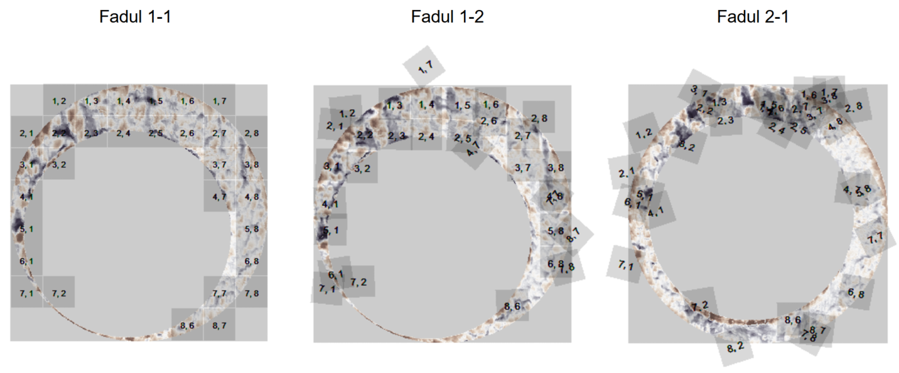

\newcommand{\hh}[1]{{\textcolor{orange}{#1}}}
\newcommand{\svp}[1]{{\textcolor{blue}{#1}}}
\newcommand{\jz}[1]{{\textcolor{purple}{#1}}}

```{r ,localDataDir, include=FALSE}
if(!dir.exists("data")){
  dir.create("data")
}
if(!file.exists("data/fadul1-1.x3p")){
  library(dplyr) # pipe not defined yet
  download.file("https://tsapps.nist.gov/NRBTD/Studies/CartridgeMeasurement/DownloadMeasurement/2d9cc51f-6f66-40a0-973a-a9292dbee36d", destfile = "data/fadul1-1.x3p", mode = "wb")
}
if(!file.exists("data/fadul1-2.x3p")){
  download.file("https://tsapps.nist.gov/NRBTD/Studies/CartridgeMeasurement/DownloadMeasurement/cb296c98-39f5-46eb-abff-320a2f5568e8", destfile = "data/fadul1-2.x3p", mode = "wb")
}
if(!file.exists("data/fadul2-1.x3p")){
  download.file("https://tsapps.nist.gov/NRBTD/Studies/CartridgeMeasurement/DownloadMeasurement/8ae0b86d-210a-41fd-ad75-8212f9522f96", destfile = "data/fadul2-1.x3p", mode = "wb")
}
```

```{r, derivativeImagesDir,include=FALSE}
if(!dir.exists("derivatives")){
  dir.create("derivatives")
}
```

```{r setup,echo=FALSE,message=FALSE,warning=FALSE}
knitr::opts_chunk$set(cache = T, dpi = 300, fig.width = 8, fig.height = 4, out.width = "\\textwidth", dpi = 300)
library(cmcR) # remotes::install_github("CSAFE-ISU/cmcR")
library(tidyverse)
library(x3ptools)
library(rgl)
set.seed(4132020)
```

<!-- # Couple of general comments  -->

<!-- \hh{I noticed a few things during the spotlight on Monday that need to be addressed:} -->

<!-- - \hh{color schemes need to be more consistent: in figures 9/10 red/black are used to indicate alignment/not aligned -->
<!-- and purple orange are used to show height -->
<!-- in the histograms, e.g. fig 11, purple orange are used to show same source/different source.} \jz{Yeah, I agree that it would be better to change this. I like the orange/purple divergent color scheme representing height, so maybe the histograms could be changed to something else? The black and red CMC plots were meant to look like they do in \cite{tong_estimating_2018}, but maybe those could be changed to same color scheme as the histograms (representative of "matching" and "non-matching").} -->
<!-- - \hh{use annotate rather than geom_text for annotations e.g. in figures 6 and 7. geom\_text is repeated with the number of rows in a data set, annotation is only drawn once. That way the text doesn't look like it's bleeding} \jz{That's a really good point. I've fixed that in the cmcR function used to create the plot and have pushed the updated version.} -->
<!-- - \hh{fig 10: use fadul 1-1 as the reference rather than fadul 2-1. That way the pictures are directy comparable.} \jz{Fadul 2-1 is used as the reference image to reflect the fact that it was partitioned into the grid of cells (instead of the other "direction" in which Fadul 1-1 was partitioned into a grid) to yield the 4 CMCs shown. I've added a better explanation for this, but it wouldn't be difficult to change to a different KNM scan if we wanted to.} -->
<!-- - \hh{I noticed that known matches and known non matches have a different scale (height) in the histograms. I think we need to talk about whether that's the best strategy.} \jz{Yes, I'm not sure if plotting the density is the best way to visualize this (as is done in pretty much all of the CMC-related papers I've seen). We can brainstorm some ideas.} -->


# Introduction {#intro}
<!-- If you put a single carriage return between sentences, it makes it a lot easier for git to merge changes back together. -->
\dfn{Research reproducibility}  refers to the ability to use the same procedures and materials as a previous study to arrive at the same results or conclusions. 
Reproducibility is \hh{ indispensable} for results to be considered valid by the wider scientific community \citep{goodman_what_2016}. \hh{Unfortunately, we cannot take reproducibility for granted:}
 recent studies have raised concerns about reproducibility of scientific findings in various fields [\citet{king_replication_1995}, \citet{baker_1500_2016}, \citet{pasquier_if_2017}]. 
Commonly identified reasons for this lack of reproducibility include (1) ambiguity in how procedures
were implemented, (2) \hh{missing or incomplete} data, and (3) \hh{missing or incomplete} computer code to replicate all statistical analyses \citep{leek_is_2017}. 

In computational research, \hh{reproducibility of results} is commonly translated to mean that the code and data used to produce published results be made publicly available \citep{peng_reproducible_2011}. \hh{However, current status quo is that }many papers describe the computational methods which were used in the data analysis in broad terms only. Computational reproducibility requires more details: 
published results may be numerically sensitive to the particular implementation of a computational method, including such considerations as data processing decisions, parameter settings, and even the chosen programming language. 
As such, peer-review and scientific progress in the truest sense requires that \emph{all} pre-processed data, code, and results be made openly available. 
In recognition of the additional requirements of computational reproducibility,  some journals have adopted policies encouraging or requiring that authors provide code and data sufficient to reproduce the statistical analyses, with the goal of building a "culture of reproducibility" in their respective fields \citep{peng_reproducible_2009, peng_reproducible_2011, stodden_toward_2013}. 

<!-- Keep the discussion general at first! All of this information applies not just to CMC, but to a broad swath of other applications -->
The fundamental reason that descriptions of data analysis procedures, combined with the raw data, are not sufficient for reproducibility is that published procedures are described in words rather than algorithmically,  and in some cases, steps are performed manually \citep{song_estimating_2018} \hh{without providing the resulting intermediary outcomes}. If the written-language description of the method in the publication is the sole source of information about the algorithm, we trade computational reproducibility for readability. We generally do not describe the particular parameter settings used (or how those were derived) when we describe an algorithm in a publication. This is an understandable editorial decision, as the purpose of a publication is to demonstrate and justify the method rather than discuss the fine details and parameter settings. Because our publications generally do not contain sufficient detail to reproduce every part of the algorithm, it is necessary to supplement the paper with open code and intermediate forms of the data (after any manual steps have been performed \hh{or simply as check points for replications}). Especially in applications like forensic science or medicine, where results from computational methods may directly affect an individual's life, transparency in how a method or algorithm is implemented is necessary \citep{angwin_machine_2016, cino_deploying_2018}.

\hh{In this light, computational reproducibility } in forensic science, is \hh{all the more important because it fundamentally enables} discussions about algorithmic transparency and accountability~\citep{kwongAlgorithmSaysYou2017, desaiTrustVerifyGuide2017}. 
Currently, subjective decisions are made by individual examiners -- \hh{human beings are} the ultimate closed-source, black-box system, and the operations which lead to a decision are largely opaque. 
There is a push to \hh{complement} these subjective decisions with automatic algorithms that objectively assess evidence and can be explained during court testimony \citep{council_strengthening_2009}.
While the goal is laudable, it is important that the community does not go only halfway, trading a subjective, human black box for objective, proprietary algorithms that are similarly opaque and unauditable.
As part of the shift towards objectivity in forensic science, automatic methods have already been developed to solve problems such as identifying matching glass shards \hh{citation?}, handwriting \hh{citation?}, shoe prints \hh{citation?}, and ballistic evidence \hh{cite xiaohui and eric}. 
While \svp{some} researchers in the forensic science community have adopted computationally reproducible habits [cite CSAFE stuff], \svp{many of the algorithms described in the literature are not reproducible or open-source.}
<!-- XXX Not sure if we should get into the fact that we have the opportunity to change things *before* they become too entrenched -->
<!-- some areas of research still lack reproducible results; computational or otherwise. -->
In this paper, we will demonstrate the ambiguities \svp{which are present} in written descriptions of algorithms by creating an open-source implementation of one well-known automatic forensic identification method. <!-- intentional buttering up before the punchline --> 
The Congruent Matching Cells (CMC) algorithm was developed at the National Institute of Standards and Technology (NIST) in 2012 to perform firearm evidence identification using identifiable markings left on spent cartridge cases from a firearm's barrel \citet{song_proposed_2013}. 
Since then, the method and its numerous extensions \citep{tong_improved_2015,chen_convergence_2017,song_estimating_2018} have shown promise in being able to differentiate between matching and non-matching cartridge cases. 
\svp{While NIST researchers and collaborators have been able to build on the foundation of the original algorithm, the code and data necessary to reproduce the results have not been made available to external researchers.}
\svp{As a result, according to} the definitions given above, these results are not reproducible. 
<!-- Various NIST researchers have been able to qualitatively reproduce results across publications [\citet{tong_improved_2015}, \citet{chen_convergence_2017}, \citet{song_estimating_2018}], but neither code nor preprocessed data for the CMC method or any of its extensions have been made publicly available.  -->

Here, we describe the process of implementing the Congruent Matching Cells (CMC) method for the comparison of marks on spent cartridge cases, using the descriptions from two published papers, \citet{song_3d_2014} and \citet{tong_improved_2015}. 
Our package, \pkg{cmcR}, provides an open-source implementation of the CMC method\svp{, but i}t also serves as an example of the implementation barriers which occur when translating published descriptions of algorithms into detailed source code. 
This process offers some insight into the necessary components which must be available for computational reproducibility. 
Our experience shows that when faced with ambiguity in how a method is implemented, there are few options available apart from performing a brute-force search through combinations of decisions that may have been made to yield the results reported. 
Unsurprisingly, it can become incredibly time intensive to implement \svp{the described results} and then sift through a wide variety of decision combinations. <!--This stymies scientific progress.-->
\svp{This not only serves as a general barrier to scientific progress; in this application, it also highlights the importance of open-source, transparent methodology in high-stakes fields such as forensic analysis.}

<!-- \svp{XXX should we cite Fadul too, since it's the original source?}\hh{XXX yes, we should cite the original source} -->
\svp{We will use the same data set which is referenced in \citet{song_3d_2014} and \citet{tong_improved_2015} to illustrate usage of the \pkg{cmcR} package. These 3d scans of cartridge cases are} available from the NIST Ballistics Toolmark Research Database \citep[NBTRD;][]{nbtrd}. The strings defined below refer to two cartridge case scans available on the NBTRD from \citet{fadul_empirical_nodate} and will be used \svp{throughout the remainder of this paper}.

```{r eval=FALSE,echo=TRUE}
library(cmcR)
set.seed(4132020)

nrbtd_url <- "https://tsapps.nist.gov/NRBTD/Studies/CartridgeMeasurement/"

fadul1.1_id <- "DownloadMeasurement/2d9cc51f-6f66-40a0-973a-a9292dbee36d"
fadul1.2_id <- "DownloadMeasurement/cb296c98-39f5-46eb-abff-320a2f5568e8"
# Should have the download code here.
```


# Cartridge cases & breech face impressions {#cartridgeCases_bfImpressions}

A \dfn{cartridge case} is \svp{the portion} of firearm ammunition that contains a projectile (e.g., bullet, shots, or slug) \svp{along with the explosive used to propel the projectile through the firearm}. 
When a firearm is discharged, the projectile stored in the cartridge case is propelled down the barrel of the firearm\svp{, while the cartridge case} is forced towards the back of the barrel. 
It strikes the back wall, known as the \dfn{breech face}, of the barrel \svp{with some force}.
\svp{Due to manufacturing imperfections, the breech face of the barrel has a theoretically unique combination of markings, which are "stamped" onto the cartridge case as it impacts the breech face during the firing process}. 
The markings left on \svp{the} cartridge case from the firearm's breech face are called \dfn{breech face impressions}.

\svp{During a forensic examination, cartridge cases may be compared using a \dfn{comparison microscope}.} \svp{Comparison microscopes allow for the comparison of two separate objects using the same viewfinder, allowing forensic practitioners to compare two pieces of toolmark evidence.}
Figures \ref{fig:ccPair_separated} and \ref{fig:ccPair_combined} \svp{show cartridge cases in unaligned and aligned states, as seen through a comparison microscope. }
\svp{While there is some similarity in the markings on the two cartridge cases shown in \autoref{fig:ccPair_separated}, this correspondence is much clearer when the cartridge cases are aligned, as in \autoref{fig:ccPair_combined} \citep[Images from ][]{firearm_id_thompson}.}
The degree to which these breech face markings align can be used to determine whether the two cartridge cases match; i.e., were fired from the same firearm. 
These breech face impressions are considered to be analogous to a firearm's "fingerprint" left on a cartridge case \citep{firearm_id_thompson}.

```{r ,echo=FALSE,fig.cap='\\label{fig:ccPair_separated} A cartridge case pair with visible breech face impressions under a microscrope. Forensic practitioners determine by visual comparison how similar these impressions are to conclude whether the pair is a match. It can be especially challenging to determine whether a marking is an \\emph{individual characteristic} caused by contact with the breech face of a particular firearm or a \\emph{subclass characteristic} shared across cartridge cases manufactured by the same manufacturer within a short time frame \\citep{firearmTraining}.',fig.align='center',fig.pos='htbp',out.width="\\textwidth"}
knitr::include_graphics("images/cartridgeCasePair_separated.PNG")
```

```{r ,echo=FALSE,fig.cap='\\label{fig:ccPair_combined} Cartridge case pair viewed side by side under a comparison microscope. A thin line can be seen separating the two views. The degree to which the markings on each cartridge case align is used to conclude a match.',fig.pos='htbp',out.width="\\textwidth"}
knitr::include_graphics("images/cartridgeCasePair_comparison.PNG")
```

\svp{While \autoref{fig:ccPair_separated} and \autoref{fig:ccPair_combined} are from comparison microscopes used by firearms examiners in laboratory settings, digital microscopy is capable of higher precision measurements of surface topology.
Using a 3D microscope, we can obtain extremely detailed scans of the cartridge case surfaces which can be used as input to an automated comparison algorithm, such as the CMC method originally proposed in \citet{song_proposed_2013}.}

<!-- \svp{XXX Briefly describe the contributions of each paper in the sequence - need to transition from visual to algorithmic examination. The paragraph below is a start, but could flow a bit better. I've tried to write the paragraph above in a way that can lead directly into this discussion.} -->

\svp{In this paper, we describe the implementation of a general CMC method which encompasses methods described in \citet{song_proposed_2013}, \citet{song_3d_2014}, and \citet{tong_improved_2015}.
\citet{song_proposed_2013} lays out the conceptual framework for the original CMC method of \citet{song_proposed_2013} \jz{that was later implemented in \citet{song_3d_2014} and \cite{tong_fired_2014}}}.
<!-- , which is referred to as the ``Top Vote" method in \jz{this paper};  -->
<!-- \jz{XXX Everyone at NIST just calls the original CMC method "the original method" or something similar -- we decided to call it the "top-vote" to remove the ambiguity of what "original" refers to. XXX}\svp{I don't remember that decision. Might be worth revisiting it.} -->
A subsequent improvement of the method presented in \citet{tong_improved_2015} and used in subsequent papers is referred to as the ``High CMC" method \citep{chen_convergence_2017}. Both implementations (and subsequent proposed improvements) can be used to correctly differentiate same and different-source cartridge cases from the test dataset \citep{fadul_empirical_nodate}.}
<!-- \citet{song_proposed_2013} lays much of the conceptual framework for what would become the Congruent} \svp{(or Contiguous)}} \jz{Matching Cells algorithm.  -->
<!-- For clarity, the initially proposed method is referred to as the "Top Vote" method in this paper.  -->
<!-- An actual implementation of the Top Vote method applied to 2D optical images was described in  \citet{tong_fired_2014} and to 3D topographical scans in \citet{song_3d_2014}.  -->
<!-- Results from both of these articles indicate that the method was able to correctly identify all 63 matching and 717 non-matching cartridge case pairs in the \citet{fadul_empirical_nodate} dataset.  -->
<!-- The first extension of the Top Vote method was described by \citet{tong_improved_2015} who were also able to correctly identify matching and non-matching pairs in the \citet{fadul_empirical_nodate} dataset. -->
<!-- While not given an official name in \citet{tong_improved_2015}, this method would later be referred to as the "High CMC" method in \citet{chen_convergence_2017} and is referred to as such in this paper.  -->
<!-- Various extensions of the Top Vote algorithm have been proposed since [\citet{zhang_correlation_2016}, \citet{chen_convergence_2017}, \citet{tong_valid_2018}]. -->
\jz{The \pkg{cmcR} package contains implementations designed for use with 3D topographical scans of the original method described in \citet{song_proposed_2013} and \citet{song_3d_2014} and the High CMC method described in \citet{tong_improved_2015}.}

<!-- An implementation of the initially proposed CMC method from \citet{song_proposed_2013} applied to 3D topographical scans of cartridge case surfaces is described in \citet{song_3d_2014}. An extension to this initially proposed method known as the High CMC method is discussed in \citet{tong_improved_2015}.  -->


<!-- Transition -->
\svp{In the next section, we examine the process of implementing the CMC method for automatic comparisons of 3D cartridge case scans. 
At each step, we will compare the description in the published papers with the implementation in code, discussing the gaps in the method description and how we filled in those gaps during the creation of `cmcR`.}
<!-- We have included pseudocode implementing each procedure in the} [Appendix](#appendix) \svp{so that any ambiguities in the prosaic description are easily resolved. -->
The source code to the full `cmcR` package is accessible at https://github.com/CSAFE-ISU/cmcR.

<!-- # Implementation {#implementation} -->

<!-- \jz{XXX Order based on newly proposed structure: XXX} -->

# The CMC method {#cmcMethod}
\svp{All of the CMC methods can be broken down into three broad stages: preprocessing, cell-based similarity feature extraction, and application of a decision rule; these steps are illustrated in} \autoref{fig:overview-flow}. 
\svp{The advantage to treating these algorithms as modular is that we can implement the algorithms as a unified set of procedures, and then test new variations against the old in a coherent, unified framework.}

\begin{figure}
\centering
\includegraphics[width=.8\textwidth]{images/overview-flow.png}
\caption{The stages of CMC methods. In the preprocessing stage, each scan is prepared for analysis, removing extraneous information and noise. Then, each scan is broken up into cells, which are numerically compared to cells in the other scan to determine an optimal alignment. Finally, each of the scores arising from the cells in the second stage are compared to a reference distribution to determine whether the scans originate from the same source or from different sources.\label{fig:overview-flow}}
\end{figure}

The primary difference between the original and high CMC methods is the decision rules utilized to separate matches and non-matches, but there are also several small differences in the preprocessing and comparison procedures.

\jz{
Current CMC literature lacks justification for changing these conditions, yet demonstrates that the same method applied under different conditions yields considerably different results. 
The sensitivity of various methods to different conditions has also not been discussed in CMC literature.}
<!-- \svp{} -->
<!-- Such a discussion based on our implementation of the \jz{original method of \citet{song_proposed_2013}} and the High CMC method can be found [below](investigation)}. -->


<!-- \svp{XXX found where now? XXX} -->

\svp{In this section, we discuss} each \jz{stage of the CMC method}
\jz{using excerpts from the original papers.}
<!-- A discussion of ambiguities in these descriptions will accompany.  -->
<!-- Switch to active voice -->
\svp{Then, we examine the implementation of each sub-procedure in the \pkg{cmcR} package, considering the differences between the text description and \jz{its algorithmic translation}.}

<!-- actual code. XXX I don't like the use of actual here, but can't think of another way to get the point across... any ideas? XXX} -->
<!-- Following this, the procedures as implemented in the \pkg{cmcR} package will be detailed and an exploration of the greater lessons learned while reconciling the methods' ambiguities will be provided.} -->

## Initial Data {#initialData}
Cartridge case \svp{scans} are commonly \svp{encoded as} a \dfn{surface matrix}: a matrix of spatially-ordered elements or "pixels" whose values correspond to the height of the cartridge case surface at a particular location. 
\autoref{fig:cartridgeCasePair} shows the surface matrices of a known match (KM) pair of cartridge cases from a study by \citet{fadul_empirical_nodate}. 
A total of 40 cartridge cases were scanned with a lateral resolution of 6.25 microns (micrometers) per pixel. The surface matrices \svp{are approximately} $1200 \times 1200$ pixels in size.

```{r, fadul1-1Screenshot,include=FALSE}
fadul1.1 <- x3ptools::read_x3p("data/fadul1-1.x3p")

#apply low-pass filter to reduce noise in scan:
surface1 <- fadul1.1$surface.matrix %>%
  cmcR::preProcess_gaussFilter(res = 3.125e-06,wavelength = 16,filtertype = "lp")

params <- rgl::r3dDefaults

zoom <- .7
size <- c(300,300)

params$windowRect <- c(40, 125, 40 + size[1], 125 + size[2])
params$userMatrix <- diag(c(1, 1, 1, 1))
params$zoom <- zoom

#for some reason the first rgl device opened doesn't plot anything, but
#subsequent devices do...
open3d(params = params)
rgl.close()

#opens blank "canvas" upon which we can add lights, surfaces, etc.
open3d(params = params)

#removes any previously declared lights in scene
rgl.pop("lights")

#set-up two lights for scene -- a lot of experimentation possible here
light3d(x = -1,y = 1,z = 2,viewpoint.rel = TRUE,ambient = "white",diffuse = "white",specular = "white")
light3d(x = 0,y = 0,z = 10,ambient = "grey60",diffuse = "grey50",specular = "grey60",viewpoint.rel = TRUE)

#setup surface visualization
multiply <- 1 #x3ptools::image_x3p default to exaggerate relief
z <- multiply * surface1 # Exaggerate the relief
yidx <- ncol(z):1
y <- fadul1.1$header.info$incrementY * yidx
x <- fadul1.1$header.info$incrementX * (1:nrow(z))

# emission, specular, ambient affect how the surface interacts with lights --
# again, a lot of possible experimentation
surface3d(x, y, z, back = "filled",emission = "grey30",specular = "grey50",ambient = "grey10")

x3ptools::x3p_snapshot(file = "derivatives/fadul1-1.png")

rgl.close()
```


```{r ,fadul1-2Screenshot,include=FALSE}
fadul1.2 <- x3ptools::read_x3p("data/fadul1-2.x3p")

surface2 <- fadul1.2$surface.matrix %>%
  cmcR::preProcess_gaussFilter(res = 3.125e-06,wavelength = 16,filtertype = "lp")
#opens blank "canvas" upon which we can add lights, surfaces, etc.
open3d(params = params)

#removes any previously declared lights in scene
rgl.pop("lights")

#set-up two lights for scene -- a lot of experimentation possible here
light3d(x = -1,y = 1,z = 2,viewpoint.rel = TRUE,ambient = "white",diffuse = "white",specular = "white")
light3d(x = 0,y = 0,z = 10,ambient = "grey60",diffuse = "grey50",specular = "grey60",viewpoint.rel = TRUE)

#setup surface visualization
multiply <- 1 #x3ptools::image_x3p default to exaggerate relief
z <- multiply * surface2 # Exaggerate the relief
yidx <- ncol(z):1
y <- fadul1.2$header.info$incrementY * yidx
x <- fadul1.2$header.info$incrementX * (1:nrow(z))

# emission, specular, ambient affect how the surface interacts with lights --
# again, a lot of possible experimentation
surface3d(x, y, z, back = "filled",emission = "grey30",specular = "grey50",ambient = "grey10")

x3ptools::x3p_snapshot(file = "derivatives/fadul1-2.png")

rgl.close()
```

```{r, rawBFs,echo=FALSE,fig.cap='\\label{fig:cartridgeCasePair} Unprocessed surface matrices of the known-match Fadul 1-1 (left) and Fadul 1-2 (right) \\citep{fadul_empirical_nodate}. The observations in the corners of these surface matrices are artifacts of the staging area in which these scans were taken. The holes on the interior of the primer surfaces are caused by the firing pin striking the primer during the firing process. The region of the primer around this hole does not come into uniform contact with the breech face of the firearm.', fig.subcap=c('',''),fig.align='center',fig.pos='htbp',out.width='.49\\linewidth',out.height='.49\\linewidth'}
knitr::include_graphics(c("derivatives/fadul1-1.png","derivatives/fadul1-2.png"))
```

Only certain regions of a cartridge case contain identifying breech face impression markings. 
\citet{song_proposed_2013} refers to these as "valid correlation regions" that are to be used to determine whether two cartridge cases match. 
Prior to applying the CMC comparison procedure, cartridge scans must undergo some preprocessing to remove sections of the cartridge case surface that do not come into contact with the breech face of the barrel.

```{r load-data, include = F, cache = T}
# fadul1.1 <- cmcR::selectBFImpression_sample_x3p("data/fadul1-1.x3p",
#                                                 gaussFilterWavelength = c(16,500))
# fadul1.2 <- cmcR::selectBFImpression_sample_x3p("data/fadul1-2.x3p",
#                                                 gaussFilterWavelength = c(16,500))

fadul1.1 <- x3ptools::read_x3p("data/fadul1-1.x3p") %>%
  cmcR::cropBFExterior(radiusOffset = -30,
                 agg_function = median) %>%
  cmcR::filterBFInterior(radiusOffset = 200) %>%
  cmcR::levelByConditionalStatistic(statistic = "quantile",
                              tau = .5,
                              method = "fn") %>%
  x3ptools::sample_x3p()

fadul1.1$surface.matrix <- cmcR::preProcess_gaussFilter(surfaceMat = fadul1.1$surface.matrix,
                                                        res = fadul1.1$header.info$incrementY)

fadul1.2 <- x3ptools::read_x3p("data/fadul1-2.x3p") %>%
  cmcR::cropBFExterior(radiusOffset = -30,
                 agg_function = median) %>%
  cmcR::filterBFInterior(radiusOffset = 200) %>%
  cmcR::levelByConditionalStatistic(statistic = "quantile",
                              tau = .5,
                              method = "fn") %>%
  x3ptools::sample_x3p()

fadul1.2$surface.matrix <- cmcR::preProcess_gaussFilter(surfaceMat = fadul1.2$surface.matrix,
                                                        res = fadul1.2$header.info$incrementY)


```

```{r cmc-ccf, include = F, cache = T}
kmComparison <- cmcR::cellCCF_bothDirections(x3p1 = fadul1.1,
                                             x3p2 = fadul1.2,
                                             cellNumHoriz = 8,
                                             minObservedProp = .1,
                                             regionToCellProp = 9,
                                             ccfMethod = "fftThenPairwise")

kmCMC <- cmcR::cmcFilter_improved(kmComparison,
                                    ccf_thresh = .5,
                                    dx_thresh = 20,
                                    theta_thresh = 6,
                                    missingTheta_decision = "fail")
```

```{r cmc-filter, include = F, cache = T}
# if (!file.exists("data/kmcmc.Rdata")) {
#   save(kmCMC, file = "data/kmcmc.Rdata")
# } else {
#   load("data/kmcmc.Rdata")
# }
```


## Preprocessing procedures {#preProcessing}

<!-- First, raw 3D topographical cartridge case surface data need to be processed before applying the CMC method.  -->

\svp{During the preprocessing stage, several sequential steps are used to prepare each cartridge case for analysis. 
In the different iterations of the CMC algorithm, there have been several minor changes to the preprocessing steps; the different variations of the steps are shown in \autoref{fig:preprocessing-schematic}.
}

\begin{figure}
\includegraphics[width=\linewidth]{images/preprocessing_flow.png}
\caption{Each CMC implementation uses slightly different procedures. Where a procedure step is not discussed or explicitly not applied in the paper, the path traverses empty space.}\label{fig:preprocessing-schematic}
\end{figure}

The implementation in \citet{tong_fired_2014} describes the preprocessing steps very succinctly:

>  After trimming processing to remove unrelated correlations areas, the final image size is reduced to 700 × 700 pixel with an estimated pixel spacing of 5.0 $\mu$m. A Gaussian smoothing filter (standard deviation $\sigma$ = 1) was implemented first to remove high frequency noise.

\svp{Complicating the issue, }the procedures used to process the surface matrices differ in \svp{each paper in} the CMC literature. \citet{song_3d_2014} outline the following preprocessing procedure:

> Trim off the inside firing pin surface and other areas outside the breed face mark, so that only breech face impression data remain for correlation.

> Identify and remove dropouts or outliers.

> Apply a band-pass Gaussian regression filter with 40 $\mu$m short cutoff length and 400 $\mu$m long cutoff length to remove low frequency components, including surface curvature, form error, waviness and high frequency components which mainly arise from the instrument noise.

While not \svp{explicit} in \citet{song_3d_2014}, \citet{song_estimating_2018} indicates that the "trimming" of the unwanted regions of the scan is performed manually. 
\svp{
The goal of this process is to remove the edges and center of the scan which did not come into contact with the breech face, as well as any artifacts of the scan and microscope staging which do not accurately represent the breefch face surface.}
<!-- These include a circular plateaued region in the center of the scan that is pushed aside by the firing pin during the firing process as well as clusters of observed values in the corners of the scan that are artifacts of the staging area in which the scan was captured.  -->
\svp{
No further information is given in the paper describing what criteria were used for this process; nor are the trimmed scans provided as intermediate data to make reproducibility possible. 
}
It is \svp{also} unclear how the dropouts and outliers are "removed" from the scan or how outliers are defined\svp{; many different methods for outlier detection and removal are used in surface metrology\citep{outlierdetection}. Most of the algorithms require the user to select thresholds or parameters; thus, without any details about how the outlier detection process was implemented, this portion of the paper is not reproducible.}

\svp{We are not aware of} an open-source implementation of the multivariate band-pass Gaussian regression filter used in surface metrology \citep{ISO16610-71}. 
Further, there are various parameters requiring specification to implement a Gaussian regression filter and it is not clear how these parameters were chosen \citep{brinkman_bodschwinna_2003}.

\svp{As a result of these ambiguities, during our implementation of the preprocessing algorithm, we had to make several educated guesses in order to match the described procedure as closely as possible.}

### Implementation of preprocessing procedures

<!-- \svp{In order to reproducibly implement the preprocessing procedure, we modified a procedure from \citet{tai_submitted_2019} used to automatically process surface matrices.}  -->

```{r include = F,cache = T}
# fadul1.1_downsampled <- x3ptools::x3p_sample(fadul1.1,m = 2)
# 
# fadul1.1_ransac <- fadul1.1_downsampled
# fadul1.1_ransac$surface.matrix <- fadul1.1_ransac$surface.matrix %>%
#   cmcR::preProcess_ransac(ransacInlierThresh = 1e-5) %>%
#   cmcR::preProcess_levelBF(useResiduals = TRUE)
# 
# fadul1.1_cropped <- fadul1.1_ransac
# fadul1.1_cropped$surface.matrix <- fadul1.1_cropped$surface.matrix %>%
#   cmcR::preProcess_cropWS(croppingThresh = 1)
# fadul1.1_cropped$header.info$sizeY <- ncol(fadul1.1_cropped$surface.matrix)
# fadul1.1_cropped$header.info$sizeX <- nrow(fadul1.1_cropped$surface.matrix)
# 
# fadul1.1_noFP <- fadul1.1_cropped
# fadul1.1_noFP$surface.matrix <- fadul1.1_noFP$surface.matrix %>%
#   cmcR::preProcess_removeFPCircle(aggregationFunction = function(x,na.rm){median(x,na.rm) - 11})
# 
# fadul1.1_filtered <- fadul1.1_noFP
# fadul1.1_filtered$surface.matrix <- fadul1.1_filtered$surface.matrix %>%
#   cmcR::preProcess_gaussFilter(res = fadul1.1_filtered$header.info$incrementY,
#                                wavelength = c(16,500))

fadul1.1_original <- x3ptools::read_x3p("data/fadul1-1.x3p")

fadul1.1_croppedExt <- cmcR::cropBFExterior(x3p = fadul1.1_original,
                                            radiusOffset = -30,
                                            agg_function = median) 

fadul1.1_croppedInt <- cmcR::filterBFInterior(fadul1.1_croppedExt,
                                              radiusOffset = 200)

fadul1.1_medRemoved <-   cmcR::levelByConditionalStatistic(fadul1.1_croppedInt,
                                                           statistic = "quantile",
                                                           tau = .5,
                                                           method = "fn")

fadul1.1_downsampled <- x3ptools::sample_x3p(fadul1.1_medRemoved,
                                             m = 2)

fadul1.1_bpFiltered <- fadul1.1_downsampled
fadul1.1_bpFiltered$surface.matrix <- cmcR::preProcess_gaussFilter(surfaceMat = fadul1.1_bpFiltered$surface.matrix,
                                                                    res = fadul1.1_bpFiltered$header.info$incrementY,
                                                                    wavelength = c(16,500),
                                                                    filtertype = "bp")
```


```{r, echo = F,warning = F,message = F,cache = T,fig.cap='\\label{fig:processingPipeline} Illustration of \\pkg{cmcR} preprocessing pipeline designed to automate the manual cleaning in the CMC papers. \\svp{At each stage, the amount of variability in height across the scan decreases as extraneous sources of noise are removed.}',fig.align='center',fig.pos='htbp',out.width='\\textwidth', message = F, warning = F}

preProcessingPlot <- cmcR::x3pListPlot(list("(1) Original" = fadul1.1_original,
                                            "(2) Crop exterior/interior" = fadul1.1_croppedInt,
                                            "(3) Level surface" = fadul1.1_medRemoved,
                                            "(4) Band-pass filter" = fadul1.1_bpFiltered),
                                       type = "list",
                                       legend.quantiles = c(0,.5,1)) %>%
  map2(.x = .,
       .y = list(element_text(),element_blank(),element_blank(),element_blank()),
       .f = ~ .x + theme(legend.position = "bottom",
                         legend.title = .y) +
         ggplot2::guides(fill = ggplot2::guide_colourbar(barheight = grid::unit(.3,"in"),
                                                         barwidth = grid::unit(1.5,"in"),
                                                         label.theme = ggplot2::element_text(size = 7),
                                                         title.theme = ggplot2::element_text(size = 10),
                                                         title.position = "top",
                                                         frame.colour = "black",
                                                         ticks.colour = "black"),
                         colour = FALSE) +
         scale_fill_gradientn(colours = rev(c('#7f3b08','#b35806','#e08214','#fdb863','#fee0b6','#f7f7f7','#d8daeb','#b2abd2','#8073ac','#542788','#2d004b')),
                              values = scales::rescale(quantile(.x[[1]]$value,c(0,.01,.025,.1,.25,.5,.75,0.9,.975,.99,1),na.rm = TRUE)),
                              breaks = c(round(min(.x[[1]]$value*1e6,na.rm = TRUE),2),
                                         0,
                                         round(max(.x[[1]]$value*1e6,na.rm=TRUE),2)),
                              limits = c(1.01*min(.x[[1]]$value*1e6,na.rm = TRUE),
                                         1.01*max(.x[[1]]$value*1e6,na.rm=TRUE)),
                              na.value = "gray80") +
         ggplot2::labs(fill = expression("Height ["*mu*"m]")))

gridExtra::grid.arrange(preProcessingPlot$`(1) Original`,
                        preProcessingPlot$`(2) Crop exterior/interior`,
                        preProcessingPlot$`(3) Level surface`,
                        preProcessingPlot$`(4) Band-pass filter`,
                        widths = unit(c(1,1,1,1),units = "null"))
```

\svp{We begin with a 3D scan, which is optionally downsampled. 
Typically, in the CMC literature,} every other row and column in the surface matrix \svp{is retained}, resulting in a matrix that is approximately 25% of the original scan dimension. 
This downsampling is performed using the \code{x3p\_sample} function from the \pkg{x3ptools} package (default is every other row and column, \code{m = 2} lines num-num in [Appendix](). 
Step 1 in \autoref{fig:processingPipeline} shows an \jz{unprocessed surface matrix.}

\jz{After reading in the surface matrix, three major regions of the scan are identified via a labeling algorithm described in \citet{hesselink_concurrent_2001} and available in the \pkg{imager} package \citep{imager}. 
These regions are the exterior of the cartridge case primer, the breech face impression region, and the firing pin impression hole in the center of the scan. 
The goal is to isolate the breech face impression region by removing (i.e., replacing with \code{NA}) the pixels in the other two regions.
Upon labeling the different regions of the cartridge case scan, the centers of the cartridge case primer and firing pin impression hole are estimated. 
Note that, as seen in step 1 of \autoref{fig:processingPipeline}, the center of the firing pin impression hole might be offset from the center of the cartridge case. 
With these centers identified, the user then specifies radii that they deem appropriate for removing the unwanted observations on the exterior of the breech face impression surface (including roll-off of the cartridge case primer) and the firing pin impression. 
While this step requires user input, the resulting surface matrix, like the one shown in step 2 of \autoref{fig:processingPipeline}, is reproducible assuming the same user-specified radii values are used. 
This is in contrast to the non-reproducible, manual procedure referenced in other CMC papers to isolate the breech face impression region.}

In \jz{steps 1 and 2 of \autoref{fig:processingPipeline}} \svp{it is clear that there is a} \jz{southwest-to-northeast trend in height values. 
Such a trend is observable in many cartridge case scans, yet does not occur consistently across cartridge cases fired from the same firearm. 
Instead, a trend in the height values could be an artifact of the scanning process where cartridge cases are not precisely, horizontally leveled prior to taking the scan.}
<!-- (XXX should we cite something about scanning SOP here? XXX).  -->
\jz{As discussed in section REF, neglecting to remove such trends leads to very different results based on our implementation. 
For example, two different-source cartridge cases with similar trends might be incorrectly deemed "congruent." }
\svp{It is unclear how such trends in height values are dealt with in the CMC literature; certainly, a high-pass Gaussian filter will remove some structure, but it is not explicitly mentioned whether any leveling is performed manually as well.} In the \pkg{cmcR} package, the breech face impression regions obtained from step 2 are leveled by estimating and subtracting the conditional median via the \code{rq} function of the \pkg{quantreg} package \citep{quantreg}. Step 3 of \autoref{fig:processingPipeline} shows a median-leveled surface matrix.

\svp{In the final preprocessing step,} a band-pass filter is applied to the processed surface matrix to reduce the effects of undesired frequencies in the comparison procedure. 
For example, low frequency (high wavelength) global structure may exist in a cartridge case scan due to manufacturing specifications \svp{(In forensics, this type of structure is referred to as a class characteristic -- it is shared by many objects of the same make and model)}.
\jz{Such similarities are often used by forensic practitioners to initially pare down the possible pool of matching cartridge cases \citep{firearm_id_thompson}.}
\svp{While this additional global structure may assist with matching cartridge cases, it may also artificially inflate the probability of making a false-positive identification. 
The goal of this analysis is to match scans based on individualizing characteristics, and so we remove the global structure using a high-pass Gaussian filter. Similarly,} high frequency (low wavelength) noise and outliers persist in cartidge case scans due to, for example, imperfections in the scanning process. 
Such observations may also reduce the accuracy of our identifications. 
Their effects can be mitigated by applying a low-pass Gaussian filter that operates as a local, moving average. 
A band-pass Gaussian filter combines the effects of low and high-pass filters\svp{; we have chosen to implement it by applying a low pass filter and a high pass filter consecutively.} 
<!-- \jz{and can be implemented} \svp{by applying the filters consecutively} \citep{gauss_filter_source} \jz{XXX I only say "can be" to emphasize that we chose one of the commonly agreed-upon ways to implement a band-pass filter XXX}.  -->
\svp{There is considerable variation in the filters applied in the CMC literature; initially, low-pass and gausian band-pass regression filters were used, but the most recent papers use a band-pass filter.} 
The current implementation for the low-pass filter involves constructing a Gaussian kernel based on a user-specified wavelength to attenuate and convolving the kernel with the surface matrix in the frequency domain \citep{computerVision}. 
A high-pass filter of a particular wavelength is applied by subtracting-away the complementary low-pass filtered surface matrix. 
The band-pass filtered surface matrix is shown in the fifth panel of \autoref{fig:processingPipeline} (\code{filterType = "bp"} and \code{wavelength = c(16,500)} default).

<!-- In the \pkg{cmcR} package, breech face impression data are isolated using a comthebination of the Random Sample Consensus (RANSAC) robust iterative plane-fitting algorithm \citep{ransac}, the Hough Transform shape detection algorithm \citep{hough}, and cropping rows/columns of the surface matrix containing only \code{NA} values on the exterior of the breech face impression region.  -->
<!-- The \pkg{cmcR} package does not yet use a Gaussian regression filter. -->
<!-- A simpler Gaussian filter, a technique used by \citet{tong_fired_2014} and \citet{song_estimating_2018}, is currently implemented instead.  -->

In order to perform the comparison procedure, \code{NA}-valued pixels must be replaced with a non-\code{NA} value. 
The convention adopted in the \pkg{cmcR} package is to use the average pixel value as a replacement. 
<!-- \svp{XXX Do we know that they did or did not use a similar consensus in the CMC method? XXX} \jz{XXX No, we don't XXX} -->
There is currently no determination or removal of outliers in the \pkg{cmcR} package's preprocessing procedures, \svp{in part because the CMC literature contains limited details on outlier removal. We instead rely on the low-pass portion of the Gaussian filter to reduce the effects of any high-frequency noise.}

To illustrate the usage of the \pkg{cmcR} package, we will consider a comparison between the KM cartridge case pair shown in \autoref{fig:cartridgeCasePair}.
The \code{selectBFImpression\_sample\_x3p} function performs all of \svp{the} preprocessing procedures \svp{described above} in a single call. 
The code to produce the first surface matrix shown in \autoref{fig:processedScans} is provided below; \svp{the second matrix is processed using the same function arguments}.

<!-- \svp{XXX Joe - please parenthetically indicate each argument name in the text above, along with its default value XXX} -->

```{r include=FALSE,eval=FALSE}
fadul1.1 <- selectBFImpression_sample_x3p(x3p_path = paste0(nrbtd_url,fadul1.1_id),
                                          ransacInlierThresh = 1e-6, #.1 microns
                                          ransacIters = 300,
                                          m = 2, #sample_x3p downsample rate
                                          gaussFilterWavelength = c(16,500),
                                          gaussFilterType = "bp") #band-pass filter
```

```{r,echo=FALSE,cache = T,fig.cap='\\label{fig:processedScans} Fadul 1-1 and Fadul 1-2 after preprocessing. Similar striated markings are now easier to visually identify on both surfaces.',fig.align='center',fig.pos='htbp',out.width='\\textwidth', message = F, warning = F}

cmcR::x3pListPlot(x3pList = list("Fadul 1-1" = fadul1.1,
                                 "Fadul 1-2" = fadul1.2),
                  # x3pList = list("Fadul 1-1" = fadul1.1$x3p,
                  #"Fadul 1-2" = fadul1.2$x3p),
                  type = "faceted",
                  rotate = 90,
                  legend.quantiles = c(0,.01,.2,.5,.8,.99,1)) +
  guides(fill = guide_colourbar(barheight = grid::unit(2.6,"inches"),
                                label.theme = element_text(size = 8),
                                title.theme = ggplot2::element_text(size = 12),
                                frame.colour = "black",
                                ticks.colour = "black")) +
  theme(legend.position = c(1.11,.551),plot.margin = ggplot2::margin(c(0,3,.2,0),unit = "cm"))
```


## "Correlation cell" comparison procedure {#comparisonProcedure}

<!-- \svp{XXX Need to quote directly from the relevant papers. Ideally, from the papers with implementations and not just theory.} -->

As described in \citet{song_proposed_2013}, breech face markings are not uniformly impressed upon a cartridge case during the firing process. 
As such, only certain sections of the cartridge case have identifiable markings that make it possible to match to a firearm. 
Calculating a similarity score between the entirety of two cartridge case surfaces might not highlight these valid correlation regions. 
Instead, \citet{song_proposed_2013} proposes partitioning one surface matrix into a grid of "correlation cells," some of which will enclose the valid correlation regions of interest. 
If a large \svp{proportion} of these correlation cells are deemed highly similar to regions in the other surface matrix, then there is evidence that the two cartridges cases match. 
\svp{T}he number of highly similar cells can be used as a more \svp{robust} similarity metric, \svp{compared to a score derived from the entire cartridge case}.

```{r, echo=FALSE,fig.cap='\\label{fig:cmc_illustration} Illustration of comparing a "cell" in the reference cartridge case scan (left) to a larger region in a questioned cartridge case scan (right). Every cell in the reference cartridge case is similarly paired with a region in the questioned. To determine the rotation at which the two cartridge cases align, the cell/region pairs are compared for various rotations of the questioned cartridge case.',fig.align='center',fig.pos='htbp',out.width='.75\\textwidth'}

knitr::include_graphics("images/cmc_illustration.PNG")
```

\autoref{fig:cmc_illustration} illustrates the cell-based comparison procedure between two cartridge case scans. 
The scan on the left is divided into a grid of $k \times k$ cells. 
\svp{The cell size (and thus, the corresponding number of cells) is optimized experimentally:}

> The cell size must be experimentally optimized, not too small and not too large. Either condition may result in low correlation accuracy. For the initial tests of 9 mm caliber cartridge cases, good correlation results for breech face correlations were obtained using the cell sizes ranging from (0.25 × 0.25) to (0.5 × 0.5) $mm^2$. \citep{song_3d_2014}

\begin{figure}
\includegraphics[width=\linewidth]{images/cmc_flow.png}
\caption{Each CMC implementation uses slightly different procedures to obtain a similarity score between two cartridge cases. Steps which are implemented with additional user-specified parameters are shaded purple; steps which are described but without sufficient detail are shaded grey.}\label{fig:cmc-schematic}
\end{figure}

\svp{\autoref{fig:cmc-schematic} shows the steps of the correlation cell comparison process in each of the papers as well as the \pkg{cmcR} implementation.}

Each cell is paired with an associated larger region in the other scan. 
The absolute location of each cell and region in their respective surface matrices remain constant. 
However, the scan on the right is rotated to determine the rotation at which the two scans are the most "similar," which is quantified using the \dfn{cross-correlation function} (CCF). 

\svp{In \citet{song_3d_2014}, the process is described with characteristic brevity:}

> CMC pairs are identified by three types of identification parameters: the correlation value CCF$_{\max}$, registration angle $\theta$ and translation distances $x$, $y$ with thresholds $T_{\text{CCF}}$, $T_\theta$ and $T_x, T_y$, respectively. The correlated cell pairs are considered as CMCs when their correlation value CCF$_{\max}$, $T_{\text{CCF}}$, and their registration angle $\theta$ and $x-y$ registration pattern are within the thresholds $T_\theta$, and $T_x, T_y$.

Note that rotating an image or surface matrix by an arbitrary angle (other than a multiple of 90 degrees) requires interpolating new pixel locations. 
A variety of interpolation schemes exist \citep{parker_comparison_1983} and \svp{there are no details provided in the} CMC literature \svp{indicating which interpolation algorithm was used}. \svp{In \pkg{cmcR}, s}urfaces matrices are rotated using a "nearest-neighbor" interpolation scheme \citep{imager}.

<!-- \svp{XXX what do we use? Make it explicit so we're not being hypocritical XXX} \jz{XXX nearest-neighbor interpolation -- this is stated in the paragraph below describing the implementation XXX} -->

\svp{For clarity and reproducibility, we will attempt to provide more precise mathematical and computational descriptions of the algorithm, starting with a definition of the cross-correlation function as well as more efficient computational implementations.} 
For two real-valued, $M \times N$ matrices $A$ and $B$, the cross-correlation function, denoted $(A \star B)$ can be defined as
$$
(A \star B)[m,n] = \sum_{i} \sum_{j} A[i,j] B[(i + m), (j + n)].
$$
Note that this finite, discretized CCF definition yields a matrix whose $[m,n]$th element quantifies the similarity between matrices $A$ and $B$ for a translation of matrix $B$ by $m$ pixels horizontally and $n$ pixel vertically. 
The index at which the CCF attains a maximum represents the \svp{optimal translation} needed to align $B$ with $A$.
\jz{Based on the definition, the CCF need not be bounded between $-1$ and $1$. However, it is common to normalize the CCF for interpretability, and} \svp{this} \jz{is the convention adopted by the \pkg{cmcR} package. 
Prior to calculating the CCF, the matrices $A$ and $B$ can be standardized through subtraction of their respective means and division by their respective standard deviations. 
This is referred to as the \dfn{Areal Cross-Correlation Function} (ACCF) in some CMC papers \citep{ott_applying_2017}.}

### Implementation of the correlation cell comparison procedure


\svp{Published implementations of the CMC algorithm do not describe precisely how the CCF is calculated. 
In image processing, it is common to use an implementation based on the discrete Fast Fourier Transform}\citep{Brown92asurvey}. 
\svp{This implementation leverages the Cross-Correlation Theorem, which states that for matrices $A$ and $B$,}
$$
(A \star B )[m,n]= \mathcal{F}^{-1}\left(\overline{\mathcal{F}(A)} \cdot \mathcal{F}(B)\right)[m,n]
$$
where $\mathcal{F}$ and $\mathcal{F}^{-1}$ denote the discrete Fourier and inverse discrete Fourier transforms, respectively, and $\overline{\mathcal{F}(A)}$ denotes the complex conjugate \citep{fft_brigham}. 
Note that the multiplication on the right-hand side is pointwise (Hadamard) multiplication. 
This result allows us to trade the moving sum computations from the definition of the CCF for two forward Fourier transformation, a pointwise product, and an inverse Fourier transformation. 
The Fast Fourier Transform (FFT) algorithm can be used to reduce the computational load considerably.

\svp{No computational shortcut comes without some tradeoffs, though, and this FFT-based CCF calculation is no different. 
The FFT does not tolerate missing values, and breech faces are not continuous surfaces - the white regions in \autoref{fig:cmc_illustration} correspond to missing values.}
\svp{While it is unclear how the CCF is implemented in the CMC papers (it is not even defined mathematically), the \pkg{cmcR} package adopts the following conventions:}

- \svp{Missing values are replaced with the overall mean value when the FFT-based CCF is computed.} 
- \svp{The optimal translation is determined using the FFT-based CCF. Replacing the missing values with the overal mean leads to a deflated CCF value (see appendix XXX for more details), but produces an accurate estimate of the optimal translation.}
- \svp{Using the optimal translation determined from the FFT-based CCF, we compute the pairwise complete CCF directly, avoiding any distortion of the CCF computation based on compensation for missing values.}

\jz{Only cells with a minimum proportion of non-missing pixels are }\svp{assessed}. \jz{The minimum threshold differs across CMC papers \citep{chen_convergence_2017,song_estimating_2018}}\svp{, as shown in \autoref{fig:cmc-schematic}, and is referenced but not specified in several other papers \citep{tong_fired_2014,song_3d_2014,chu_validation_2013}.}
\jz{The minimum threhsold used for the results in this paper is 10% non-missing.}
<!-- \svp{XXX what proportion do we use? If it's variable, we should say that we have implemented this as a parameter setting for compatibility with the other algorithms} -->

\svp{The entire matching procedure is performed twice: once with scan A partitioned and scan B as the target, and once with scan B partitioned and scan A as the target.}
The correlation cell comparison procedure is implemented in the \code{cellCCF\_bothDirections} function. 

```{r echo=TRUE,eval=FALSE}
kmComparison <- cellCCF_bothDirections(x3p1 = fadul1.1,
                                       x3p2 = fadul1.2,
                                       thetas = seq(-30,30,by = 3),
                                       cellNumHoriz = 8,
                                       cellNumVert = 8,
                                       minObservedProp = .1)
```

\autoref{tab:cellCCF} shows several rows of the result when \code{fadul1.1} was divided into a grid of cells and \code{fadul1.2} was rotated by $-24$ degrees. 
Although a grid of $8 \times 8$ cells were used, there were only 43 cell/region pairs that contained a sufficient proportion of non-missing values (10% in this example). 
\svp{The features derived from the correlation cell procedure (CCF$_{max}$, $\Delta x$, $\Delta y$, $\theta$) are used as inputs to the methods for assessment of match strength.}

```{r include=FALSE,eval=FALSE}
kmComparison$comparison_1to2$ccfResults %>%
  topResultsPerCell() %>%
  head()
```
```{r echo=FALSE,warning=F,message=F,eval=TRUE,cache = T}
kmComparison$comparison_1to2$ccfResults %>%
  topResultsPerCell() %>%
  ungroup() %>%
  mutate(cellIndex = cmcR:::linear_to_matrix(index = (cellNum %% ceiling(sqrt(max(cellNum)))) +
                                               floor((ceiling(sqrt(max(cellNum)))^2 - cellNum)/ceiling(sqrt(max(cellNum))))*ceiling(sqrt(max(cellNum))) +
                                               ifelse(cellNum %% ceiling(sqrt(max(cellNum))) == 0,ceiling(sqrt(max(cellNum))),0),
                                             nrow = ceiling(sqrt(max(cellNum))),
                                             byrow = TRUE)) %>%
  mutate(`Cell index` = cellIndex,
         `Pairwise-complete corr.` = round(ccf,3),
         `FFT-based corr.` = round(fft.ccf,3),
         `Non-missing percent.` = round(100*nonMissingProportion,2)) %>%
  select(-c(cellNum,cellID)) %>%
  select(c(`Cell index`,`Pairwise-complete corr.`,`FFT-based corr.`,dx,dy,theta,`Non-missing percent.`)) %>%
  filter(theta == -24) %>%
  arrange(`Cell index`) %>%
  head() %>%
  knitr::kable(caption = "\\label{tab:cellCCF} Example of output from correlation cell comparison procedure between Fadul 1-1 and Fadul 1-2 rotated by -24 degrees. Due to the large proportion of missing values that are replaced to compute the FFT-based correlation, the pairwise-complete correlation is most often greater than the FFT-based correlation.",
               format = "latex",
               align = c("|c","c","c","r","r","r","c|"),
               col.names = c("Cell Index",
                             "Pairwise-comp. corr.",
                             "FFT-based corr.",
                             "$\\Delta$x",
                             "$\\Delta$y",
                             "$\\theta$",
                             "Non-NA percent."),
               escape = FALSE) %>%
  kableExtra::kable_styling(latex_options = "hold_position",
                            position = "center")
```

## Decision Rule

\svp{Using the thetas, translation vectors, and CCFs produced by the correlation cell procedure, the CMC literature describes two slightly different methods for aggregating this information into a consensus decision about the similarity of the two cartridge cases.} 

As stated in \citet{song_3d_2014}, 

> [t]he qualifications of CMCs require not only high correlation values CCF$_{\max} \geq T_{\text{CCF}}$, but also similar registration angles $\theta$ (within the threshold $T_{\theta}$) and similar $x - y$ registration pattern (within the thresholds $T_x$, $T_y$).

A truly matching pair of cartridge cases \svp{would have similar translation and rotation values for each cell, estimated by maximizing the cell-wise CCF; a nonmatching pair of cartridge cases would have a variety of different translation and rotation values showing no particular pattern.}

<!-- \svp{XXX Add a figure (and reference) here showing CMCs from the original method as in figure 15, 16, for matching and nonmatching cartridges. So e.g. A | A' B, 3 across, with blue and red squares on A' and B showing the cells from A aligned.} -->

\jz{\autoref{fig:originalMethod_sideBySide} shows the CMCs determined under the original method of \citet{song_proposed_2013} from comparing the matching pair Fadul 1-1 to Fadul 1-2 and the non-matching pair Fadul 1-1 to Fadul 2-1. 
Fadul 1-1 was treated as the reference scan in both comparisons. 
Descendants of the original method of \citet{song_proposed_2013} perform comparisons twice for a given pair so that each scan is treated as the reference scan (referred to as the two \dfn{comparison directions}). 
Blue cells represent the 19 cells identified as CMCs between Fadul 1-1 and Fadul 1-2. 
Red cells represent the alignment of non-CMCs at which they attain the highest CCF$_{\max}$ value. 
The comparison between Fadul 1-1 and Fadul 1-2 yields 12 non-CMCs. 
The comparison between Fadul 1-1 and Fadul 2-1 yields 32 non-CMCs.}

```{r,echo=FALSE,cache = T}
# fadul2.1 <- cmcR::selectBFImpression_sample_x3p("data/fadul2-1.x3p",
#                                                 gaussFilterWavelength = c(16,500))

fadul2.1 <- x3ptools::read_x3p("data/fadul2-1.x3p") %>%
  cropBFExterior(radiusOffset = -30,
                 agg_function = median) %>%
  filterBFInterior(radiusOffset = 200) %>%
  levelByConditionalStatistic(statistic = "quantile",
                              tau = .5,
                              method = "fn") %>%
  x3ptools::sample_x3p()

fadul2.1$surface.matrix <- cmcR::preProcess_gaussFilter(surfaceMat = fadul2.1$surface.matrix,
                                                        res = fadul2.1$header.info$incrementY)

knmComparison <- cmcR::cellCCF_bothDirections(x3p1 = fadul1.1,
                                              x3p2 = fadul2.1,
                                              #x3p1 = fadul1.2$x3p,
                                              #x3p2 = fadul2.1$x3p,
                                              cellNumHoriz = 8,
                                              minObservedProp = .1,
                                              regionToCellProp = 9,
                                              ccfMethod = "fftThenPairwise")

knmCMC <- cmcR::cmcFilter_improved(knmComparison,
                                   ccf_thresh = .5,
                                   dx_thresh = 20,
                                   theta_thresh = 6,
                                   missingTheta_decision = "fail")
```

```{r cache = T,include=FALSE}
knmCMCPlot <- cmcR::cmcPlot(fadul1.1,
              fadul2.1,
              cellCCF_bothDirections_output = knmComparison,
              cmcFilter_improved_output = knmCMC,
              type = "faceted",
              x3pNames = c("Fadul 1-1","Fadul 2-1"),
              legend.quantiles = c(0,.01,.2,.5,.8,.99,1),
              height.colors = colorspace::desaturate(c('#7f3b08','#b35806',
                                                       '#e08214','#fdb863',
                                                       '#fee0b6','#f7f7f7',
                                                       '#d8daeb','#b2abd2',
                                                       '#8073ac','#542788',
                                                       '#2d004b'),
                                                     amount = .75),
              cell.colors = c("#a60b00","#1b03a3"),
              cell.alpha = .15,
              na.value = "gray80")

#We want Fadul 1-1 to be the reference cartridge case for all 3 of these plots
#to enforce visual consistency. The original CMC method applied to Fadul 1-1 and
#Fadul 1-2 results in two CMC counts (one for each comparison direction), the
#minimum of which is associated with Fadul 1-2 being the reference cartridge
#case. Unless changed, the cmcPlot function (by design) will then create a Top
#Vote CMC plot with Fadul 1-2 as the reference cartridge case (which we don't
#want). Since we desire Fadul 1-1 to be the reference for this particular
#illustrative example, we will artificially inflate the number CMCs in the Fadul
#1-2 vs. Fadul 1-1 direction (i.e., with Fadul 1-2 as the reference) so as to
#force Fadul 1-1 to be plotted as the reference.

kmCMC_fake <- kmCMC

kmCMC_fake$originalMethodCMCs$comparison_2to1 <- bind_rows(kmCMC_fake$originalMethodCMCs$comparison_2to1,
                                                    kmCMC_fake$originalMethodCMCs$comparison_2to1)

kmCMCPlot <- cmcR::cmcPlot(fadul1.1,
                          fadul1.2,
                          # fadul1.2$x3p,
                          # fadul1.1$x3p,
                          cellCCF_bothDirections_output = kmComparison,
                          cmcFilter_improved_output = kmCMC_fake,
                          # cellCCF_bothDirections_output = kmComparison_swapped,
                          # cmcFilter_improved_output = kmCMC_swapped,
                          x3pNames = c("Fadul 1-1","Fadul 1-2"),
                          legend.quantiles = c(0,.01,.2,.5,.8,.99,1),
                          height.colors = colorspace::desaturate(c('#7f3b08',
                                                                   '#b35806',
                                                                   '#e08214',
                                                                   '#fdb863',
                                                                   '#fee0b6',
                                                                   '#f7f7f7',
                                                                   '#d8daeb',
                                                                   '#b2abd2',
                                                                   '#8073ac',
                                                                   '#542788',
                                                                   '#2d004b'),
                                                                 amount = .75),
        cell.colors = c("#a60b00","#1b03a3"),
        cell.alpha = .15,
        na.value = "gray80")

knmCMCPlot_list_comparison1to2 <- cmcR::cmcPlot(fadul1.1,
                                 fadul2.1,
                                 cellCCF_bothDirections_output = knmComparison,
                                 cmcFilter_improved_output = knmCMC,
                                 type = "list",
                                 x3pNames = c("Fadul 1-1","Fadul 2-1"),
                                 legend.quantiles = c(0,.01,.2,.5,.8,.99,1),
                                 height.colors = colorspace::desaturate(c('#7f3b08','#b35806',
                                                                          '#e08214','#fdb863',
                                                                          '#fee0b6','#f7f7f7',
                                                                          '#d8daeb','#b2abd2',
                                                                          '#8073ac','#542788',
                                                                          '#2d004b'),
                                                                        amount = .75),
                                 cell.colors = c("black","black"),
                                 cell.alpha = .15,
                                 cell.text.size = 7,
                                 na.value = "gray90")

kmCMCPlot_list_comparison1to2 <- cmcR::cmcPlot(fadul1.1,
                                fadul1.2,
                                # fadul1.2$x3p,
                                # fadul1.1$x3p,
                                cellCCF_bothDirections_output = kmComparison,
                                cmcFilter_improved_output = kmCMC_fake,
                                # cellCCF_bothDirections_output = kmComparison_swapped,
                                # cmcFilter_improved_output = kmCMC_swapped,
                                x3pNames = c("Fadul 1-1","Fadul 1-2"),
                                legend.quantiles = c(0,.01,.2,.5,.8,.99,1),
                                height.colors = colorspace::desaturate(c('#7f3b08',
                                                                         '#b35806',
                                                                         '#e08214',
                                                                         '#fdb863',
                                                                         '#fee0b6',
                                                                         '#f7f7f7',
                                                                         '#d8daeb',
                                                                         '#b2abd2',
                                                                         '#8073ac',
                                                                         '#542788',
                                                                         '#2d004b'),
                                                                       amount = .75),
                                cell.colors = c("black","black"),
                                cell.alpha = .15,
                                cell.text.size = 7,
                                na.value = "gray90",
                                type = "list")

# kmCMCPlot_list_comparison1to2$originalMethodCMCs$`Fadul 1-1`$layers[[2]]$mapping$fill <- NULL

# kmCMCPlot_list_comparison1to2$originalMethodCMCs$`Fadul 1-1`$layers[[2]]$mapping$colour <- "black"
# 
# kmCMCPlot_list_comparison1to2$originalMethodCMCs$`Fadul 1-1`$layers[[2]]$mapping$size <-
```

<!-- ```{r echo=FALSE,message=FALSE,error=FALSE,out.width='\\textwidth',cache = T,fig.cap='\\label{fig:originalMethod_sideBySide} CMC results under the original method of \\citet{song_proposed_2013} from comparing the matching pair Fadul 1-1 to Fadul 1-2 and the non-matching pair Fadul 1-1 to Fadul 2-1. In the right two plots, blue cells show how each CMC aligns in the other surface matrix while red cells show how the non-CMCs align to attain their CCF$_{\\max}$ value. Note that Fadul 1-1 is treated as the "reference" scan in both of these comparison, meaning it is divided into a grid of cells that are compared to larger regions in the other scans.',fig.pos = 'h'} -->
<!--  -->
<!-- ``` -->

<!-- \begin{figure} -->
<!-- \centering -->
<!-- \includegraphics[width=\textwidth]{images/originalMethod_sideBySide_secondDraft.png} -->
<!-- \caption{\jz{Estimated phase alignment and CCF$_{\max}$ distributions for the comparison between the matching Fadul 1-1 vs. Fadul 1-2 and non-matching Fadul 1-1 vs. Fadul 2-1. Fadul 1-1 is treated as the "reference" scan, meaning it is split into a grid of cells and compared to regions in the other cartridge cases. The cells shown on Fadul 1-2 and Fadul 2-1 represent where each cell in Fadul 1-1 attains the highest CCF$_{\max}$ value. The distributions below the scans depict the actual $x,y,\theta$, and CCF$_{\max}$ values for each cell/region pair used in the comparison. For the first three rows, $x,y,$ and $\theta$ values within the blue ribbons are "congruent" in that they are within the allowed tolerance $(T_x = T_y = 20$ pixels, $T_\theta = 6$ degree) of the median alignment value. In the last row, CCF$_{\max}$ values above the allowed threshold $(T_{\text{CCF}} \geq .5$) are considered "congruent."}} -->
<!-- \end{figure} -->

\svp{The first step in the decision process is to obtain a consensus estimate of $x, y, \theta$; these estimated values are then used in the evaluation of the alignment of each cell/region pair.}
\svp{The consensus set of $x, y, \theta$ is} referred to as the \dfn{registration phase} of the cell/region pairs \citep{song_proposed_2013}. 

<!-- \svp{Both methods enforce decision criteria on the CCF, translation in x, translation in y, and rotation angle $\theta$ to determine which cells are declared to be sufficiently similar; then, the total number of similar cells is used to evaluate the cartridge cases as whole units.} -->
<!-- \svp{The criteria proposed in \citet{song_proposed_2013} are fairly strict; the High CMC method described in \citet{tong_improved_2015} adjusts the procedure for determining consensus estimates and the subsequent decision rules.} -->
\jz{The final step in any CMC method is to apply a set of criteria (i.e., a decision rule) to determine whether a consensus exists among these values. 
Where the various proposed CMC methods principally differ is in these criteria. 
For example, in the original method of \citet{song_proposed_2013}, the strength of the consensus is quantified by the number of cell/region pairs with "similar" registration phases (to be defined in [the description of the original method](\#originalMethod)). To overcome limitations of the original method, its descendants, including the High CMC method, apply more stringent criteria.}

In this section, we describe two particular methods that are implemented in the \pkg{cmcR} package. These are the original method of \citet{song_proposed_2013} and the High CMC of \citet{tong_improved_2015}. In particular, we focus on how these two methods' decision rules differ.

### The original method of \citet{song_proposed_2013} {#originalMethod}

\jz{An actual implementation fo the original method of \citet{song_proposed_2013} is described in \citet{song_3d_2014}. The decision rule} \citet{song_3d_2014} describe using \jz{is based on}

> a virtual reference with three reference registration parameters $\theta_{\text{ref}}$, $x_{\text{ref}}$ and $y_{\text{ref}}$ generated by the median values of the collective $\theta$, and $x$-, $y$-translation values of all cell pairs.

That is, a consensus is determined by finding the median registration phase values across the cell/region pairs for a particular cartridge case pair comparison.
\svp{Then, the distances between the consensus registration values and the cell comparison values are assessed to determine whether they are within a specified distance of the consensus.}
\svp{This consensus assessment introduces threshold parameters $T_{x}, T_{y}, T_\theta, T_{\text{CCF}}$.
}

\svp{Let $x_i, y_i, \theta_i$ denote the translation and rotation parameters which produce the highest CCF for the alignment of cell/region pair $i$.}
\svp{A c}ell/region pair $i$ is declared a match if all of the following conditions hold:
\begin{enumerate}
\item $|x_i - x_{\text{ref}}| \leq T_{x}$ \\
\item $|y_i - y_{\text{ref}}| \leq T_{y}$ \\
\item $|\theta_i - \theta_{\text{ref}}| \leq T_{\theta}$ \\
\item CCF$_{\max,i} \geq T_{\text{CCF}}$.
\end{enumerate}

\citet{song_3d_2014} indicate that these thresholds need to be determined experimentally. 
There is little consensus on an optimal set of thresholds nor discussion on the sensitivity of proposed methods to different threshold choices in the CMC literature.
\jz{This means that there is little known about the effectiveness of the any CMC method to "out-of-bag" samples.
\autoref{tab:thresholdTable} summarizes the thresholds used in various CMC papers.}

\begin{table}[ht]
    \centering
    \begin{tabular}{|l|r|r|r|}
      \hline
        Paper & Translation (pix.) & Rotation (deg.) & CCF$_{\max}$ \\
        \hline
        \citet{song_3d_2014} & 20 & 6 & .6 \\
        \hline
        \citet{tong_fired_2014} & 30 & 3 & .25 \\
        \hline
        \citet{tong_improved_2015} & 15 & 3 & .55 \\
        \hline
        \citet{chen_convergence_2017} & 20 & 3 & .4 \\
        \hline
        \citet{song_estimating_2018} & 20 & 6 & .5\\
        \hline
    \end{tabular}
    \caption{Each CMC implementation uses slightly different translation, rotation, and CCF$_{\max}$ thresholds to classify matches. There is currently no principled approach to determining these thresholds in the CMC literature. Instead, thresholds seem to be chosen by authors through experimentation and selecting thresholds that provide promising results.}
    \label{tab:thresholdTable}
\end{table}

<!-- \svp{XXX does song provide any information on how these thresholds should be determined? XXX make some snarky comment about how you can't use this method in a lab yet because ground truth isn't known?} -->

<!-- \svp{XXX Show the consensus estimates graphically, and the distribution of differences between estimated values and the consensus value. XXX} -->

\jz{To illustrate the assumptions underlying the CMC method, compare the results of the cell-based comparison procedure for the comparison between the known match pair Fadul 1-1 and Fadul 1-2 and the known non-match pair Fadul 1-1 and Fadul 2-1. 
\autoref{fig:translationVotes} shows the distributions of the $\{(x_i, y_i)\}_{i = 1,...,n}$ values which produce the highest CCF for the alignment of each cell/region pair.
The squares in \autoref{fig:translationVotes} are centered on the comparisons' respective $(x_{\text{ref}},y_{\text{ref}})$ values and represent the maximum distance an $(x_i,y_i)$ estimated translation value can be from $(x_{\text{ref}},y_{\text{ref}})$ to be classified as "congruent" based on thresholds $T_{x} = T_{y} = 20$ pixels. 
Of the 29 cell/region pairs considered in the known match comparison between Fadul 1-1 and Fadul 1-2, 19 $(x_i,y_i)$ values are within 20 pixels of $(x_{\text{ref}},y_{\text{ref}})$. 
In contrast, 3 out of 35 $(x_i,y_i)$ are within 20 pixels of $(x_{\text{ref}},y_{\text{ref}})$ for the known non-match comparison between Fadul 1-1 and Fadul 2-1.} These plots exhibit similar behavior to Figures 1 and 2 in \citet{chen_convergence_2017} which show the estimated translation values for various rotation values for the same cartridge case pairs.
<!-- \svp{XXX I think some points are missing in the KM plot at least - how many points were excluded for not having enough area? I count 39 points (27 inside, I'm taking your word on that).} -->

```{r include=FALSE}
kmComparison_dxData <- kmComparison$comparison_1to2$ccfResults %>%
  topResultsPerCell() %>%
  ungroup() %>%
  mutate(med_dx = median(dx),
         med_dy = median(dy)) %>%
  mutate(dx_threshMinus = med_dx - 20,
         dx_threshPlus = med_dx + 20,
         dy_threshMinus = med_dy - 20,
         dy_threshPlus = med_dy + 20) %>%
  mutate(Classification = factor(ifelse(abs(dx - med_dx) <= 20,"Congruent","Not Congruent"),
                                 levels = c("Not Congruent","Congruent")))

kmComparison_dyData <- kmComparison$comparison_1to2$ccfResults %>%
  topResultsPerCell() %>%
  ungroup() %>%
  mutate(med_dx = median(dx),
         med_dy = median(dy)) %>%
  mutate(dx_threshMinus = med_dx - 20,
         dx_threshPlus = med_dx + 20,
         dy_threshMinus = med_dy - 20,
         dy_threshPlus = med_dy + 20) %>%
  mutate(Classification = factor(ifelse(abs(dy - med_dy) <= 20,"Congruent","Not Congruent"),
                                 levels = c("Not Congruent","Congruent")))

kmComparison_ccfData <- kmComparison$comparison_1to2$ccfResults %>%
  topResultsPerCell() %>%
  ungroup() %>%
  mutate(ccf_thresh = .5) %>%
  mutate(Classification = factor(ifelse(ccf >= .5,"Congruent","Not Congruent"),
                                 levels = c("Not Congruent","Congruent")))

kmComparison_thetaData <- kmComparison$comparison_1to2$ccfResults %>%
  topResultsPerCell() %>%
  ungroup() %>%
  mutate(med_theta = median(theta)) %>%
  mutate(theta_threshMinus = med_theta - 6,
         theta_threshPlus = med_theta + 6) %>%
  mutate(Classification = ifelse(abs(theta - med_theta) <= 6, "Congruent","Not Congruent")) %>%
  mutate(Classification = factor(Classification,levels = c("Not Congruent","Congruent")))

knmComparison_dxData <- knmComparison$comparison_1to2$ccfResults %>%
  topResultsPerCell() %>%
  ungroup() %>%
  mutate(med_dx = median(dx),
         med_dy = median(dy)) %>%
  mutate(dx_threshMinus = med_dx - 20,
         dx_threshPlus = med_dx + 20,
         dy_threshMinus = med_dy - 20,
         dy_threshPlus = med_dy + 20) %>%
  mutate(Classification = factor(ifelse(abs(dx - med_dx) <= 20,"Congruent","Not Congruent"),
                                 levels = c("Not Congruent","Congruent")))

knmComparison_dyData <- knmComparison$comparison_1to2$ccfResults %>%
  topResultsPerCell() %>%
  ungroup() %>%
  mutate(med_dx = median(dx),
         med_dy = median(dy)) %>%
  mutate(dx_threshMinus = med_dx - 20,
         dx_threshPlus = med_dx + 20,
         dy_threshMinus = med_dy - 20,
         dy_threshPlus = med_dy + 20) %>%
  mutate(Classification = factor(ifelse(abs(dy - med_dy) <= 20,"Congruent","Not Congruent"),
                                 levels = c("Not Congruent","Congruent")))

knmComparison_ccfData <- knmComparison$comparison_1to2$ccfResults %>%
  topResultsPerCell() %>%
  ungroup() %>%
  mutate(ccf_thresh = .5) %>%
  mutate(Classification = factor(ifelse(ccf >= .5,"Congruent","Not Congruent"),
                                 levels = c("Not Congruent","Congruent")))

knmComparison_thetaData <- knmComparison$comparison_1to2$ccfResults %>%
  topResultsPerCell() %>%
  ungroup() %>%
  mutate(med_theta = median(theta)) %>%
  mutate(theta_threshMinus = med_theta - 6,
         theta_threshPlus = med_theta + 6) %>%
  mutate(Classification = ifelse(abs(theta - med_theta) <= 6, "Congruent","Not Congruent")) %>%
  mutate(Classification = factor(Classification,levels = c("Not Congruent","Congruent")))
```

```{r include=FALSE,fig.height=1,fig.width=2}
kmComparison_dxData_plot <- kmComparison_dxData %>%
  ggplot() +
  geom_histogram(aes(x = dx, 
                     fill = Classification),
                 alpha = .7,
                 binwidth = 1
                 # ,colour = "white"
                 ) +
  scale_fill_manual(values = c("#a60b00","#1b03a3")) +
  # geom_vline(aes(xintercept = med_dx),
  #            colour = "#7570b3") +
  geom_ribbon(mapping = aes(y = seq(0,3.5,length.out = 31),
                            xmin = kmComparison_dxData$med_dx - 20.5,
                            xmax = kmComparison_dxData$med_dx + 20.5),
              fill = "#7570b3",
              alpha = .3) +
  theme_bw() +
  scale_x_continuous(expression(paste("Estimated horizontal translation ",Delta,"x")), 
                     breaks = seq(-100,100,by = 50),
                     limits = c(-101,101)
                     ) +
  # coord_fixed(expand = FALSE,
  #             ratio = 11) +
  scale_y_continuous(limits = c(0,3.5)) +
  ylab("# Cell Pairs") +
  theme(legend.position = c(1, 1),
        legend.justification = c(1, 1),
        legend.direction = "horizontal",
        legend.background = element_blank(),
        legend.text = element_text(size = 7),
        legend.title = element_text(size = 7),
        axis.text = element_text(size = 4),       
        axis.title.x = element_text(size = 6), 
        axis.title.y = element_text(size = 4),  
        plot.margin=unit(c(0,.1,0,.1), "cm"),
        legend.key.size = unit(0.3, "cm"))

pltLegend <- cowplot::get_legend(kmComparison_dxData_plot)

kmComparison_dxData_plot <- kmComparison_dxData_plot + 
  theme(legend.position = "none")

knmComparison_dxData_plot <- knmComparison_dxData %>%
  ggplot() +
  geom_histogram(aes(x = dx, 
                     fill = Classification),
                 alpha = .7,
                 binwidth = 1
                 # ,colour = "white"
                 ) +
  scale_fill_manual(values = c("#a60b00","#1b03a3")) +
  # geom_vline(aes(xintercept = med_dx),
  #            colour = "#7570b3") +
  geom_ribbon(mapping = aes(y = seq(0,3.5,length.out = 32),
                            xmin = knmComparison_dxData$med_dx - 20,
                            xmax = knmComparison_dxData$med_dx + 20),
              fill = "#7570b3",
              alpha = .3) +
  theme_bw() +
  scale_x_continuous(expression(paste("Estimated horizontal translation ",Delta,"x")), 
                     breaks = seq(-100,100,by = 50),
                     limits = c(-101,101)
                     ) +
  # coord_fixed(expand = FALSE,
  #             ratio = 11) +
  scale_y_continuous(limits = c(0,3.5)) +
  ylab("# Cell Pairs") +
  # theme(legend.position = "none",
  #       axis.text = element_text(size = 14),         axis.title = element_text(size = 14), plot.margin=unit(c(.4,.4,.4,.4), "cm"))
  theme(legend.position = "none",
        axis.text = element_text(size = 4),        
        axis.title.x = element_text(size = 6), axis.title.y = element_text(size = 4)
        ,plot.margin=unit(c(0,.1,0,.1), "cm")
        )

kmComparison_dyData_plot <- kmComparison_dyData %>% 
  ggplot() +
  geom_histogram(aes(x = dy, 
                     fill = Classification),
                 alpha = .7,
                 binwidth = 1
                 # ,colour = "white"
                 ) +
  scale_fill_manual(values = c("#a60b00","#1b03a3")) +
  # geom_vline(aes(xintercept = med_dy),
  #            colour = "#7570b3") +
  geom_ribbon(mapping = aes(y = seq(0,3.5,length.out = 31),
                            xmin = kmComparison_dxData$med_dy - 20,
                            xmax = kmComparison_dxData$med_dy + 20),
              fill = "#7570b3",
              alpha = .3) +
  theme_bw() +
  scale_x_continuous(expression(paste("Estimated horizontal translation ",Delta,"y")), 
                     breaks = seq(-100,100,by = 50),
                     limits = c(-101,101)
                     ) +
  # coord_fixed(expand = FALSE,
  #             ratio = 10) +
  scale_y_continuous(limits = c(0,3.5)) +
  ylab("# Cell Pairs") +
  # theme(legend.position = "none",
  #       axis.text = element_text(size = 14),         axis.title = element_text(size = 14), plot.margin=unit(c(.4,.4,.4,.4), "cm"))
  theme(legend.position = "none",
        axis.text = element_text(size = 4),        
        axis.title.x = element_text(size = 6), axis.title.y = element_text(size = 4)
        ,plot.margin=unit(c(0,.1,0,.1), "cm")
        )

knmComparison_dyData_plot <- knmComparison_dyData %>% 
  ggplot() +
  geom_histogram(aes(x = dy, 
                     fill = Classification),
                 alpha = .7,
                 binwidth = 1
                 # ,colour = "white"
                 ) +
  scale_fill_manual(values = c("#a60b00","#1b03a3")) +
  # geom_vline(aes(xintercept = med_dy),
  #            colour = "#7570b3") +
  geom_ribbon(mapping = aes(y = seq(0,3.5,length.out = 32),
                            xmin = knmComparison_dxData$med_dy - 20.5,
                            xmax = knmComparison_dxData$med_dy + 20.5),
              fill = "#7570b3",
              alpha = .3) +
  theme_bw() +
  scale_x_continuous(expression(paste("Estimated horizontal translation ",Delta,"y")), 
                     breaks = seq(-100,100,by = 50),
                     limits = c(-101,101)
                     ) +
  # coord_fixed(expand = FALSE,
  #             ratio = 10) +
  scale_y_continuous(limits = c(0,3.5)) +
  ylab("# Cell Pairs") +
  # theme(legend.position = "none",
  #       axis.text = element_text(size = 14),         axis.title = element_text(size = 14), plot.margin=unit(c(.4,.4,.4,.4), "cm"))
  theme(legend.position = "none",
        axis.text = element_text(size = 4),        
        axis.title.x = element_text(size = 6), axis.title.y = element_text(size = 4)
        ,plot.margin=unit(c(0,.1,0,.1), "cm")
        )

kmComparison_thetaData_plot <- kmComparison_thetaData %>%
  ggplot() +
  geom_bar(aes(x = theta, 
               fill = Classification),
           alpha = .7) +
  scale_fill_manual(values = c("#a60b00","#1b03a3")) +
  # geom_vline(aes(xintercept = med_theta),
  #            colour = "#7570b3") +
  geom_ribbon(aes(y = seq(0,12,length.out = 31),
                  xmin = kmComparison_thetaData$med_theta - 7.5,
                  xmax = kmComparison_thetaData$med_theta + 7.5),
              fill = "#7570b3",
              alpha = .3) +
  theme_bw() +
  # coord_fixed(expand = FALSE,
  #             ratio = .95) +
  scale_x_continuous(expression(paste("Estimated rotation angle ", theta)), 
                     breaks = seq(-30,30,by = 15),
                     limits = c(-32,32)) +
  scale_y_continuous(limits = c(0,12),
                     breaks = seq(0,12,by = 2)) +
  ylab("# Cell Pairs") +
  # theme(legend.position = "none",
  #       axis.text = element_text(size = 14),         axis.title = element_text(size = 14), plot.margin=unit(c(.4,.4,.4,.4), "cm"))
  theme(legend.position = "none",
        axis.text = element_text(size = 4),        
        axis.title.x = element_text(size = 6), axis.title.y = element_text(size = 4)
        ,plot.margin=unit(c(0,.1,0,.1), "cm")
        )

knmComparison_thetaData_plot <- knmComparison_thetaData %>%
  ggplot() +
  geom_bar(aes(x = theta, 
               fill = Classification),
           alpha = .7) +
  scale_fill_manual(values = c("#a60b00","#1b03a3")) +
  # geom_vline(aes(xintercept = med_theta),
  #            colour = "#7570b3") +
  geom_ribbon(aes(y = seq(0,12,length.out = 32),
                  xmin = knmComparison_thetaData$med_theta - 6,
                  xmax = knmComparison_thetaData$med_theta + 6),
              fill = "#7570b3",
              alpha = .3) +
  theme_bw() +
  # coord_fixed(expand = FALSE,
  #             ratio = .95) +
  scale_x_continuous(expression(paste("Estimated rotation angle ", theta)), 
                     breaks = seq(-30,30,by = 15),
                     limits = c(-32,32)) +
  scale_y_continuous(limits = c(0,12),
                     breaks = seq(0,12,by = 2)) +
  ylab("# Cell Pairs") +
  # theme(legend.position = "none",
  #       axis.text = element_text(size = 14),         axis.title = element_text(size = 14), plot.margin=unit(c(.4,.4,.4,.4), "cm"))
  theme(legend.position = "none",
        axis.text = element_text(size = 4),        
        axis.title.x = element_text(size = 6), axis.title.y = element_text(size = 4)
        ,plot.margin=unit(c(0,.1,0,.1), "cm")
        )

kmComparison_ccfData_plot <- kmComparison_ccfData %>%
  ggplot(aes(x = ccf,fill = Classification)) +
  geom_histogram(
    # colour = "white",
    binwidth = .01) +
  scale_fill_manual(values = c("#a60b00","#1b03a3")) +
  geom_vline(aes(xintercept = ccf_thresh),
             colour = "#7570b3") +
  geom_ribbon(mapping = aes(y = seq(-1,4,length.out = 31),
                            xmin = ccf_thresh,
                            xmax = 1),
              fill = "#7570b3",
              alpha = .3) +
  theme_bw() +
  scale_x_continuous(expression(paste("Estimated cross-correlation CCF"[max])), 
                     breaks = seq(0,1,by = .5),
                     limits = c(0,1)) +
  # coord_fixed(expand = FALSE,
  #             ratio = .045) +
  scale_y_continuous(limits = c(0,4)) +
  ylab("# Cell Pairs") +
  # theme(legend.position = "none",
  #       axis.text = element_text(size = 14),         axis.title = element_text(size = 14), plot.margin=unit(c(.4,.4,.4,.4), "cm"))
  theme(legend.position = "none",
        axis.text = element_text(size = 4),        
        axis.title.x = element_text(size = 6), axis.title.y = element_text(size = 4)
        ,plot.margin=unit(c(0,.1,0,.1), "cm")
        )

knmComparison_ccfData_plot <- knmComparison_ccfData %>%
  ggplot(aes(x = ccf,fill = Classification)) +
  geom_histogram(
    # colour = "white",
    binwidth = .01) +
  scale_fill_manual(values = c("#a60b00","#1b03a3")) +
  geom_vline(aes(xintercept = ccf_thresh),
             colour = "#7570b3") +
  geom_ribbon(mapping = aes(y = seq(0,4,length.out = 32),
                            xmin = ccf_thresh,
                            xmax = 1),
              fill = "#7570b3",
              alpha = .3) +
  theme_bw() +
  scale_x_continuous(expression(paste("Estimated cross-correlation CCF"[max])), 
                     breaks = seq(0,1,by = .5),
                     limits = c(0,1)
                     ) +
  # coord_fixed(expand = FALSE,
  #             ratio = .045) +
  scale_y_continuous(limits = c(0,4)) +
  ylab("# Cell Pairs") +
  # theme(legend.position = "none",
  #       axis.text = element_text(size = 14),         axis.title = element_text(size = 14), plot.margin=unit(c(.4,.4,.4,.4), "cm"))
  theme(legend.position = "none",
        axis.text = element_text(size = 4),        
        axis.title.x = element_text(size = 6), axis.title.y = element_text(size = 4)
        ,plot.margin=unit(c(0,.1,0,.1), "cm")
        )
```

```{r include=FALSE}
kmCMCPlot_list_comparison1to2$originalMethodCMCs$`Fadul 1-1`$layers <- kmCMCPlot_list_comparison1to2$originalMethodCMCs$`Fadul 1-1`$layers[-3]
kmCMCPlot_list_comparison1to2$originalMethodCMCs$`Fadul 1-2`$layers <- kmCMCPlot_list_comparison1to2$originalMethodCMCs$`Fadul 1-2`$layers[-3]
knmCMCPlot_list_comparison1to2$originalMethodCMCs$`Fadul 2-1`$layers <- knmCMCPlot_list_comparison1to2$originalMethodCMCs$`Fadul 2-1`$layers[-3]

kmCMCPlot_list_comparison1to2$originalMethodCMCs$`Fadul 1-1` <- kmCMCPlot_list_comparison1to2$originalMethodCMCs$`Fadul 1-1` +
  ggplot2::theme(legend.position = "none",
                 plot.margin=unit(c(0,-.5,0,-.5), "cm"),
                 plot.title = element_blank()) +
  coord_fixed(xlim = c(-400,3600), ylim = c(-100,3800)) +
  annotate(geom = "text",x = 3300/2,y = 3100/2,label = "Fadul 1-1",size = 4)

kmCMCPlot_list_comparison1to2$originalMethodCMCs$`Fadul 1-2` <- kmCMCPlot_list_comparison1to2$originalMethodCMCs$`Fadul 1-2` +
  ggplot2::theme(legend.position = "none",
                 plot.margin=unit(c(0,-.5,0,-.5), "cm"),
                 plot.title = element_blank()) +
  coord_fixed(xlim = c(-400,3600), ylim = c(-100,3800)) +
  annotate(geom = "text",x = 3300/2,y = 3100/2,label = "Fadul 1-2",size = 4)

knmCMCPlot_list_comparison1to2$originalMethodCMCs$`Fadul 2-1` <- knmCMCPlot_list_comparison1to2$originalMethodCMCs$`Fadul 2-1` +
  ggplot2::theme(legend.position = "none",
                 plot.margin=unit(c(0,-.5,0,-.5), "cm"),
                 plot.title = element_blank()) +
  coord_fixed(xlim = c(-400,3600), ylim = c(-100,3800)) +
  annotate(geom = "text",x = 3300/2,y = 3100/2,label = "Fadul 2-1",size = 4)
```


```{r warning=FALSE,message=FALSE,echo=FALSE,out.width='\\textwidth',dpi = 1000,cache = T,fig.cap = '\\label{fig:originalMethod_sideBySide} \\jz{Estimated phase alignment and CCF$_{\\max}$ distributions for the comparison between the matching Fadul 1-1 vs. Fadul 1-2 and non-matching Fadul 1-1 vs. Fadul 2-1. Fadul 1-1 is treated as the "reference" scan, meaning it is split into a grid of cells and compared to regions in the other cartridge cases. The cells shown on Fadul 1-2 and Fadul 2-1 represent where each cell in Fadul 1-1 attains the highest CCF$_{\\max}$ value. The distributions below the scans depict the actual $x,y,\\theta$, and CCF$_{\\max}$ values for each cell/region pair used in the comparison. For the first three rows, $x,y,$ and $\\theta$ values within the blue ribbons are "congruent" in that they are within the allowed tolerance $(T_x = T_y = 20$ pixels, $T_\\theta = 6$ degree) of the median alignment value. In the last row, CCF$_{\\max}$ values above the allowed threshold $(T_{\\text{CCF}} \\geq .5$) are considered "congruent."}'}
#problem with cowplot is that it's trying to force each square of the grid to be the same size -- not sure how to fix this


horizontalTranslation_label <- ggplot() +
  annotate("text",x = 1,y = 1,size = 2,label = "  Horizontal \n Translation") +
  theme_void()

verticalTranslation_label <- ggplot() +
  annotate("text",x = 1,y = 1,size = 2,label = "  Vertical \n Translation") +
  theme_void()

rotation_label <- ggplot() +
  annotate("text",x = 1,y = 1,size = 2,label = "Rotation") +
  theme_void()

ccf_label <- ggplot() +
  annotate("text",x = 1,y = 1,size = 2,label = expression(paste("CCF"[max]))) +
  theme_void()

blank_label <- ggplot() +
  annotate("text",x = 1,y = 1,size = 2,label = " ") +
  theme_void() 

gridExtra::grid.arrange(kmCMCPlot_list_comparison1to2$originalMethodCMCs$`Fadul 1-1`,
                        kmCMCPlot_list_comparison1to2$originalMethodCMCs$`Fadul 1-2`,
                        knmCMCPlot_list_comparison1to2$originalMethodCMCs$`Fadul 2-1`,
                        horizontalTranslation_label,
                        kmComparison_dxData_plot,
                        knmComparison_dxData_plot,
                        verticalTranslation_label,
                        kmComparison_dyData_plot,
                        knmComparison_dyData_plot,
                        rotation_label,
                        kmComparison_thetaData_plot,
                        knmComparison_thetaData_plot,
                        ccf_label,
                        kmComparison_ccfData_plot,
                        knmComparison_ccfData_plot,
                        blank_label,
                        blank_label,
                        pltLegend,
                        heights = unit(c(7,4,4,4,4,2),units = "null"),
                        widths = unit(c(1,1.5,1.5),"null"))

```

```{r include=FALSE}
medianData_comparison1to2 <- kmComparison$comparison_1to2$ccfResults %>%
              topResultsPerCell() %>%
              ungroup() %>%
              select(-c(cellID,fft.ccf,nonMissingProportion)) %>%
              summarise(dx = median(dx),
                        dy = median(dy),
                        theta = median(theta),
                        ccf = .75,
                        cellNum = 100)

yminData_comparison1to2 <- medianData_comparison1to2 %>%
  mutate(dx = dx - 20,
         dy = dy - 20,
         theta = theta - 6,
         ccf = .5,
         cellNum = 99)

ymaxData_comparison1to2 <- medianData_comparison1to2 %>%
  mutate(dx = dx + 20,
         dy = dy + 20,
         theta = theta + 6,
         ccf = 1,
         cellNum = 101)

congruentData_comparison1to2 <- kmComparison$comparison_1to2$ccfResults %>%
  topResultsPerCell() %>%
  ungroup() %>%
  select(-c(cellID,fft.ccf,nonMissingProportion)) %>%
  bind_rows(yminData_comparison1to2,
            medianData_comparison1to2,
            ymaxData_comparison1to2) %>% 
  select(-ccf) %>%
  pivot_longer(cols = c(dx,dy,theta),
               names_to = "parameter") %>%
  group_by(parameter) %>%
  mutate(value = scales::rescale(value)) %>%
  bind_rows(kmComparison$comparison_1to2$ccfResults %>%
              topResultsPerCell() %>%
              ungroup() %>%
              select(-c(cellID,fft.ccf,nonMissingProportion)) %>%
              bind_rows(yminData_comparison1to2,
                        medianData_comparison1to2,
                        ymaxData_comparison1to2) %>%
              select(-c(dx,dy,theta)) %>%
              mutate(parameter = "ccf") %>%
              rename(value = ccf)) %>%
  arrange(cellNum)

extremaData_comparison1to2 <- congruentData_comparison1to2 %>%
  filter(cellNum %in% c(99,100,101)) %>%
  ungroup()  %>%
  select(-c(cellNum)) %>%
  mutate(name = rep(c("ymin","ymed","ymax"),each = 4)) %>%
  pivot_wider(id_cols = parameter,
              names_from = name,
              values_from = value)

medianData_comparison2to1 <- kmComparison$comparison_2to1$ccfResults %>%
              topResultsPerCell() %>%
              ungroup() %>%
              select(-c(cellID,fft.ccf,nonMissingProportion)) %>%
              summarise(dx = median(dx),
                        dy = median(dy),
                        theta = median(theta),
                        ccf = .75,
                        cellNum = 100)

yminData_comparison2to1 <- medianData_comparison2to1 %>%
  mutate(dx = dx - 20,
         dy = dy - 20,
         theta = theta - 6,
         ccf = .5,
         cellNum = 99)

ymaxData_comparison2to1 <- medianData_comparison2to1 %>%
  mutate(dx = dx + 20,
         dy = dy + 20,
         theta = theta + 6,
         ccf = 1,
         cellNum = 101)

congruentData_comparison2to1 <- kmComparison$comparison_2to1$ccfResults %>%
  topResultsPerCell() %>%
  ungroup() %>%
  select(-c(cellID,fft.ccf,nonMissingProportion)) %>%
  bind_rows(yminData_comparison2to1,
            medianData_comparison2to1,
            ymaxData_comparison2to1) %>% 
  select(-ccf) %>%
  pivot_longer(cols = c(dx,dy,theta),
               names_to = "parameter") %>%
  group_by(parameter) %>%
  mutate(value = scales::rescale(value)) %>%
  bind_rows(kmComparison$comparison_2to1$ccfResults %>%
              topResultsPerCell() %>%
              ungroup() %>%
              select(-c(cellID,fft.ccf,nonMissingProportion)) %>%
              bind_rows(yminData_comparison2to1,
                        medianData_comparison2to1,
                        ymaxData_comparison2to1) %>%
              select(-c(dx,dy,theta)) %>%
              mutate(parameter = "ccf") %>%
              rename(value = ccf)) %>%
  arrange(cellNum)

extremaData_comparison2to1 <- congruentData_comparison2to1 %>%
  filter(cellNum %in% c(99,100,101)) %>%
  ungroup()  %>%
  select(-c(cellNum)) %>%
  mutate(name = rep(c("ymin","ymed","ymax"),each = 4)) %>%
  pivot_wider(id_cols = parameter,
              names_from = name,
              values_from = value)
```

```{r, include=FALSE}
originalMethod_comparison1to2_pcp <- congruentData_comparison1to2 %>%
   filter(cellNum < 90) %>%
  ungroup() %>%
  pivot_wider(id_cols = c(cellNum,parameter),
              names_from = parameter,
              values_from = value) %>%
  mutate(Classification = case_when(dx >= extremaData_comparison1to2[1,"ymin"][[1]] & dx <= extremaData_comparison1to2[1,"ymax"][[1]] & 
                                      dy >= extremaData_comparison1to2[2,"ymin"][[1]] & dy <= extremaData_comparison1to2[2,"ymax"][[1]] & 
                                      theta >= extremaData_comparison1to2[3,"ymin"][[1]] & theta <= extremaData_comparison1to2[3,"ymax"][[1]] & 
                                      ccf >= extremaData_comparison1to2[4,"ymin"][[1]] & ccf <= extremaData_comparison1to2[4,"ymax"][[1]] ~ "Congruent",
                                    TRUE ~ "Not Congruent"))  %>%
  pivot_longer(cols = c(dx,dy,theta,ccf),
               names_to = "parameter") %>%
  mutate(parameter = factor(parameter,c("dx","dy","theta","ccf")),
         Classification = factor(Classification,levels = c("Congruent","Not Congruent"))) %>%
  ggplot() +
  scale_colour_manual(values = c("#1b03a3","#a60b00")) +
  geom_line(aes(x = parameter,y = value,group = cellNum,colour = Classification),
            size = .1) +
  geom_tile(data = extremaData_comparison1to2,
            aes(x = parameter,
                y = ymed,
                width = .25,
                height = ymax - ymin),
            fill = "#7570b3",
            colour = "black",
            alpha = .4) +
  theme_bw() +
  theme(axis.text.y = element_blank(),
        axis.title.y = element_blank(),
        axis.title.x = element_blank(),
        axis.ticks = element_blank(),
        legend.position = "none",
        plot.margin = unit(c(.55,0,0,0), "cm")) +
  scale_x_discrete(labels = c(expression(paste(Delta, "x")),
                              expression(paste(Delta, "y")),
                              expression(theta),
                              expression("CCF"[max])))

originalMethod_comparison2to1_pcp <- congruentData_comparison2to1 %>%
  filter(cellNum < 90) %>%
  ungroup() %>%
  pivot_wider(id_cols = c(cellNum,parameter),
              names_from = parameter,
              values_from = value) %>%
  mutate(Classification = case_when(dx >= extremaData_comparison2to1[1,"ymin"][[1]] & dx <= extremaData_comparison2to1[1,"ymax"][[1]] & 
                                      dy >= extremaData_comparison2to1[2,"ymin"][[1]] & dy <= extremaData_comparison2to1[2,"ymax"][[1]] & 
                                      theta >= extremaData_comparison2to1[3,"ymin"][[1]] & theta <= extremaData_comparison2to1[3,"ymax"][[1]] & 
                                      ccf >= extremaData_comparison2to1[4,"ymin"][[1]] & ccf <= extremaData_comparison2to1[4,"ymax"][[1]] ~ "Congruent",
                                    TRUE ~ "Not Congruent"))  %>%
  pivot_longer(cols = c(dx,dy,theta,ccf),
               names_to = "parameter") %>%
  mutate(parameter = factor(parameter,c("dx","dy","theta","ccf")),
         Classification = factor(Classification,levels = c("Congruent","Not Congruent"))) %>%
  ggplot() +
  scale_colour_manual(values = c("#1b03a3","#a60b00")) +
  geom_line(aes(x = parameter,y = value,group = cellNum,colour = Classification),
            size = .1) +
  geom_tile(data = extremaData_comparison2to1,
            aes(x = parameter,
                y = ymed,
                width = .25,
                height = ymax - ymin),
            fill = "#7570b3",
            colour = "black",
            alpha = .4) +
  theme_bw() +
  theme(axis.text.y = element_blank(),
        axis.title.y = element_blank(),
        axis.title.x = element_blank(),
        axis.ticks = element_blank(),
        legend.position = "none",
        plot.margin = unit(c(.55,0,0,0), "cm")) +
  scale_x_discrete(labels = c(expression(paste(Delta, "x")),
                              expression(paste(Delta, "y")),
                              expression(theta),
                              expression("CCF"[max])))
```

```{r, include=FALSE}
kmCMCPlot_list_comparison1to2$originalMethodCMCs$`Fadul 1-1` <- kmCMCPlot_list_comparison1to2$originalMethodCMCs$`Fadul 1-1` +
  ggplot2::theme(plot.margin=unit(c(0,-.5,0,-.5), "cm"))

kmCMCPlot_list_comparison1to2$originalMethodCMCs$`Fadul 1-2` <- kmCMCPlot_list_comparison1to2$originalMethodCMCs$`Fadul 1-2` +
  ggplot2::theme(plot.margin=unit(c(0,-.5,0,-.5), "cm"))

knmCMCPlot_list_comparison1to2$originalMethodCMCs$`Fadul 2-1` <- knmCMCPlot_list_comparison1to2$originalMethodCMCs$`Fadul 2-1` +
  ggplot2::theme(plot.margin=unit(c(0,-.5,0,-.5), "cm"))

knmCMC_fake <- knmCMC

knmCMC_fake$originalMethodCMCs$comparison_1to2 <- bind_rows(knmCMC_fake$originalMethodCMCs$comparison_1to2,
                                                            knmCMC_fake$originalMethodCMCs$comparison_1to2)

knmCMCPlot_list_comparison2to1 <- cmcR::cmcPlot(fadul2.1,
                                                fadul1.1,
                                                cellCCF_bothDirections_output = knmComparison,
                                                cmcFilter_improved_output = knmCMC_fake,
                                                type = "list",
                                                x3pNames = c("Fadul 2-1","Fadul 1-1"),
                                                legend.quantiles = c(0,.01,.2,.5,.8,.99,1),
                                                height.colors = colorspace::desaturate(c('#7f3b08','#b35806',
                                                                                         '#e08214','#fdb863',
                                                                                         '#fee0b6','#f7f7f7',
                                                                                         '#d8daeb','#b2abd2',
                                                                                         '#8073ac','#542788',
                                                                                         '#2d004b'),
                                                                                       amount = .75),
                                                cell.colors = c("black","black"),
                                                cell.alpha = .15,
                                                cell.text.size = 7,
                                                na.value = "gray90")

kmCMCPlot_list_comparison2to1 <- cmcR::cmcPlot(fadul1.1,
                                               fadul1.2,
                                               cellCCF_bothDirections_output = kmComparison,
                                               cmcFilter_improved_output = kmCMC,
                                               x3pNames = c("Fadul 1-1","Fadul 1-2"),
                                               legend.quantiles = c(0,.01,.2,.5,.8,.99,1),
                                               height.colors = colorspace::desaturate(c('#7f3b08',
                                                                                        '#b35806',
                                                                                        '#e08214',
                                                                                        '#fdb863',
                                                                                        '#fee0b6',
                                                                                        '#f7f7f7',
                                                                                        '#d8daeb',
                                                                                        '#b2abd2',
                                                                                        '#8073ac',
                                                                                        '#542788',
                                                                                        '#2d004b'),
                                                                                      amount = .75),
                                               cell.colors = c("black","black"),
                                               cell.alpha = .15,
                                               cell.text.size = 7,
                                               na.value = "gray90",
                                               type = "list")

kmCMCPlot_list_comparison2to1$originalMethodCMCs$`Fadul 1-1`$layers <- kmCMCPlot_list_comparison2to1$originalMethodCMCs$`Fadul 1-1`$layers[-3]
kmCMCPlot_list_comparison2to1$originalMethodCMCs$`Fadul 1-2`$layers <- kmCMCPlot_list_comparison2to1$originalMethodCMCs$`Fadul 1-2`$layers[-3]
knmCMCPlot_list_comparison2to1$originalMethodCMCs$`Fadul 2-1`$layers <- knmCMCPlot_list_comparison2to1$originalMethodCMCs$`Fadul 2-1`$layers[-3]

kmCMCPlot_list_comparison2to1$originalMethodCMCs$`Fadul 1-1` <- kmCMCPlot_list_comparison2to1$originalMethodCMCs$`Fadul 1-1` +
  ggplot2::theme(legend.position = "none",
                 plot.margin=unit(c(0,-.5,0,-.5), "cm"),
                 plot.title = element_blank()) +
  coord_fixed(xlim = c(-400,3600), ylim = c(-100,3800)) +
  annotate(geom = "text",x = 3300/2,y = 3100/2,label = "Fadul 1-1",size = 4)

kmCMCPlot_list_comparison2to1$originalMethodCMCs$`Fadul 1-2` <- kmCMCPlot_list_comparison2to1$originalMethodCMCs$`Fadul 1-2`+
  ggplot2::theme(legend.position = "none",
                 plot.margin=unit(c(0,-.5,0,-.5), "cm"),
                 plot.title = element_blank()) +
  coord_fixed(xlim = c(-400,3600), ylim = c(-100,3800)) +
  annotate(geom = "text",x = 3300/2,y = 3100/2,label = "Fadul 1-2",size = 4)

knmCMCPlot_list_comparison2to1$originalMethodCMCs$`Fadul 2-1` <- knmCMCPlot_list_comparison2to1$originalMethodCMCs$`Fadul 2-1` +
  ggplot2::theme(legend.position = "none",
                 plot.margin=unit(c(0,-.5,0,-.5), "cm"),
                 plot.title = element_blank()) +
  coord_fixed(xlim = c(-400,3600), ylim = c(-100,3800)) +
  annotate(geom = "text",x = 3300/2,y = 3100/2,label = "Fadul 2-1",size = 4)
```


```{r,warning=FALSE,message=FALSE,echo=FALSE,out.width='\\textwidth',dpi = 1000,cache = F,fig.cap = '\\label{fig:originalMethod_bothDirections} \\jz{The High CMC method requires that the cell-based comparison procedure be performed in both directions, meaning each scan is treated as the "reference" scan that is partitioned into a grid of cells that are compared to the "target" scan. To obtain a preliminary CMC count, the decision rule from the original method of \\citet{song_proposed_2013} is separately applied to the results obtained from the two comparison directions. The two parallel coordinate plots represent the translation, rotation, and CCF values obtained from the cell-based comparison procedure. Each connected path represents a single cell/region pair. Blue paths correspond to "congruent" cell/region pairs, meaning they exclusively pass through the purple "congruent" regions. Any paths that leave these regions are not congruent. There are 19 and 18 congruent cell/region pairs, respectively, for the two plots shown. The minimum of these two, 18, is used as the preliminary CMC count.}'}

reference_label <- ggplot() +
  annotate("text",x = 1,y = 1,size = 4.5,label = expression(paste(underline("Reference")))) +
  theme_void()

target_label <- ggplot() +
  annotate("text",x = 1,y = 1,size = 4.5,label = expression(paste(underline("Target")))) +
  theme_void()

originalMethod_label <- ggplot() +
  annotate("text",x = 1,y = 1,size = 4.5,label = expression(paste(underline("Original Method Classif.")))) +
  theme_void()

originalCMC_count_label <- ggplot() +
  annotate("text",x = 1,y = 1,size = 4.5,label = expression(paste(underline("CMC Count")))) +
  theme_void()

originalCMC_comparison1to2_label <- ggplot() +
  annotate("text",x = 1,y = 1,size = 4,label = "19 CMCs") +
  theme_void()

originalCMC_comparison2to1_label <- ggplot() +
  annotate("text",x = 1,y = 1,size = 4,label = "18 CMCs") +
  theme_void()


gridExtra::grid.arrange(reference_label,
                        target_label,
                        originalMethod_label,
                        originalCMC_count_label,
                        kmCMCPlot_list_comparison1to2$originalMethodCMCs$`Fadul 1-1`,
                        kmCMCPlot_list_comparison1to2$originalMethodCMCs$`Fadul 1-2`,
                        originalMethod_comparison1to2_pcp,
                        originalCMC_comparison1to2_label,
                        kmCMCPlot_list_comparison2to1$originalMethodCMCs$`Fadul 1-2`,
                        kmCMCPlot_list_comparison2to1$originalMethodCMCs$`Fadul 1-1`,
                        originalMethod_comparison2to1_pcp,
                        originalCMC_comparison2to1_label,
                        blank_label,
                        blank_label,
                        pltLegend,
                        blank_label,
                        heights = unit(c(2,9,9,2),units = "null"),
                        widths = unit(c(2,2,2,1),"null")
                        )
```

```{r}
theta_rescaled <- bind_rows(kmComparison$comparison_1to2$ccfResults) %>%
  select(theta) %>%
  distinct() %>%
  mutate(thetaScaled = scales::rescale(theta))

highCMC_medianData_comparison1to2 <- bind_rows(kmComparison$comparison_1to2$ccfResults$`-27`,
                                               kmComparison$comparison_1to2$ccfResults$`-24`) %>%
  group_by(theta) %>%
  summarise(dx = median(dx),
            dy = median(dy)) %>%
  ungroup() %>%
  mutate(ccf = c(.75,.75),
         cellNum = c(100,103))

highCMC_yminData_comparison1to2 <- highCMC_medianData_comparison1to2 %>%
  mutate(dx = dx - 20,
         dy = dy - 20,
         ccf = c(.5,.5),
         cellNum = c(99,102))

highCMC_ymaxData_comparison1to2 <- highCMC_medianData_comparison1to2 %>%
  mutate(dx = dx + 20,
         dy = dy + 20,
         ccf = c(1,1),
         cellNum = c(101,103))

highCMC_congruentData_comparison1to2 <- bind_rows(kmComparison$comparison_1to2$ccfResults$`-27`,
                                                  kmComparison$comparison_1to2$ccfResults$`-24`) %>%
  select(-c(cellID,fft.ccf,nonMissingProportion)) %>%
  bind_rows(highCMC_yminData_comparison1to2,
            highCMC_medianData_comparison1to2,
            highCMC_ymaxData_comparison1to2) %>% 
  select(-ccf) %>%
  pivot_longer(cols = c(dx,dy),
               names_to = "parameter") %>%
  group_by(parameter) %>%
  mutate(scaledValue = scales::rescale(value)) %>%
  bind_rows(bind_rows(kmComparison$comparison_1to2$ccfResults$`-27`,
                      kmComparison$comparison_1to2$ccfResults$`-24`) %>%
              select(-c(cellID,fft.ccf,nonMissingProportion)) %>%
              bind_rows(highCMC_yminData_comparison1to2,
                        highCMC_medianData_comparison1to2,
                        highCMC_ymaxData_comparison1to2) %>%
              select(-c(dx,dy)) %>%
              mutate(parameter = "ccf") %>%
              rename(value = ccf) %>%
              mutate(scaledValue = value)) %>%
  arrange(cellNum)

highCMC_extremaData_comparison1to2 <- highCMC_congruentData_comparison1to2  %>%
  filter(cellNum > 90) %>%
  select(-c(cellNum,value)) %>%
  arrange(theta,parameter) %>%
  ungroup() %>%
  mutate(name = rep(c("ymin","ymed","ymax"),times = 6),
         theta = factor(theta,levels = c(-27,-24))) %>%
  pivot_wider(id_cols = c(parameter,theta,scaledValue),
              names_from = name,
              values_from = scaledValue)

highCMC_comparison1to2_congruentCells <- highCMC_congruentData_comparison1to2 %>%
  filter(cellNum < 90) %>%
  left_join(highCMC_extremaData_comparison1to2,by = c("parameter","theta")) %>%
  mutate(Classification = ifelse(scaledValue >= ymin & scaledValue <= ymax,"Congruent","Not Congruent")) %>%
  group_by(cellNum,theta) %>%
  summarise(Classification = ifelse(all(Classification == "Congruent"),"Congruent","Not Congruent"))
```

```{r eval=FALSE,include=FALSE}
highCMC_congruentData_comparison1to2 %>%
  filter(cellNum < 90) %>%
  left_join(theta_rescaled,by = "theta") %>%
  pivot_wider(id_cols = c(cellNum,theta,parameter,thetaScaled),names_from = parameter,values_from = scaledValue) %>%
  pivot_longer(cols = c(dx,dy,ccf,thetaScaled),
               names_to = "parameter",
               values_to = "scaledValue") %>%
  left_join(highCMC_comparison1to2_congruentCells,by = c("cellNum","theta")) %>%
  mutate(group = paste0(cellNum,theta),
         parameter = factor(parameter,c("dx","dy","thetaScaled","ccf")),
         Classification = factor(Classification,levels = c("Congruent","Not Congruent")),
         theta = factor(theta,levels = c(-27,-24))) %>%
  ggplot() +
  # scale_colour_manual(values = c("#1b03a3","#a60b00")) +
  geom_line(aes(x = parameter,
                y = scaledValue,
                group = group,
                linetype = Classification,
                colour = theta),
            size = .1) +
  geom_tile(data = highCMC_extremaData_comparison1to2,
            aes(x = parameter,
                y = ymed,
                width = .25,
                height = ymax - ymin
                ,fill = theta
                ),
            colour = "black",
            alpha = .4) +
  # scale_fill_brewer(palette="OrRd") +
  theme_bw() +
  theme(axis.text.y = element_blank(),
        axis.title.y = element_blank(),
        axis.title.x = element_blank(),
        axis.ticks = element_blank(),
        legend.position = "none",
        plot.margin = unit(c(.55,0,0,0), "cm")) +
  scale_x_discrete(labels = c(expression(paste(Delta, "x")),
                              expression(paste(Delta, "y")),
                              expression(theta),
                              expression("CCF"[max])))
```

```{r, include=FALSE}
highCMC_medianData_comparison1to2_lowCMC <- bind_rows(kmComparison$comparison_1to2$ccfResults$`30`,
                                               kmComparison$comparison_1to2$ccfResults$`27`) %>%
  group_by(theta) %>%
  summarise(dx = median(dx),
            dy = median(dy)) %>%
  ungroup() %>%
  mutate(ccf = c(.75,.75),
         cellNum = c(100,103))

highCMC_yminData_comparison1to2_lowCMC <- highCMC_medianData_comparison1to2_lowCMC %>%
  mutate(dx = dx - 20,
         dy = dy - 20,
         ccf = c(.5,.5),
         cellNum = c(99,102))

highCMC_ymaxData_comparison1to2_lowCMC <- highCMC_medianData_comparison1to2_lowCMC %>%
  mutate(dx = dx + 20,
         dy = dy + 20,
         ccf = c(1,1),
         cellNum = c(101,103))

highCMC_congruentData_comparison1to2_lowCMC <- bind_rows(kmComparison$comparison_1to2$ccfResults$`30`,
                                                  kmComparison$comparison_1to2$ccfResults$`27`) %>%
  select(-c(cellID,fft.ccf,nonMissingProportion)) %>%
  bind_rows(highCMC_yminData_comparison1to2_lowCMC,
            highCMC_medianData_comparison1to2_lowCMC,
            highCMC_ymaxData_comparison1to2_lowCMC) %>% 
  select(-ccf) %>%
  pivot_longer(cols = c(dx,dy),
               names_to = "parameter") %>%
  group_by(parameter) %>%
  mutate(scaledValue = scales::rescale(value)) %>%
  bind_rows(bind_rows(kmComparison$comparison_1to2$ccfResults$`30`,
                      kmComparison$comparison_1to2$ccfResults$`27`) %>%
              select(-c(cellID,fft.ccf,nonMissingProportion)) %>%
              bind_rows(highCMC_yminData_comparison1to2_lowCMC,
                        highCMC_medianData_comparison1to2_lowCMC,
                        highCMC_ymaxData_comparison1to2_lowCMC) %>%
              select(-c(dx,dy)) %>%
              mutate(parameter = "ccf") %>%
              rename(value = ccf) %>%
              mutate(scaledValue = value)) %>%
  arrange(cellNum)

highCMC_extremaData_comparison1to2_lowCMC <- highCMC_congruentData_comparison1to2_lowCMC  %>%
  filter(cellNum > 90) %>%
  select(-c(cellNum,value)) %>%
  arrange(theta,parameter) %>%
  ungroup() %>%
  mutate(name = rep(c("ymin","ymed","ymax"),times = 6)) %>%
  pivot_wider(id_cols = c(parameter,theta,scaledValue),
              names_from = name,
              values_from = scaledValue)

highCMC_comparison1to2_congruentCells_lowCMC <- highCMC_congruentData_comparison1to2_lowCMC %>%
  filter(cellNum < 90) %>%
  left_join(highCMC_extremaData_comparison1to2_lowCMC,by = c("parameter","theta")) %>%
  mutate(Classification = ifelse(scaledValue >= ymin & scaledValue <= ymax,"Congruent","Not Congruent"),
         theta = factor(theta,levels = c(27,30))) %>%
  group_by(cellNum,theta) %>%
  summarise(Classification = ifelse(all(Classification == "Congruent"),"Congruent","Not Congruent"))
```

```{r}
highCMC_comparison1to2_thetaNeg24 <- highCMC_congruentData_comparison1to2 %>%
  filter(cellNum < 90 & theta == -24) %>%
  left_join(theta_rescaled,by = "theta") %>%
  pivot_wider(id_cols = c(cellNum,theta,parameter,thetaScaled),names_from = parameter,values_from = scaledValue) %>%
  pivot_longer(cols = c(dx,dy,ccf,thetaScaled),
               names_to = "parameter",
               values_to = "scaledValue") %>%
  left_join(highCMC_comparison1to2_congruentCells,by = c("cellNum","theta")) %>%
  mutate(group = paste0(cellNum,theta),
         parameter = factor(parameter,c("dx","dy","thetaScaled","ccf")),
         Classification = factor(Classification,levels = c("Congruent","Not Congruent")),
         theta = factor(theta,levels = c(-27,-24))) %>%
  filter(parameter != "thetaScaled") %>%
  ggplot() +
  scale_colour_manual(values = c("#1b03a3","#a60b00")) +
  geom_line(aes(x = parameter,
                y = scaledValue,
                group = group,
                colour = Classification
                # linetype = Classification,
                # colour = theta
                ),
            size = .1) +
  geom_tile(data = highCMC_extremaData_comparison1to2 %>%
              filter(theta == -24),
            aes(x = parameter,
                y = ymed,
                width = .25,
                height = ymax - ymin
                # ,fill = theta
                ),
            fill = "#7570b3",
            colour = "black",
            alpha = .4) +
  theme_bw() +
  theme(axis.text.y = element_blank(),
        axis.title.y = element_blank(),
        axis.title.x = element_blank(),
        axis.ticks = element_blank(),
        legend.position = "none",
        plot.margin = unit(c(.55,0,0,0), "cm")) +
  scale_x_discrete(labels = c(expression(paste(Delta, "x")),
                              expression(paste(Delta, "y")),
                              # expression(theta),
                              expression("CCF"[max])))

highCMC_comparison1to2_theta30 <- highCMC_congruentData_comparison1to2_lowCMC %>%
  filter(cellNum < 90 & theta == 30) %>%
  left_join(theta_rescaled,by = "theta") %>%
  pivot_wider(id_cols = c(cellNum,theta,parameter,thetaScaled),names_from = parameter,values_from = scaledValue) %>%
  pivot_longer(cols = c(dx,dy,ccf,thetaScaled),
               names_to = "parameter",
               values_to = "scaledValue") %>%
  mutate(theta = factor(theta,levels = c(27,30))) %>%
  left_join(highCMC_comparison1to2_congruentCells_lowCMC %>%
              mutate(theta = factor(theta,levels = c(27,30))),
            by = c("cellNum","theta")) %>%
  mutate(group = paste0(cellNum,theta),
         parameter = factor(parameter,c("dx","dy","thetaScaled","ccf")),
         Classification = factor(Classification,levels = c("Congruent","Not Congruent"))) %>%
  filter(parameter != "thetaScaled") %>%
  ggplot() +
  scale_colour_manual(values = c("#1b03a3","#a60b00")) +
  geom_line(aes(x = parameter,
                y = scaledValue,
                group = group,
                colour = Classification
                # linetype = Classification,
                # colour = theta
                ),
            size = .1) +
  geom_tile(data = highCMC_extremaData_comparison1to2_lowCMC %>%
              filter(theta == 30),
            aes(x = parameter,
                y = ymed,
                width = .25,
                height = ymax - ymin
                # ,fill = theta
                ),
            fill = "#7570b3",
            colour = "black",
            alpha = .4) +
  theme_bw() +
  theme(axis.text.y = element_blank(),
        axis.title.y = element_blank(),
        axis.title.x = element_blank(),
        axis.ticks = element_blank(),
        legend.position = "none",
        plot.margin = unit(c(.55,0,0,0), "cm")) +
  scale_x_discrete(labels = c(expression(paste(Delta, "x")),
                              expression(paste(Delta, "y")),
                              # expression(theta),
                              expression("CCF"[max])))
```

```{r echo=FALSE,message=FALSE,warning=FALSE}
highCMC_comparison1to2_cmcTheta <- cmcR::cmcPerThetaBarPlot(kmComparison$comparison_1to2,
                         ccf_thresh = .5,
                         dx_thresh = 20,
                         theta_thresh = 6,
                         x3pNames = c("Fadul 1-1","Fadul 1-2")) +
  coord_cartesian(xlim = c(-30,30),
                  ylim = c(0,20)) +
  ggplot2::scale_fill_manual(values = c("gray50","black")) +
  scale_x_continuous(expression(paste("Rotation angle ", theta)), 
                     breaks = seq(-30,30,by = 15),
                     limits = c(-32,32))

highCMC_comparison1to2_cmcTheta <- highCMC_comparison1to2_cmcTheta %>%
  ggedit::remove_geom("text") +
  annotate(geom = "text",x = -12,y = 17.5,label = "High CMC = 17")

thetaNeg24_label <- ggplot() +
  annotate("text",x = 1,y = 1,size = 4,label = expression(paste(theta," = -24"))) +
  theme_void()

theta30_label <- ggplot() +
  annotate("text",x = 1,y = 1,size = 4,label = expression(paste(theta," = 30"))) +
  theme_void()

ggplot(data.frame(a = 1)) +
  theme_void() +
  coord_cartesian(xlim = c(1,30),
                  ylim = c(1,30),
                  expand = FALSE) +
  annotation_custom(ggplotGrob(highCMC_comparison1to2_cmcTheta),xmin = 6,xmax = 24,ymin = 1,ymax = 30) +
  annotation_custom(ggplotGrob(highCMC_comparison1to2_thetaNeg24),xmin = 1,xmax = 6,ymin = 3,ymax = 13) +
  annotation_custom(ggplotGrob(thetaNeg24_label),xmin = 1,xmax = 6,ymin = 9.5,ymax = 15) +
  annotation_custom(ggplotGrob(highCMC_comparison1to2_theta30),xmin = 24,xmax = 29,ymin = 3,ymax = 13) +
  annotation_custom(ggplotGrob(theta30_label),xmin = 24,xmax = 29,ymin = 9.5,ymax = 15) +
  geom_path(data = data.frame(x = 6:10,y = rep(8,times = 5)),
            aes(x = x, y = y), size = 1, arrow = arrow(length = unit(.02, "npc"), type = "closed")) +
  geom_path(data = data.frame(x = c(23,24.1),y = rep(8,times = 2)),
            aes(x = x, y = y), size = 1, arrow = arrow(length = unit(.02, "npc"), type = "closed",ends = "first"))
```


Turning our attention to the estimated rotation values, \jz{\autoref{fig:rotationVotes} shows the distribution of the $\theta_i$ values which produce the highest CCF for the comparisons of Fadul 1-1 vs. Fadul 1-2 and Fadul 1-1 vs. Fadul 2-1. A vertical line is drawn at the comparisons' respective $\theta_{\text{ref}}$ value and a threshold of $T_{\theta} = 6$ degrees is used to classify $\theta_i$ values as "congruent." 25 of 29 known match and 2 of 34 known non-match $\theta_i$ values are classified as congruent under these conditions.}

```{r echo = FALSE,eval=FALSE,cache = T,fig.align = 'left',fig.cap='\\label{fig:rotationVotes} Estimated rotation values for the comparison of Fadul 1-1 and Fadul 1-2 (left) and Fadul 1-1 and Fadul 2-1 (right). Values within the purple bands satisfy the congruency criterion of being within 6 degrees of the median rotation value. This threshold envelopes the obvious mode around -24 degrees consisting of 25 estimated translation values for the Fadul 1-1 vs. Fadul 1-2 matching pair. In contrast, no such mode is observed for the Fadul 1-1 vs. Fadul 2-1 non-match pair and consequently only 8 estimated rotation values are classified as "congruent".',fig.pos = 'h'}
bind_rows(kmComparison$comparison_1to2$ccfResults %>%
            topResultsPerCell() %>%
            ungroup() %>%
            mutate(`Comparison Type` = "Fadul 1-1 vs. Fadul 1-2"),
          knmComparison$comparison_2to1$ccfResults %>%
            topResultsPerCell() %>%
            ungroup() %>%
            mutate(`Comparison Type` = "Fadul 1-1 vs. Fadul 2-1")) %>%
  group_by(`Comparison Type`) %>%
  mutate(med_theta = median(theta)) %>%
  mutate(theta_threshMinus = med_theta - 6,
         theta_threshPlus = med_theta + 6) %>%
  mutate(Classification = ifelse(abs(theta - med_theta) <= 6, "Congruent","Not Congruent")) %>%
  mutate(Classification = factor(Classification,levels = c("Not Congruent","Congruent"))) %>%
  ggplot() +
  geom_bar(aes(x = theta, 
               fill = Classification),
           alpha = .7) +
  scale_fill_manual(values = c("#a60b00","#1b03a3")) +
  geom_vline(aes(xintercept = med_theta),
             colour = "#7570b3") +
  geom_ribbon(data.frame(y = rep(seq(-1,12,length.out = 33),2)) %>%
                mutate(med_theta = rep(c(-24,12),each = 33),
                       `Comparison Type` = rep(c("Fadul 1-1 vs. Fadul 1-2","Fadul 1-1 vs. Fadul 2-1"),each = 33),
                       Classification = factor(rep(c("Congruent","Not Congruent"),each = 33),levels = c("Not Congruent","Congruent"))),
              mapping = aes(y = y,
                            xmin = med_theta - 7.5,
                            xmax = med_theta + 7.5),
              fill = "#7570b3",
              alpha = .3) +
  theme_bw() +
  coord_fixed(expand = FALSE) +
  scale_x_continuous(expression(paste("Estimated rotation angle ", theta)), 
                     breaks = seq(-30,30,by = 3),
                     limits = c(-32,32)) +
  ylab("# Cell Pairs") +
  facet_wrap(~ `Comparison Type`,nrow = 2) +
  theme(legend.position = c(1, 1), legend.justification = c(1, 1), legend.direction = "horizontal", legend.background = element_blank())
```


<!-- \svp{XXX do we want to discuss the sensitivity analysis here? XXX} -->

<!-- \svp{The \jz{original method of \citet{song_proposed_2013}} has one major limitation, which is highlighted in \citet{tong_improved_2015}:} -->
The High CMC utilizes the behavior of the CCF$_{\max}$ values across various rotations more advantageously than the original method of \citet{song_proposed_2013}. 
Additionally, comparisons are performed in both “directions” so that each surface matrix takes on the role of the surface matrix that is partitioned into a grid of cells.


### The High CMC method {#highCMCMethod}

\jz{An analogy is useful for understanding the difference between the decision rules of the original method of \citet{song_proposed_2013} and the High CMC method. Consider the decision rules as a voting system by which each cell in the reference scan votes for what it considers to be the true registration phase (translations and rotation) of the overall scans. The "votes" of each cell are ranked based on the associated CCF$_{\max}$ value. The original method of \citet{song_proposed_2013} might be viewed as a single-choice voting system similar to the system used in U.S. presidential elections. That is, every cell is allowed to submit one vote corresponding to the registration phase with the highest CCF$_{\max}$ value. Some of these votes are discarded if the associated CCF$_{\max}$ are below the $T_{\text{CCF}}$ threshold. A consensus is determined by counting the number of votes that are close to the reference values $x_{\text{ref}}, y_{\text{ref}}, \theta_{\text{ref}}$ (which is dyadically defined based on the $T_x,T_y,T_{\theta}$ thresholds). By considering only the "top vote" of each cell, information is lost regarding other registration phases for which a cell might also rank highly. As \citet{tong_improved_2015} observe:}

> some of the valid cell pairs may be mistakenly excluded from the CMC count because by chance their correlation yields a higher CCF value at a rotation angle outside the threshold range $T_\theta$.

\jz{The High CMC method lifts the single-choice restriction by allowing cells to cast a vote for the translation phase at every $\theta$ value for which it has a sufficiently large associated CCF$_{\max}$ value. 
Under this system, each vote represents the translation phase that the cell considers to be the true translation phase of the overall scans conditional on a particular $\theta$ value.
In this way, the High CMC method might be viewed as an approval voting system in which an individual may cast a vote for all of the candidates that they would like.
For each $\theta$ value, the number of translation phase votes that are close to the $\theta$-specific reference values $x_{\text{ref},\theta}, y_{\text{ref},\theta}$ are counted (now defined based only on the $T_x,T_y$ thresholds).
This yields what \citet{tong_improved_2015} refer to as a "CMC-$\theta$" distribution representing, as they consider it, the number of "congruent cells" per $\theta$ value. 
Thus, there may be more than one $\theta$ value for which a single cell/region pair is considered congruent.
While seemingly contradictory (as there should be only one "true" $\theta$ alignment value), \citet{tong_improved_2015} justify their method by the empirical observation:}

> [i]f two images are truly matching, the CMC-$\theta$ distribution of matching image pairs should have a prominent peak located near the initial phase angle $\Theta_0$, while non-matching image pairs may have a relatively flat and random CMC-$\theta$ distribution pattern.

\jz{The assumption underlying the High CMC method is that the number of cells classified as congruent should be larger near the true $\theta$ value (the "initial phase angle $\Theta_0$", as they call it) than for other $\theta$ values if the cartridge case pair is indeed a match.}
These phenomena are illustrated in Figures \ref{fig:kmCMCPerTheta} and \ref{fig:knmCMCPerTheta}. 
\autoref{fig:kmCMCPerTheta} shows the CMC counts per rotation value in both directions for the known match pair Fadul 1-1 and Fadul 1-2 from \citet{fadul_empirical_nodate}. 
We can clearly see a CMC mode around $\theta = -24$ in one direction and $21$ in the other, which is to be expected for a known match pair. 
\autoref{fig:knmCMCPerTheta}, on the other hand, shows the CMC counts for the known non-match pair Fadul 1-1 and Fadul 2-1; in this comparison, no such CMC count mode is achieved.

Based on this observation, \citet{tong_improved_2015} outline the following procedure for the High CMC method:

> Conduct both forward and backward correlations at each rotation and record the registration based on CCF$_{\max}$, $x$, and $y$ for each cell at each rotation. These data will be used in the next two steps separately.

> At every rotation angle, each cell in the reference image finds a registration position in the compared image with a maximum CCF value. By selecting the registration with the maximum CCF value for each cell, the two CMC numbers determined by the four thresholds can be obtained based on the original algorithm [\citet{tong_fired_2014}]. The lower CMC number is used as the initial result.

> Build CMC-$\theta$ distributions using the data generated in step 1, by counting the number of cells that have congruent positions at each individual rotation angle. Calculate the angular range of “high CMCs” using both the forward and backward CMC-$\theta$ distributions, as illustrated in Figs. 2 and 3.

> If the angular range of the “high CMCs” is within the range $T_\theta$, identify the CMCs for each rotation angle in this range and combine them to give the number of CMCs for this comparison in place of the original CMC number. In this step, if the range is narrower than $T_\theta$, the nearby angles are included to make the range equal to $T_\theta$; CMCs with same index in each rotation are only counted once.

\citet{tong_improved_2015} introduce an additional criterion to identify a mode in the CMC count per $\theta$ distribution.
\jz{Let $\{\text{CMC}_{\theta} : \theta \in \Theta \}$ denote the CMC-$\theta$ distribution where $\Theta$ is the set of rotation values considered for the comparison. 
Define CMC$_{\max} \equiv \max_{\theta} \{\text{CMC}_{\theta} : \theta \in \Theta\}$.
\citet{tong_improved_2015} \svp{define} a "high" CMC threshold as CMC$_{\text{high}} \equiv$ CMC$_{\max} - \tau$ for some constant $\tau$ (they choose $\tau = 1$).
Now let $\Theta_{\text{high}} \equiv \{\theta : \text{CMC}_{\theta} \geq \text{CMC}_{\text{high}}\}$.
That is, $\Theta_{\text{high}}$ consists of the $\theta$ values with "high" CMC counts.
\citet{tong_improved_2015} propose calculating $R = \max_{\theta} \Theta_{\text{high}} - \min_{\theta} \Theta_{\text{high}}$.
If $R \leq T_{\theta}$, then there is evidence that a single mode exists in the CMC-$\theta$ distribution (and thus that the cartridge case pair is a match).
Otherwise, no such mode exists (by their definition) and the cartridge case pair is likely not a match.
The horizontal dashed lines in Figures \ref{fig:kmCMCPerTheta} and \ref{fig:knmCMCPerTheta} represent the CMC$_{\text{high}}$ thresholds. 
The $\theta \in \Theta_{\text{high}}$ are represented by blue bars.
For the matching pair shown in \ref{fig:kmCMCPerTheta}, the range of $\Theta_{\text{high}}$ is less than the threshold $T_{\theta} = 6$ degrees, so this pair would "pass" the High CMC criterion.
In contrast, the range of $\Theta_{\text{high}}$ is larger than $T_{\theta} = 6$ degrees for the non-match pair shown in \autoref{fig:knmCMCPerTheta}. 
Thus, the non-match pair would "fail" the High CMC criterion.}

The "prominent peak" empirical observation upon which the High CMC method is based does seem to hold for many known match and known non-match pairs in our experience.
However, we've observed that the behavior of the CMC-$\theta$ distributions depend heavily on the preprocessing procedures used and thresholds set. 
In particular, the CMC-$\theta$ distributions for some KNM pairs exhibit the prominent peak behavior for a wide range of threshold values making them difficult to distinguish from KM pairs.

```{r,echo=FALSE,message=FALSE,warning=FALSE,cache = F,fig.cap='\\label{fig:kmCMCPerTheta} CMC count per rotation value in both directions for the comparison between Fadul 1-1 and Fadul 1-2. The High CMC threshold is defined to be the max CMC count observed across all rotation values minus some constant ($\\tau = 1$ in this example). A clear CMC count mode is observed in both directions at opposite $\\theta$ values. The only $\\theta$ values with associated CMC counts greater than or equal to the High CMC threshold are adjacent (in particular, within $T_{\\theta} = 6$ degrees of each other). \\citet{tong_improved_2015} propose using this as evidence that the cartridge case pair are matches.', fig.align='center',fig.pos='h',out.width='.7\\textwidth'}
cmcR::cmcPerThetaBarPlot(kmComparison,
                         ccf_thresh = .5,
                         dx_thresh = 20,
                         theta_thresh = 6,
                         x3pNames = c("Fadul 1-1","Fadul 1-2"))
```

```{r,echo=FALSE,cache = F,fig.cap='\\label{fig:knmCMCPerTheta} CMC count per rotation value in both directions for the comparison between Fadul 1-1 and Fadul 2-1. In contrast to \\autoref{fig:kmCMCPerTheta}, the $\\theta$ values with associated CMC count greater than or equal to the High CMC threshold are considerably more diffuse (in particular, the range of such $\\theta$ values is larger than $T_{\\theta} = 6$ degrees). \\citet{tong_improved_2015} propose using this as evidence that the cartridge case pair are non-matches.',fig.align='center',fig.align='center',fig.pos='h',out.width='.7\\textwidth'}
cmcR::cmcPerThetaBarPlot(knmComparison,
                         ccf_thresh = .5,
                         dx_thresh = 20,
                         theta_thresh = 6,
                         x3pNames = c("Fadul 1-1","Fadul 2-1"))
```


### Implementation of decision rules {#decisionRuleImplementation}

<!-- \svp{XXX this is a bit abrupt, can you transition into the implementation a bit more gently? Make the point that the parameters described above are included as parameters, and thus, we defer the determination of what the values of those parameters should be until the next section?} -->

\jz{In this section, we will demonstrate our implementation of the decision rules applied in the original method of \citet{song_proposed_2013} and the High CMC method of \citet{tong_improved_2015}.
For illustrative purposes, we will consider a particular set of $T_x, T_y, T_{\theta}, T_{\text{CCF}}$ values.
A discussion of how to actually determine thresholds is provided in the} [investigation](#investigation) \jz{section}.

The \code{cmcFilter\_improved} function determines CMCs under both the \jz{original method of \citet{song_proposed_2013}} and the High CMC method for user-defined threshold values.
In the event of a CMC$_{\max}$ count tie between more than one adjacent $\theta$ values, then the median of these $\theta$ values is used as the registration angle. 
Different options exist to handle situations in which one direction fails the High CMC criterion while the other passes. See the \code{cmcFilter\_improved} documentation for more information.

```{r echo=TRUE,eval=FALSE}
kmCMC <- cmcR::cmcFilter_improved(kmComparison,
                                  ccf_thresh = .5,
                                  dx_thresh = 20,
                                  dy_thresh = 20,
                                  theta_thresh = 6)
```

The \code{cmcPlot} function will construct a plot to visualize cells have been declared a CMC and those that have not. 
The CMCs and non-CMCs for the current example under the \jz{original method of \cite{song_proposed_2013}} are shown in blue and red, respectively, in \autoref{fig:topVoteCMCPlot}.
Blue cells show how each CMC aligns in the other surface matrix while red cells show how the non-CMCs align to attain their CCF$_{\max}$ value.

```{r,echo=FALSE,cache = F,fig.cap='\\label{fig:topVoteCMCPlot} CMC results for the comparison between Fadul 1-1 and Fadul 1-2 using the original method of \\citet{song_proposed_2013}. Fadul 1-1 (left) acts as the reference cartridge case to which Fadul 1-2 (right) is compared. The 19 blue cells on the right show the phase registration of each cell identified as congruent. The 12 red cells on the right show where cells \\emph{not} identified as congruent achieve the maximum pairwise-complete correlation across all rotations of Fadul 1-2 considered.',fig.align='center',fig.pos='htbp',out.width='\\textwidth'}

kmCMCPlot$originalMethodCMCs
```

Similarly, CMCs and non-CMCs determined under the High CMC method are shown in \autoref{fig:highCMCPlot}.

```{r,echo=FALSE,cache = F,fig.cap='\\label{fig:highCMCPlot} CMC results for the comparison between Fadul 1-1 and Fadul 1-2 using the High CMC method, which tends to assign a higher CMC count to cartridge case pairs that pass its more stringent criteria (discussed in section REF). This matching cartridge case pair passes the High CMC criterion, meaning 26 cells are identified as congruent while only 6 are not.',fig.align='center',fig.pos='htbp',out.width='\\textwidth'}

kmCMCPlot$highCMCs
```

In contrast, \autoref{fig:knmCMCPlot} shows the CMC results for a comparison between Fadul 1-1 and a known non-match scan, Fadul 2-1, under the same pre, inter, and post-processing conditions used for the known match comparison.

```{r,echo=FALSE,cache = F,fig.cap='\\label{fig:knmCMCPlot} CMC results for the comparison between the non-match pair Fadul 1-1 and Fadul 2-1. This pair failed the High CMC criterion and also yielded 0 CMCs under the original method of \\citet{song_proposed_2013}. As such, all 32 cells considered are classified as non-congruent.', fig.align='center',fig.pos='htbp',out.width='\\textwidth'}

knmCMCPlot$originalMethodCMCs
```


## An incomplete method? XXX this needs a better title XXX

\svp{This section needs to serve as a transition between the method and the investigation - summarizing the holes we've discovered in the descriptions and moving towards a resolution of those holes through brute-force investigation.}

\jz{In this section we summarize the ambiguities identified in the original descriptions of the CMC methods. 
In the following section we investigate ways in which such ambiguities can be rectified by exploring a set of reproducibility principles.}

\jz{It is important to note that much of what we have presented as "the CMC method" might not be considered as such by the original authors. 
In particular, other authors might distinguish proposed methods based only on how their decision rules differ.
We include the preprocessing and cell-based comparison procedures as part of the CMC methodology to emphasize how dependent the final results are on decisions made in these first two steps.
We have only come to this realization after considerable experimentation with and tweaking of our implementation.
The preprocessing and cell-based comparison procedures are discussed only briefly, if at all \citep{tong_improved_2015}, in the CMC literature, yet the results reported often indicate a sensitivity to these procedures.
An actual sensitivity analysis of proposed CMC methods has yet to be published.
Instead, such an analysis seems to be done internally and only promising results are reported.
This is akin to other statistical faux pas such as p-hacking and, left unchecked, leads to results that are difficult to generalize to new data XXX is this too critical? XXX.}

\jz{Apart from the CMC methods' generalizability, we also simply do not know how the proposed methods are implemented. 
Ambiguities in the methods range from minor implicit parameter choices (e.g., the convergence criteria for the robust Gaussian regression filter \citep{brinkman_bodschwinna_2003}) to procedures that fundamentally change how similarity features are extracted (e.g., how the cross-correlation is calculated). 
As discussed in the} [introduction](#intro), \jz{this an issue that pervades computational research for which only prosaic descriptions of algorithms are provided.}
\jz{The only solution to such ambiguity is to enumerate, implement, and pare-down the possible choices that could have been made to arrive to published results.
Unsurprisingly, this process takes a considerable amount of time and resources that would be better spent furthering the state of the field.}

\jz{Ambiguities in the decision rules' prosaic descriptions, specifically that of the High CMC method, lead to different interpretations of how to apply the rules.
Recall from} [High CMC method](#highCMCMethod) \jz{section that the High CMC criterion attempts to identify a "prominent peak" or mode in the CMC-$\theta$ distribution.
However, based on the description it is unclear how to proceed if a mode wider than one $\theta$ value is identified (i.e., if two or more consecutive $\theta$ values have CMC counts equal to CMC$_{\max}$).
We've observed such situations to be quite common among both matching and non-matching pairs.
As described in the} [Decision Rule Implementation](#decisionRuleImplementation) \jz{section, \pkg{cmcR} treats the median of such $\theta$ values as the "modal" $\theta$ value.}

\jz{It also common to observe situations among matching and non-matching pairs in which a mode is identified at a particular $\theta$ value in one comparison direction but not in the other.
Due to this ambiguity, a variety of processing conditions need to be considered.
Let $\theta_{\text{mode},1-2}$ and $\theta_{\text{mode},2-1}$ be the modal $\theta$ values identified in the two comparison directions (note that either or both of these may be missing values if the associated direction fails the High CMC criterion).
If acting conservatively, we might behave as if both $\theta_{\text{mode},1-2}$ and $\theta_{\text{mode},2-1}$ are missing if one of them is.
In this case, the cartridge case pair would "fail" the High CMC criterion and be assigned the minimum of the two CMC counts determined in both directions under the original method of \citet{song_proposed_2013}.
A more liberal alternative would be to behave as if both directions pass the High CMC criterion if only one direction passes.
This would involve replacing the missing modal $\theta$, $\theta_{\text{mode},1-2}$ for sake of argument, with $-\theta_{\text{mode},2-1}$.
The High CMCs would then be counted as if neither $\theta_{\text{mode},1-2}$ nor $\theta_{\text{mode},2-1}$ were missing.}

\jz{We might also require the reference rotation values determined under the original method of \citet{song_proposed_2013}, $\theta_{\text{ref},1-2}, \theta_{\text{ref},2-1}$, to agree with the modal $\theta$ values determined under the High CMC method, $\theta_{\text{mode},1-2},  \theta_{\text{mode},2-1}$.
Since the original method of \citet{song_proposed_2013} and High CMC criteria are applied in both directions for the High CMC method, we can determine specifically if $|\theta_{\text{ref},1-2} - \theta_{\text{mode},1-2}| \leq T_\theta$ and $|\theta_{\text{ref},2-1} - \theta_{\text{mode},2-1}| \leq T_\theta$.
Indeed, assuming that both the original method of \citet{song_proposed_2013} and the High CMC method are effective at differentiating matching and non-matching cartridge cases, they should both provide a relatively accurate estimate of the correct alignment rotation.
If either of these inequalities fail to hold, then a cartridge case pair would be assigned the minimum of the two CMC counts determined in both directions under the original method of \citet{song_proposed_2013}.}

\jz{In the next section, we describe the process of resolving these ambiguities in the CMC method descriptions. In doing so, we abstract a set of principles by which methods and results can be rendered both computationally reproducible and better understood.}

# Investigation of cell-based forensic pattern matching methods {#investigation}

As described in [initial data](#initialData) section, the set of cartridge case scans from \citet{fadul_empirical_nodate} is commonly used to compare the performance of various methods in the CMC literature. 
This set consists of 40 cartridge cases; 63 known match pairs and 717 known non-match pairs. 
While the exact procedures by which these scans are processed are unavailable, the surface data are openly available in their raw, unprocessed format NIST Ballistics Toolmark Research Database.
Thus, some level of comparison between the implementation provided in the \pkg{cmcR} package and published results is possible.
However, justification for any differences will ultimately involve educated hypothesization due to the closed-source nature of the original implementations.

For any cartridge case pair, the number of CMCs can be determined under the original method of \citet{song_proposed_2013} and the High CMC method described in [implementation](#implementation) section.
\jz{We have applied our implementation of these two methods to the} 780 cartridge case pairs available in the \citet{fadul_empirical_nodate} dataset \jz{under a wide variety of processing conditions to determine which conditions yield perfect identification}.
Perfect identification of all matching and non-matching pairs corresponds to choosing a CMC count threshold that separates the distributions of the matching and non-matching CMC counts. 
Many authors have found success in choosing a CMC count threshold of 6 CMCs [\citet{tong_improved_2015}, \citet{song_estimating_2018}] as initially proposed by \citet{song_proposed_2013}, although this threshold has been shown to not generalize well to all proposed methods or cartridge case datasets \citep{chen_convergence_2017}.
In this section, we will investigate how ambiguities identified in the [CMC method descriptions](cmcMethod) induce a high degree of sensitivity to choosing the "correct" processing conditions.
A sensitivity analysis of the original method \jz{of \citet{song_proposed_2013}} and its descendants has yet to be published. 
As previously discussed, the conditions under which these proposed methods are applied differ considerably across papers making it difficult to compare results. 
We hope to partly remedy this problem by providing a discussion of the sensitivity of the original method of \citet{song_proposed_2013} and the High CMC method.
While the presentation provided here is far from exhaustive, we focus this discussion on what we have found to be highly influential factors on the methods' sensitivity.
These factors include sensitivity to the choice of congruency thresholds (discussed in the [section describing the orignal method's decision rule](#originalMethod)), to the reader's interpretation of the methods' descriptions, and to the preprocessing procedures employed before feature-extraction. \jz{In identifying these influential factors, we also propose a set of principles applicable to any type of computationally reproducible research. We argue that adherence to these principles yields not only reproducible results, but also greater clarity of a proposed method.}

## Communicating a method's sensitivity to processing conditions

\jz{One of these influential factors is the choice of $T_x, T_y, T_\theta, T_{\text{CCF}}$ thresholds use to declare a particular cell/region pair "congruent." 
Many combinations of these thresholds yield perfect separation between the matching and non-matching CMC count distributions. 
As such, some other diagnostic must be used to compare different sets of thresholds.
Considering that ground-truth is known for the Fadul dataset, we will obtain a group of known match CMC counts and a group of known non-match CMC counts for each set of thresholds. 
A simple diagnostic based on this observation is the ratio of the between- and (average) within-group variances of the CMC counts.
That is, let CMC$_{i,j_i}$ denote the CMC count assigned to the $j_i$th cartridge case pair, $j_i = 1,...,n_i$, $n_1 = 63, n_2 = 717$, from the $i$th group, $i = 1,2$ representing matches and non-matches, respectively. 
Then for each set of thresholds we calculate}
$$
r = \frac{\frac{1}{n_1 + n_2 - 1} \sum_{i=1}^2 \sum_{j=1}^{n_i} \left(\text{CMC}_{i,j_i} - \overline{\text{CMC}}\right)^2}{\frac{1}{2} \sum_{i=1}^2 \frac{1}{n_i - 1}\sum_{j=1}^{n_i} \left(\text{CMC}_{i,j_i} - \overline{\text{CMC}}_i\right)^2}
$$
\jz{where $\overline{\text{CMC}}_i$ denotes the within-group CMC count average and $\overline{\text{CMC}}$ denotes the grand CMC count average. Greater separation between and less variability within the match and non-match CMC count distributions will yield larger $r$ values. As such, larger values of $r$ are preferred.}

<!-- \autoref{fig:topVoteCMC_perfectIdentification} shows an example of a particular set of thresholds that yields separation between the known match and known non-match CMC count distributions.  -->
<!-- An appropriate CMC count threshold would be where the dashed, vertical line is drawn at 8.5 CMCs.  -->
<!-- Separation is also achieved using the Top Vote method by \citet{tong_improved_2015} and \citet{chen_convergence_2017}, among others.  -->
<!-- It should be noted that these authors report CMC count distributions with fewer "false positive" CMCs for non-match pairs.  -->
<!-- However, the behavior of these distributions changes considerably depending on the thresholds specified. -->

\jz{\autoref{fig:topVoteCMC_sensitivity} illustrates the sensitivity of the original method of \citet{song_proposed_2013} to various $T_{\text{CCF}}$ and $T_{\Delta x}, T_{\Delta y}$ values where $T_{\theta} = 6$ degrees. 
The thresholds become more restrictive from top to bottom and from right to left, meaning the least restrictive set of thresholds is represented in the top-right corner.
We can see that many of these combinations yield separation between the matching and non-matching CMC count distributions.
Additionally, as one might expect, fewer CMCs are assigned to both non-matching and matching pairs as the thresholds become more restrictive.}

```{r echo=FALSE,fig.cap='\\label{fig:topVoteCMC_sensitivity} CMC count relative frequencies under the original method of \\citet{song_proposed_2013} for various $T_{\\Delta x}, T_{\\Delta y}$, and $T_{\\text{CCF}}$ values and $T_{\\theta} = 6$ degrees. Thresholds become more stringent as the $T_{\\Delta x}, T_{\\Delta y}$ values decrease and $T_{\\text{CCF}}$ values increase. AUCs based on the minimum CMC count classification threshold and Between/Within group variance ratios are shown for each combination. AUC $= 1$ corresponds to perfect separation of the match and non-match CMC count distributions and a larger Between/Within group variance ratio value is preferred.', fig.align='left',fig.pos='htbp',out.width='\\textwidth'}

load("data/cmcCountData.RData")

cmcs_varRatios <-  cmcs_downSampled %>%
  pivot_longer(cols = c(originalMethodCMCs,highCMCs),names_to = "cmcType",values_to = "cmcCount") %>%
  group_by(theta_thresh,ccf_thresh,dx_thresh,missingTheta_decision,compareInitialAndHighThetas,cmcType,type) %>%
  mutate(group_var = var(cmcCount)) %>%
  ungroup(type) %>%
  mutate(withinGroup_var = mean(group_var),
         betweenGroup_var = var(cmcCount)) %>%
  mutate(varRatio = betweenGroup_var/withinGroup_var)

cmcs_aucs <- cmcs_downSampled %>%
  group_by(theta_thresh,ccf_thresh,dx_thresh,missingTheta_decision,compareInitialAndHighThetas) %>%
  dplyr::group_split()  %>%
  map_dfr(function(paramConditionedResults = .x){
    
    topVoteROC <- paramConditionedResults %>%
      pROC::roc(response = type,
                predictor = originalMethodCMCs,
                levels = c("non-match","match"),
                quiet = TRUE)
    
    highROC <- paramConditionedResults %>%
      pROC::roc(response = type,
                predictor = highCMCs,
                levels = c("non-match","match"),
                quiet = TRUE)
    
    paramConditionedResults %>%
      mutate(topVoteCMC_AUC = rep(topVoteROC$auc),
             highCMC_AUC = rep(highROC$auc))
  }) 

topVoteCMC_labels <- cmcs_aucs %>%
  ungroup() %>%
  filter(missingTheta_decision == "replace" & compareInitialAndHighThetas == TRUE & theta_thresh == 6) %>%
  filter((ccf_thresh %in% c(.4,.5) | (ccf_thresh > .39 & ccf_thresh < .41)) & dx_thresh %in% c(10,20,30)) %>%
  inner_join(cmcs_varRatios %>%
               ungroup() %>%
               filter(cmcType == "originalMethodCMCs") %>%
               select(ccf_thresh,dx_thresh,theta_thresh,varRatio) %>%
               distinct(),by = c("theta_thresh","ccf_thresh","dx_thresh")) %>%
  select(ccf_thresh,dx_thresh,topVoteCMC_AUC,varRatio) %>%
  distinct() %>%
  rename(`Trans. Thresh` = dx_thresh,
         `CCF Thresh` = ccf_thresh) %>%
  mutate(label = sprintf("AUC: %.4f\nVar. Ratio: %.2f", topVoteCMC_AUC, varRatio))
  

cmcs_aucs %>%
  ungroup() %>%
  filter(missingTheta_decision == "replace" & compareInitialAndHighThetas == TRUE & theta_thresh == 6) %>% 
  filter((ccf_thresh %in% c(.4,.5) | (ccf_thresh > .39 & ccf_thresh < .41)) & dx_thresh %in% c(10,20,30)) %>%
  select(-c(missingTheta_decision,compareInitialAndHighThetas)) %>%
  distinct() %>% 
  rename(`Trans. Thresh` = dx_thresh,
         `CCF Thresh` = ccf_thresh) %>%
  ggplot() +
  geom_bar(aes(x = originalMethodCMCs,
               y = ..prop..,
               fill = type),
           stat = "count",
           alpha = .7) +
  geom_label(data = topVoteCMC_labels,
             aes(x = 15,
                 y = .7,
                 label = label),
             size = 4) +
  facet_grid(rows = vars(`CCF Thresh`),
             cols = vars(`Trans. Thresh`),
             scales = "free_y",labeller = label_both) +
  scale_fill_manual(values = c("#40B0A6","#E1BE6A")) +
  guides(fill = guide_legend(override.aes = list(alpha = 1))) +
  theme_bw() + 
  theme(legend.position = "bottom",
        strip.text = element_text(size = 7)) +
  xlab("Original Method CMC Count") +
  ylab("Relative Frequency")
```

<!-- \jz{Changing the faceted "sensitivity" plots like the one below to show Number of Pairs instead of Relative Frequency makes it almost impossible to see the known match distributions. And reducing the number of facets doesn't *really* help that much. I think the only options are to (1) keep the relative frequency and point-out that it's on a different scale from the above (although this would flow awkwardly) or (2) not include the sensitivity plots. Not sure what the best course of action would be.} -->

<!-- \autoref{fig:highCMC_perfectIdentification} shows the distribution of high CMC counts under the same threshold values as in \autoref{fig:topVoteCMC_perfectIdentification}.  -->
<!-- The dashed, vertical line is again drawn at 8.5 CMCs.  -->
<!-- The non-match pairs show the same distribution of CMCs as they did under the Top Vote method.  -->
<!-- Many matching pairs are assigned a higher CMC count than under the Top Vote method. -->

\jz{\autoref{fig:highCMC_sensitivity} illustrates the sensitivity of the High CMC method to various $T_{\text{CCF}}$ and $T_{\Delta x}, T_{\Delta y}$ values where $T_{\theta} = 6$ degrees. 
In particular, we set \code{missingTheta\_decision = "fail"} which treats a failure of the High CMC criterion in either direction as a failure in both directions.
We also enforce agreement between the $\theta_{\text{ref},1-2}, \theta_{\text{ref},2-1}$ from the original method of \citet{song_proposed_2013} and the High CMC $\theta_{\text{mode},1-2}, \theta_{\text{mode},2-1}$ values by setting \code{compareInitialAndHighThetas = TRUE}. 
We can see considerable separation between the non-match and match CMC count distributions for multiple combinations of thresholds. 
However, due to the more complicated logic employed in the High CMC method, the monotonic relationship between threshold value and CMC count observed in \autoref{fig:topVoteCMC_sensitivity} does not necessarily hold in \autoref{fig:highCMC_sensitivity}.}

```{r,echo=FALSE, fig.cap='\\label{fig:highCMC_sensitivity} High CMC count relative frequencies for various $T_{\\Delta x}, T_{\\Delta y}$, and $T_{\\text{CCF}}$ values and $T_{\\theta} = 6$ degrees, \\code{missingTheta\\_decision = "fail"}, and \\code{compareInitialAndHighThetas = TRUE}. Thresholds become more stringent as the $T_{\\Delta x}, T_{\\Delta y}$ values decrease and $T_{\\text{CCF}}$ values increase. AUCs based on the minimum CMC count classification threshold and Between/Within group variance ratios are shown for each combination.',fig.align='left',fig.pos='htbp',out.width='\\textwidth'}
highCMC_conservative_labels <- cmcs_aucs %>%
  ungroup() %>%
  filter(missingTheta_decision == "fail" & compareInitialAndHighThetas == TRUE & theta_thresh == 6) %>%
  filter((ccf_thresh %in% c(.4,.5) | (ccf_thresh > .39 & ccf_thresh < .41)) & dx_thresh %in% c(10,20,30)) %>%
  inner_join(cmcs_varRatios %>%
               ungroup() %>%
               filter(cmcType == "highCMCs" & missingTheta_decision == "fail" & compareInitialAndHighThetas == TRUE) %>%
               select(ccf_thresh,dx_thresh,theta_thresh,varRatio) %>%
               distinct(),
             by = c("theta_thresh","ccf_thresh","dx_thresh")) %>%
  select(ccf_thresh,dx_thresh,highCMC_AUC,varRatio) %>%
  distinct() %>%
  rename(`Trans. Thresh` = dx_thresh,
         `CCF Thresh` = ccf_thresh) %>%
  mutate(label = sprintf("AUC: %.4f\nVar. Ratio: %.2f", highCMC_AUC, varRatio))

cmcs_aucs %>%
  ungroup() %>%
  filter(missingTheta_decision == "fail" & compareInitialAndHighThetas == TRUE & theta_thresh == 6) %>% 
  filter((ccf_thresh %in% c(.4,.5) | (ccf_thresh > .39 & ccf_thresh < .41)) & dx_thresh %in% c(10,20,30)) %>%
  distinct() %>%
  rename(`Trans. Thresh` = dx_thresh,
         `CCF Thresh` = ccf_thresh) %>%
  ggplot() +
  geom_bar(aes(x = highCMCs,
               y = ..prop..,
               fill = type),
           stat = "count",
           alpha = .7) +
  geom_label(data = highCMC_conservative_labels,
             aes(x = 22.5,
                 y = .7,
                 label = label),
             size = 4) +
  facet_grid(rows = vars(`CCF Thresh`),
             cols = vars(`Trans. Thresh`),
             scales = "free_y",labeller = label_both) +
  scale_fill_manual(values = c("#40B0A6","#E1BE6A")) +
  guides(fill = guide_legend(override.aes = list(alpha = 1))) +
  theme_bw() + 
  theme(legend.position = "bottom",
        strip.text = element_text(size = 7)) +
  xlab("High CMC Count") +
  ylab("Relative Frequency")
```

## The dangers of prosaic algorithm descriptions

\jz{It should also be noted that the success of the High CMC method hinges largely on selecting processing conditions such that no non-match pairs pass the High CMC criterion. 
That is, the High CMC criterion functions as a rough match vs. non-match decision rule prior to assigning CMCs. 
Recall from the section on the REF that ambiguity in the original description leads to different interpretations of the the method should be implemented.
Namely, how cartridge case pairs for which only one comparison direction passes the High CMC criterion should be dealt with.
The \code{missingTheta\_decision} argument of the \code{cmcFilter\_improved} function controls how CMCs are assigned if only one direction passes the High CMC criterion. 
Additionally, the \code{compareInitialAndHighThetas} argument dictates whether a comparison of the $\theta_{\text{ref}}$ value determined under the original method of \citet{song_proposed_2013} to agree with the modal $\theta_{\text{mode}}$ value determined under the High CMC method. 
\autoref{fig:highCMC_comparison_sensitivity} demonstrates how results change under 4 combinations of these two arguments with $T_{\Delta x} = T_{\Delta y} = 20$, $T_{\text{CCF}} = .5$, and $T_{\\theta} = 6$ degrees.
In particular, considering \code{missingTheta\_decision = "replace"} vs. \code{"fail"}, which treats passing the High CMC criterion in one direction as a pass or fail in both, respectively. 
We also consider \code{compareInitialAndHighThetas = TRUE} vs. \code{FALSE}, which changes whether the $\theta_{\text{ref},1-2}, \theta_{\text{ref},2-1}$ and $\theta_{\text{mode},1-2}, \theta_{\text{mode},2-1}$ values are compared.
We can clearly see a second mode for the least restrictive argument specifications of \code{missingTheta\_decision = "replace"} and \code{compareInitialAndHighThetas = FALSE}.
These large false-positive CMC counts are associated with cartridge case pairs that pass the high CMC criterion.
The bimodal behavior of the non-match CMC distribution observed in \autoref{fig:highCMC_comparison_sensitivity} is similar to that of Figure 8 in \citet{chen_convergence_2017} where the High CMC method was applied to cartridge case data from \citet{laPorte_validation_2011}.}

\jz{This illustrates how a prosaic description of an algorithm is generally insufficient to properly implement the method. As is the case with the High CMC method, unintentional ambiguities in written-language descriptions lead to different interpretations of the method. Even precise algorithmic descriptions typically gloss-over the usage of particular programming languages, functions, or parameter settings. Algorithms that theoretically should be consistent across implementations may in-practice yield numerical inconsistencies due to factors that would require the authors' careful consideration to yield consistent. For example, how different programming languages handle various datatypes (floating-point, complex numbers, etc.) or how random seeds are used to initialize pseudorandom number generators. Because of this, anything short of providing the code and data used to produce published results renders computational reproduction challenging, if not impossible.}

```{r ,echo=FALSE, fig.cap='\\label{fig:highCMC_comparison_sensitivity} High CMC count relative frequencies for various interpretations on the High CMC method description given in \\citet{tong_improved_2015} with $T_{\\Delta x} = T_{\\Delta y} = 20$, $T_{\\text{CCF}} = .5$, and $T_{\\theta} = 6$ degrees. In particlar, compares CMC results for different the 4 combinations of \\code{missingTheta\\_decision = "fail"} or \\code{"replace"} and \\code{compareInitialAndHighThetas = TRUE} or \\code{FALSE} (see \\@sec:highMethod for details). Different interpretations of the High CMC method description lead to different results, particularly with respect to the behavior of the non-match CMC count distribution. Additionally, as evidenced by the stillness of the matching CMC count distribution, this illustrates how the High CMC criterion functions essentially as a preliminary classification rule for non-matches vs. matches.',fig.align='left',fig.pos='htbp',out.width='\\textwidth'}

highCMC_comparison_labels <- cmcs_aucs %>%
  ungroup() %>%
  filter(missingTheta_decision %in% c("replace","fail")  & theta_thresh == 6) %>%
  filter(ccf_thresh == .5 & dx_thresh == 20) %>%
  inner_join(cmcs_varRatios %>%
               ungroup() %>%
               filter(missingTheta_decision %in% c("replace","fail")  & theta_thresh == 6 & ccf_thresh == .5 & dx_thresh == 20 & cmcType == "highCMCs") %>%
               select(missingTheta_decision,compareInitialAndHighThetas,ccf_thresh,theta_thresh,dx_thresh,varRatio) %>%
               distinct(),
             by = c("missingTheta_decision","compareInitialAndHighThetas","ccf_thresh","theta_thresh","dx_thresh")) %>%  
  select(missingTheta_decision,compareInitialAndHighThetas,highCMC_AUC,varRatio)  %>%
  distinct() %>%
  rename(`Missing Theta` = missingTheta_decision,
         `Compare Initial/High Thetas` = compareInitialAndHighThetas) %>%
  mutate(label = sprintf("AUC: %.4f\nVar. Ratio: %.2f", highCMC_AUC, varRatio))

cmcs_aucs %>%
  ungroup() %>%
  filter(missingTheta_decision %in% c("replace","fail") & theta_thresh == 6) %>%
  filter(ccf_thresh == .5 & dx_thresh == 20)  %>%
  distinct() %>%
  rename(`Missing Theta` = missingTheta_decision,
         `Compare Initial/High Thetas` = compareInitialAndHighThetas) %>%
  ggplot() +
  geom_bar(aes(x = highCMCs,
               y = ..prop..,
               fill = type),
           stat = "count",
           alpha = .7) +
  geom_label(data = highCMC_comparison_labels,
             aes(x = 22.5,
                 y = .5,
                 label = label),
             size = 4) +
  facet_grid(rows = vars(`Missing Theta`),
             cols = vars(`Compare Initial/High Thetas`),
             scales = "free_y",labeller = label_both) +
  scale_fill_manual(values = c("#40B0A6","#E1BE6A")) +
  guides(fill = guide_legend(override.aes = list(alpha = 1))) +
  theme_bw() + 
  theme(legend.position = "bottom",
        strip.text = element_text(size = 7)) +
  xlab("High CMC Count") +
  ylab("Relative Frequency")
```

## The benfits of modularizing an algorithm

\jz{Changes to the preprocessing procedures have major impact on the effectiveness of the CMC method. 
For example, consider a change to the procedure described in section REF in which surface matrices are not leveled before applying the bandpass Gaussian filter (i.e., skipping step 3 show of \autoref{fig:processingPipeline}). 
Recall that this step is performed in our implementation due to the trends in height values exhibited frequently yet inconsistently across cartridge cases fired from the same firearm. 
No explicit reference is given for how these trends are handled in the CMC literature.}

\jz{\autoref{fig:highCMC_noLeveling_sensitivity} shows the results of the High CMC methods under the exact same processing conditions as in \autoref{fig:highCMC_sensitivity} except that the surface matrices were not leveled prior to applying the bandpass Gaussian filter. 
These 6 plots are analogous to other threshold combinations considered for this sensitivity analysis (the data for which are available [wherever we put the data]). 
They illustrate that the High CMC method becomes considerably less effective at differentiating matches from non-matches when surface matrices' trends aren't removed. 
In particular, non-matching cartridge case pairs with similar trends may be assigned more "false-positive" CMCs while, conversely, matching pairs with dissimilar trends are assigned fewer CMCs.}

\jz{This example illuminates another principle that can be generalized to any type of reproducible scientific research: modulurization of processing procedures. 
Dividing a method into a modularized "pipeline" of exchangeable steps makes it easier to explore the sensitivites and deficiencies of a method.
Further, results and scientific insights are more transparent compared to "black box" or close-source methods.
Researchers such as the authors of the various CMC methods already have some form of this modularization, as evidenced by the slight differences in procedures across the CMC literature. 
However, there has yet to be a consolidation of the various procedures used into an "optimal" processing pipeline. 
Perhaps a more principled approach cast as an optimization problem is required rather than an experimental approach.}

```{r,echo=FALSE, fig.cap='\\label{fig:highCMC_noLeveling_sensitivity} High CMC count relative frequencies for various $T_{\\Delta x}, T_{\\Delta y}$, and $T_{\\text{CCF}}$ values and $T_{\\theta} = 6$ degrees, \\code{missingTheta\\_decision = "fail"}, and \\code{compareInitialAndHighThetas = TRUE} where the breech face impression surfaces were not leveled during preprocessing. Compared to \\autoref{fig:highCMC_sensitivity}, this demonstrates that High CMC method becomes less effective if this processing step is skipped. Modularization of the processing procedures into a "pipeline" is useful for uncovering such sensitivites.',fig.align='left',fig.pos='htbp',out.width='\\textwidth'}
cmcs_noLeveling_varRatios <-  cmcs_downSampled_noLeveling %>%
  pivot_longer(cols = c(originalMethodCMCs,highCMCs),names_to = "cmcType",values_to = "cmcCount") %>%
  group_by(theta_thresh,ccf_thresh,dx_thresh,missingTheta_decision,compareInitialAndHighThetas,cmcType,type) %>%
  mutate(group_var = var(cmcCount)) %>%
  ungroup(type) %>%
  mutate(withinGroup_var = mean(group_var),
         betweenGroup_var = var(cmcCount)) %>%
  mutate(varRatio = betweenGroup_var/withinGroup_var)

cmcs_noLeveling_aucs <- cmcs_downSampled_noLeveling %>%
  group_by(theta_thresh,ccf_thresh,dx_thresh,missingTheta_decision,compareInitialAndHighThetas) %>%
  dplyr::group_split()  %>%
  map_dfr(function(paramConditionedResults = .x){
    
    topVoteROC <- paramConditionedResults %>%
      pROC::roc(response = type,
                predictor = originalMethodCMCs,
                levels = c("non-match","match"),
                quiet = TRUE)
    
    highROC <- paramConditionedResults %>%
      pROC::roc(response = type,
                predictor = highCMCs,
                levels = c("non-match","match"),
                quiet = TRUE)
    
    paramConditionedResults %>%
      mutate(topVoteCMC_AUC = rep(topVoteROC$auc),
             highCMC_AUC = rep(highROC$auc))
  })

highCMC_noLeveling_labels <- cmcs_noLeveling_aucs %>%
  ungroup() %>%
  filter(missingTheta_decision == "fail" & compareInitialAndHighThetas == TRUE & theta_thresh == 6) %>%
  filter((ccf_thresh %in% c(.4,.5) | (ccf_thresh > .39 & ccf_thresh < .41)) & dx_thresh %in% c(10,20,30)) %>%
  inner_join(cmcs_noLeveling_varRatios %>%
               ungroup() %>%
               filter(cmcType == "highCMCs" & missingTheta_decision == "fail" & compareInitialAndHighThetas == TRUE) %>%
               select(ccf_thresh,dx_thresh,theta_thresh,varRatio) %>%
               distinct(),
             by = c("theta_thresh","ccf_thresh","dx_thresh")) %>%
  select(ccf_thresh,dx_thresh,highCMC_AUC,varRatio) %>%
  distinct() %>%
  rename(`Trans. Thresh` = dx_thresh,
         `CCF Thresh` = ccf_thresh) %>%
  mutate(label = sprintf("AUC: %.4f\nVar. Ratio: %.2f", highCMC_AUC, varRatio))

cmcs_noLeveling_aucs %>%
  ungroup() %>%
  filter(missingTheta_decision == "fail" & compareInitialAndHighThetas == TRUE & theta_thresh == 6) %>% 
  filter((ccf_thresh %in% c(.4,.5) | (ccf_thresh > .39 & ccf_thresh < .41)) & dx_thresh %in% c(10,20,30)) %>%
  distinct() %>%
  rename(`Trans. Thresh` = dx_thresh,
         `CCF Thresh` = ccf_thresh) %>%
  ggplot() +
  geom_bar(aes(x = highCMCs,
               y = ..prop..,
               fill = type),
           stat = "count",
           alpha = .7) +
  geom_label(data = highCMC_noLeveling_labels,
             aes(x = 22.5,
                 y = .7,
                 label = label),
             size = 4) +
  facet_grid(rows = vars(`CCF Thresh`),
             cols = vars(`Trans. Thresh`),
             scales = "free_y",labeller = label_both) +
  scale_fill_manual(values = c("#40B0A6","#E1BE6A")) +
  guides(fill = guide_legend(override.aes = list(alpha = 1))) +
  theme_bw() + 
  theme(legend.position = "bottom",
        strip.text = element_text(size = 7)) +
  xlab("High CMC Count") +
  ylab("Relative Frequency")
```
<!-- \autoref{fig:highCMC_sensitivity} shows CMC count distributions determined using the High CMC method for various CCF and translation thresholds.  -->
<!-- We have observed that the High CMC criterion functions effectively as a preliminary classification rule for matching vs. non-matching cartridge case pairs.  -->
<!-- Any pair that passes the High CMC criterion, matching or non-matching, is assigned a large number of CMCs.  -->
<!-- Thus, the success of the High CMC method hinges on choosing preprocessing parameter and threshold values such that few non-matches pass the High CMC criterion.  -->
<!-- An issue related to this is that there does not exist an agreed-upon set of alignment parameter thresholds nor a method, other than pure experimentation, by which these thresholds can be determined in the CMC literature.  -->
<!-- While not shown here, we have seen that certain combinations of preprocessing conditions and thresholds yield a bimodal non-match CMC count distribution consisting of pairs that do not pass High CMC criterion (and are assigned few CMCs) and pairs that do (and are assigned many false positive CMCs).  -->
<!-- Similar non-match bimodal behavior can be seen in Figure 8 of \citet{chen_convergence_2017} where the High CMC method was applied to cartridge case data from \citet{laPorte_validation_2011}. -->

<!-- Similar to the Top Vote method, the implementation in the \pkg{cmcR} package tends to give a larger number of false positive High CMCs to non-match pairs relative to results in the CMC literature.  -->
<!-- On the other hand, the number of CMCs assigned to matching pairs is comparable under both methods.  -->

# Conclusion {#conclusion}

The results shared in this manuscript indicate that the implementation of the CMC method in the \pkg{cmcR} package is qualitatively similar to those in the CMC literature. 
As such methods could potentially be used in the future as evidence to support legal conclusions, it is imperative that specific implementations be openly available for assessment and validation. 
Furthermore, reproducibility of results hinges on automating as much of the comparison process as possible. 
We have discussed the ways in which the prosaic descriptions of CMC procedures fail to adequately detail implementations that yield reproducible results. 
Ambiguity in the implementation stems mainly from implicit parameters and processing choices in the written-language descriptions. 
While admissible from a readability perspective, anything short of making the original code available renders published results not reproducible. 
This is compounded by the fact that a critical preprocessing step is performed manually and that preprocessed data are not publicly available.

At one time, it was common to publish the specific implementation of an algorithm as raw source code \citep{bron_merge_1972} within the journal article (or at minimum, in the appendix \citep{friend_sorting_1956} if the article contained a significant amount of analysis). 
While it is still relatively common to provide access to a github repository or other repository for source code, these repositories are not guaranteed to exist in perpetuity; certainly, when compared to \citep{bron_merge_1972}, the likelihood of being able to find the source code for an article is higher when the code is included in the article or made readily accessible in another format. 
In many cases, though, authors do not make their code available for analysis; this provides a substantial hurdle when attempting to use, replicate, or compare the published method and represents a significant barrier to scientific progress. 
Unfortunately, a pure `re-implementation' of existing work generally does not count as research, which does not encourage to build on one another's work nor compare across approaches from different research groups. 
Re-implementations often require enumerating and implementing a wide variety of processing options, likely larger than the scope of the original implementation, and yield a deeper understanding of a method's proficiency \citep{Stodden2013SettingTD}. 
The process by which the CMC method was implemented in the \pkg{cmcR} package testifies to how important the recent push for open-source development is to scientific progress.

<!-- Lastly, it is simply best academic practice to be transparent about how certain results were obtained and how sensitive these results are to different processing conditions. The \pkg{cmcR} package is intended to provide researchers with an automatic, transparent tool to further explore the potential of the CMC method and develop novel techniques to perform firearm evidence identification. -->

Future changes to the current implementation will likely come in the form of improvements to the way that breech face impressions are automatically isolated and highlighted within the scan. Additionally, there are also a number of other extensions to the initially proposed CMC method that currently lack an open-source implementation. The foundation set by the \pkg{cmcR} package should make it easier to implement these extensions in the future. 

\bibliography{RJreferences}
