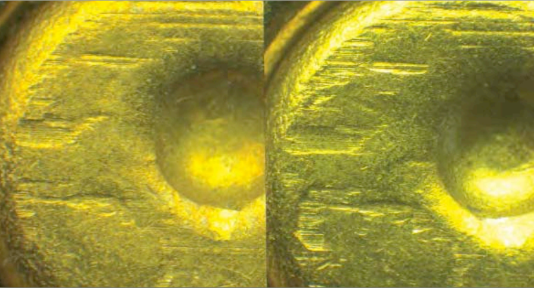
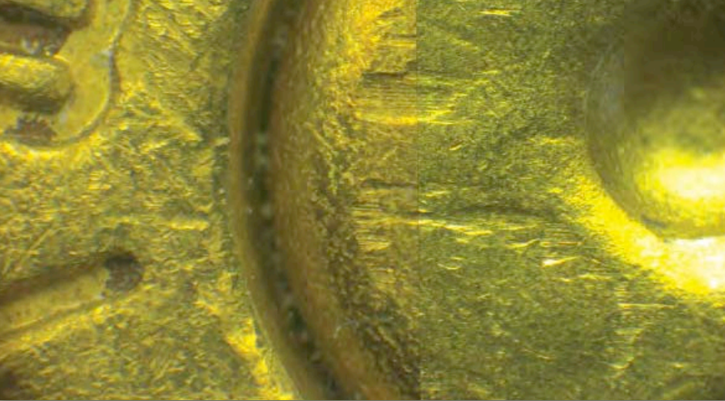

\newcommand{\hh}[1]{{\textcolor{orange}{#1}}}
\newcommand{\svp}[1]{{\textcolor{teal}{#1}}}
\newcommand{\jz}[1]{{\textcolor{purple}{#1}}}

```{r ,localDataDir, include=FALSE}
if(!dir.exists("data")){
  dir.create("data")
}
if(!file.exists("data/fadul1-1.x3p")){
  library(dplyr) # pipe not defined yet
  download.file("https://tsapps.nist.gov/NRBTD/Studies/CartridgeMeasurement/DownloadMeasurement/2d9cc51f-6f66-40a0-973a-a9292dbee36d", destfile = "data/fadul1-1.x3p", mode = "wb")
}
if(!file.exists("data/fadul1-2.x3p")){
  download.file("https://tsapps.nist.gov/NRBTD/Studies/CartridgeMeasurement/DownloadMeasurement/cb296c98-39f5-46eb-abff-320a2f5568e8", destfile = "data/fadul1-2.x3p", mode = "wb")
}
if(!file.exists("data/fadul2-1.x3p")){
  download.file("https://tsapps.nist.gov/NRBTD/Studies/CartridgeMeasurement/DownloadMeasurement/8ae0b86d-210a-41fd-ad75-8212f9522f96", destfile = "data/fadul2-1.x3p", mode = "wb")
}
```

```{r, derivativeImagesDir,include=FALSE}
if(!dir.exists("derivatives")){
  dir.create("derivatives")
}
```

```{r setup,echo=FALSE,message=FALSE,warning=FALSE}
knitr::opts_chunk$set(cache = T, dpi = 300)
library(cmcR)
library(tidyverse)
library(x3ptools)
library(rgl)
set.seed(4132020)
```

# Couple of general comments 

\hh{I noticed a few things during the spotlight on Monday that need to be addressed:
\begin{itemize}
\item color schemes need to be more consistent: in figures 9/10 red/black are used to indicate alignment/not aligned
and purple orange are used to show height
in the histograms, e.g. fig 11, purple orange are used to show same source/different source. \jz{Yeah, I agree that it would be better to change this. I like the orange/purple divergent color scheme representing height, so maybe the histograms could be changed to something else? The black and red CMC plots were meant to look like they do in \cite{tong_estimating_2018}, but maybe those could be changed to same color scheme as the histograms (representative of "matching" and "non-matching").}
\item use annotate rather than geom_text for annotations e.g. in figures 6 and 7. geom_text is repeated with the number of rows in a data set, annotation is only drawn once. That way the text doesn't look like it's bleeding \jz{That's a really good point. I've fixed that in the cmcR function used to create the plot and have pushed the updated version.}
\item fig 10: use fadul 1-1 as the reference rather than fadul 2-1. That way the pictures are directy comparable. \jz{Fadul 2-1 is used as the reference image to reflect the fact that it was partitioned into the grid of cells (instead of the other "direction" in which Fadul 1-1 was partitioned into a grid) to yield the 4 CMCs shown. I've added a better explanation for this, but it wouldn't be difficult to change to a different KNM scan if we wanted to.}
\item I noticed that known matches and known non matches have a different scale (height) in the histograms. I think we need to talk about whether that's the best strategy. \jz{Yes, I'm not sure if plotting the density is the best way to visualize this (as is done in pretty much all of the CMC-related papers I've seen). We can brainstorm some ideas.}
\end{itemize}
}

# Introduction {#intro}
<!-- If you put a single carriage return between sentences, it makes it a lot easier for git to merge changes back together. -->
\dfn{Research reproducibility} commonly refers to the ability to use the same procedures and materials as a previous study to arrive at the same results or conclusions. 
Reproducibility is necessary for results to be considered valid by the wider scientific community \citep{goodman_what_2016}. 
However, recent studies have raised concerns about reproducibility of scientific findings in various fields [\citet{king_replication_1995}, \citet{baker_1500_2016}, \citet{pasquier_if_2017}]. 
Commonly identified reasons for this lack of reproducibility include ambiguity in how a procedure (lab or computational) was implemented, data which is not provided or incomplete, and unavailable computer code sufficient to replicate any statistical analyses \citep{leek_is_2017}. 

In \svp{computational} research, this is commonly translated to mean that the code and data used to produce published results be made openly available \citep{peng_reproducible_2011}. \svp{Many papers describe (in broad terms) the computational methods which were used in the data analysis, but computational reproducibility requires more. 
Published results may be numerically sensitive to the particular implementation of a computational method, including such considerations as data processing decisions, parameter settings, and even the chosen programming language \citep{peng_reproducible_2011}. 
As such, peer-review and scientific progress in the truest sense requires that \emph{all} pre-processed data, code, and results be made openly available. 
In recognition of the additional requirements of computational reproducibility, } some journals have adopted policies encouraging or requiring that \svp{authors provide code and data sufficient to reproduce the statistical analyses, with the goal of building} a "culture of reproducibility" in their respective fields \citep{peng_reproducible_2009, peng_reproducible_2011, stodden_toward_2013}. 

<!-- Keep the discussion general at first! All of this information applies not just to CMC, but to a broad swath of other applications -->
\svp{The fundamental reason that descriptions of data analysis procedures, combined with the raw data, are not sufficient for reproducibility is that published procedures} are described in prose rather than algorithmically,  and \svp{in some cases, steps} are performed manually \citep{song_estimating_2018}. If the written-language description of the method in the publication is the sole source of information about the algorithm, we trade computational reproducibility for readability. We generally do not describe the particular parameter settings used (or how those were derived) when we describe an algorithm in a publication. \svp{This is an understandable editorial decision, as} the purpose of a publication is to demonstrate and justify the method rather than discuss the fine details and parameter settings. Because of this, however, it is necessary to \svp{supplement the paper with} open code and \svp{intermediate forms of the data (after any manual steps have been performed),} because our publications generally do not contain sufficient detail to reproduce every part of the algorithm. Especially in applications like forensic science or medicine, where results from computational methods may directly affect an individual's life, transparency in how a method or algorithm is implemented is necessary [\citet{angwin_machine_2016}, \citet{cino_deploying_2018}].

\svp{In forensic science, the discussion of computational reproducibility is commingled with discussions about algorithmic transparency and accountability\citep{kwongAlgorithmSaysYou2017, desaiTrustVerifyGuide2017}. 
Currently, subjective decisions are made by individual examiners - the ultimate closed-source, black-box system. 
There is a push to replace these subjective decisions with automatic algorithms that objectively assess evidence and can be more easily explained during court testimony \citep{council_strengthening_2009}.
While this is a laudable goal, it is important that the community does not go only halfway, trading a subjective, human black box for objective, proprietary algorithms that are similarly opaque and unauditable.}
<!-- These issues occur alongside discussion in forensic science about the use of automatic algorithms to supplement the opinions of forensic examiners and provide an objective assessment of evidence in court \citep{council_strengthening_2009}. -->
<!-- There is a recognition in the community that subjective decisions made by individuals are a ``black box" that produces conclusions which are not transparent, accountable, or ``open", but the same issues can be found in closed-source or proprietary software and methods.} -->
\svp{As part of this initiative, automatic} methods have been developed to solve problems such as identifying matching glass shards, \svp{handwriting}, shoe prints, and ballistic \svp{evidence}. 
While \svp{some} researchers in the forensic science community have adopted computationally reproducible habits [cite CSAFE stuff], \svp{many of the algorithms in the literature are not reproducible or open-source.}
<!-- some areas of research still lack reproducible results; computational or otherwise. -->
In this paper, we will demonstrate the ambiguities \svp{which are present} in written descriptions of algorithms by creating an open-source implementation of one well-known automatic forensic identification method. <!-- intentional buttering up before the punchline --> 
The Congruent Matching Cells (CMC) algorithm was developed at the National Institute of Standards and Technology (NIST) in 2012 to perform firearm evidence identification using identifiable markings left on spent cartridge cases from a firearm's barrel \citet{song_proposed_2013}. 
Since then, the method and its numerous extensions \citep{tong_improved_2015,chen_convergence_2017,song_estimating_2018} have shown promise in being able to differentiate between matching and non-matching cartridge cases. 
\svp{While NIST researchers and collaborators have been able to build on the foundation of the original algorithm, the code and data necessary to reproduce the results have not been made available to external researchers.}
\svp{As a result, according to} the definitions given above, these results are not reproducible. 
<!-- Various NIST researchers have been able to qualitatively reproduce results across publications [\citet{tong_improved_2015}, \citet{chen_convergence_2017}, \citet{song_estimating_2018}], but neither code nor pre-processed data for the CMC method or any of its extensions have been made publicly available.  -->

Here, we describe the process of implementing the Congruent Matching Cells (CMC) method for the comparison of marks on spent cartridge cases, using the descriptions from two published papers, \citet{song_3d_2014} and \citet{tong_improved_2015}. 
Our package, \pkg{cmcR}, provides an open-source implementation of the CMC method\svp{, but i}t also serves as an example of the implementation barriers which occur when translating published descriptions of algorithms into detailed source code. 
This process offers some insight into the necessary components which must be available for computational reproducibility. 
Our experience shows that when faced with ambiguity in how a method is implemented, there are few options available apart from performing a brute-force search through combinations of decisions that may have been made to yield the results reported. 
Unsurprisingly, it can become incredibly time intensive to implement and then sift through a wide variety of decision combinations. <!--This stymies scientific progress.-->
\svp{This not only serves as a barrier to scientific progress; in this application, it also highlights the importance of open-source, transparent methodology in forensic analysis.}

\svp{We will use the same data set which is referenced in \citet{song_3d_2014} and \citet{tong_improved_2015} to illustrate usage of the \pkg{cmcR} package. These 3d scans of cartridge cases are} available from the NIST Ballistics Toolmark Research Database (NBTRD)\citep{nbtrd}. The strings defined below refer to two cartridge case scans available on the NBTRD from \citet{fadul_empirical_nodate} and will be used \svp{throughout the remainder of this paper}.

```{r eval=FALSE,echo=TRUE}
library(cmcR)
set.seed(4132020)

nrbtd_url <- "https://tsapps.nist.gov/NRBTD/Studies/CartridgeMeasurement/"

fadul1.1_id <- "DownloadMeasurement/2d9cc51f-6f66-40a0-973a-a9292dbee36d"
fadul1.2_id <- "DownloadMeasurement/cb296c98-39f5-46eb-abff-320a2f5568e8"
# Should have the download code here.
```


# Cartridge cases & breech face impressions {#cartridgeCases_bfImpressions}

A \dfn{cartridge case} is \svp{the portion} of firearm ammunition that contains a projectile (e.g., bullet, shots, or slug) \svp{along with the explosive used to propel the projectile through the firearm}. 
When a firearm is discharged, the projectile stored in the cartridge case is propelled down the barrel of the firearm\svp{, while the cartridge case} is forced towards the back of the barrel. 
It strikes the back wall, known as the \dfn{breech face}, of the barrel \svp{with some force}.
\svp{Due to manufacturing imperfections, the breech face of the barrel has a theoretically unique combination of markings, which are "stamped" onto the cartridge case as it impacts the breech face during the firing process}. 
<!-- Markings due to, e.g., manufacturing imperfections are ingrained on the breech face. When the cartridge case slams against the breech face, these markings can be "stamped" into either the primer of the cartridge case or the cartridge case itself.  -->
The markings left on \svp{the} cartridge case from the firearm's breech face are called \dfn{breech face impressions}.

\svp{During a forensic examination, cartridge cases may be compared using a }
<!-- An example of two cartridge cases \svp{examined} under a  -->
\dfn{comparison microscope}.
\svp{Comparison microscopes allow for the comparison of two separate objects using the same viewfinder, allowing forensic practitioners to compare two pieces of toolmark evidence.}
<!-- , a tool commonly used by forensic practitioners to perform firearm evidence identification, is shown in Figures \ref{fig:ccPair_separated} and \ref{fig:ccPair_combined}.  -->
Figures \ref{fig:ccPair_separated} and \ref{fig:ccPair_combined} \svp{show cartridge cases in unaligned and aligned states, as seen through a comparison microscope. 
\svp{While there is some similarity in the markings on the two cartridge cases shown in \autoref{fig:ccPair_separated}, this correspondance is much clearer when the cartridge cases are aligned, as in \autoref{fig:ccPair_combined}\citep[Images from ]{firearm_id_thompson}.}
<!-- Such comparison microscopy involves placing two cartridge cases under separate lenses.  -->
<!-- The staging areas are combined via a series of lenses, prisms, and mirrors such that both cartridge cases can be seen side by side through a single field of view.  -->
<!-- Striated breech face markings can be seen on each cartridge case in Figure \ref{fig:ccPair_separated}. Figure \ref{fig:ccPair_combined} shows the two cartridge cases under a comparison microscope where a thin vertical line indicates the separation of the two views.  -->
The degree to which these breech face markings align can be used to determine whether the two cartridge cases match; i.e., were fired from the same firearm. 
These breech face impressions are considered to be analogous to a firearm's "fingerprint" left on a cartridge case \citep{firearm_id_thompson}.

```{r ,echo=FALSE,fig.cap='\\label{fig:ccPair_separated} Cartridge case pair with visible breech face impressions under a microscrope.',fig.align='center',fig.pos='htbp',out.width="\\textwidth"}

```

```{r ,echo=FALSE,fig.cap='\\label{fig:ccPair_combined} Cartridge case pair viewed side by side under a comparison microscope.',fig.pos='htbp',out.width="\\textwidth"}

```

\svp{While \autoref{fig:ccPair_separated} and \autoref{fig:ccPair_combined} are from comparison microscopes, digital microscopy is capable of higher precision measurements of surface topology.
Using a 3D microscope, we can obtain extremely detailed scans of the cartridge case surfaces which can be used as input to a comparison algorithm, such as the CMC method originally proposed in \citet{song_proposed_2013}.}

\svp{XXX Briefly describe the contributions of each paper in the sequence - need to transition from visual to algorithmic examination. The paragraph below is a start, but could flow a bit better. I've tried to write the paragraph above in a way that can lead directly into this discussion.}

An implementation of the initially proposed CMC method from \citet{song_proposed_2013} applied to 3D topographical scans of cartridge case surfaces is described in \citet{song_3d_2014}. An extension to this initially proposed method known as the High CMC method is discussed in \citet{tong_improved_2015}. 


<!-- Transition -->
\svp{In the next section, we examine the process of implementing the CMC method for automatic comparisons of 3D cartridge case scans. 
At each step, we will compare the description in the published papers with the implementation in code, discussing the gaps in the method description and how we filled in those gaps during the creation of `cmcR`.
We have included pseudocode implementing each procedure in the} [Appendix](#appendix) \svp{so that any ambiguities in the prosaic description are easily resolved.
In addition, the source code to the full `cmcR` package is accessible at https://github.com/jzemmels/cmcR.
}
\svp{XXX Joe - the package really should live under CSAFE-ISU, not your personal account. Would you mind transferring it over? That will make it easier for CSAFE to maintain once you've moved on to other projects. XXX}

# Methods {#methods} \svp{XXX Could we call this Implementation? It's not traditional, but it's more specific.}

<!-- To acknowledge the original work, excerpts from these articles will be provided. A discussion about ambiguity in how the methods were originally described and how they are implemented in the \pkg{cmcR} package will accompany these excerpts. The [Appendix](#appendix) contains pseudocode detailing the procedures more precisely. -->

## Pre-processing procedures {#preProcessing}

First, 3D topographical cartridge case surface data in their raw format need to be processed before the CMC method can be effectively applied. 
Cartridge case surface data are commonly represented via a \dfn{surface matrix}: a matrix of spatially-ordered elements or "pixels" whose values correspond to the height of the cartridge case surface at a particular location. 
Figure \ref{fig:cartridgeCasePair} shows the surface matrices of a known match (KM) pair of cartridge cases from a study by \citet{fadul_empirical_nodate}. 
\svp{A total of 40 cartridge cases were scanned with a lateral resolution of 6.25 microns (micrometers) per pixel. The surface matrices \svp{are approximately} $1200 \times 1200$ pixels in size.

```{r, fadul1-1Screenshot,include=FALSE}
fadul1.1 <- x3ptools::read_x3p("data/fadul1-1.x3p")

#apply lowpass filter to reduce noise in scan:
surface1 <- fadul1.1$surface.matrix %>%
  cmcR::preProcess_gaussFilter(res = 3.125e-06,wavelength = 16,filtertype = "lp")

params <- rgl::r3dDefaults

zoom <- .7
size <- c(300,300)

params$windowRect <- c(40, 125, 40 + size[1], 125 + size[2])
params$userMatrix <- diag(c(1, 1, 1, 1))
params$zoom <- zoom

#for some reason the first rgl device opened doesn't plot anything, but
#subsequent devices do...
open3d(params = params)
rgl.close()

#opens blank "canvas" upon which we can add lights, surfaces, etc.
open3d(params = params)

#removes any previously declared lights in scene
rgl.pop("lights")

#set-up two lights for scene -- a lot of experimentation possible here
light3d(x = -1,y = 1,z = 2,viewpoint.rel = TRUE,ambient = "white",diffuse = "white",specular = "white")
light3d(x = 0,y = 0,z = 10,ambient = "grey60",diffuse = "grey50",specular = "grey60",viewpoint.rel = TRUE)

#setup surface visualization
multiply <- 1 #x3ptools::image_x3p default to exaggerate relief
z <- multiply * surface1 # Exaggerate the relief
yidx <- ncol(z):1
y <- fadul1.1$header.info$incrementY * yidx
x <- fadul1.1$header.info$incrementX * (1:nrow(z))

# emission, specular, ambient affect how the surface interacts with lights --
# again, a lot of possible experimentation
surface3d(x, y, z, back = "filled",emission = "grey30",specular = "grey50",ambient = "grey10")

x3ptools::x3p_snapshot(file = "derivatives/fadul1-1.png")

rgl.close()
```


```{r ,fadul1-2Screenshot,include=FALSE}
fadul1.2 <- x3ptools::read_x3p("data/fadul1-2.x3p")

surface2 <- fadul1.2$surface.matrix %>%
  cmcR::preProcess_gaussFilter(res = 3.125e-06,wavelength = 16,filtertype = "lp")
#opens blank "canvas" upon which we can add lights, surfaces, etc.
open3d(params = params)

#removes any previously declared lights in scene
rgl.pop("lights")

#set-up two lights for scene -- a lot of experimentation possible here
light3d(x = -1,y = 1,z = 2,viewpoint.rel = TRUE,ambient = "white",diffuse = "white",specular = "white")
light3d(x = 0,y = 0,z = 10,ambient = "grey60",diffuse = "grey50",specular = "grey60",viewpoint.rel = TRUE)

#setup surface visualization
multiply <- 1 #x3ptools::image_x3p default to exaggerate relief
z <- multiply * surface2 # Exaggerate the relief
yidx <- ncol(z):1
y <- fadul1.2$header.info$incrementY * yidx
x <- fadul1.2$header.info$incrementX * (1:nrow(z))

# emission, specular, ambient affect how the surface interacts with lights --
# again, a lot of possible experimentation
surface3d(x, y, z, back = "filled",emission = "grey30",specular = "grey50",ambient = "grey10")

x3ptools::x3p_snapshot(file = "derivatives/fadul1-2.png")

rgl.close()
```

```{r, rawBFs,echo=FALSE,fig.cap='\\label{fig:cartridgeCasePair} Two known match cartridge case scans from \\citet{fadul_empirical_nodate}',fig.subcap=c('',''),fig.align='center',fig.pos='htbp',out.width='.49\\linewidth',out.height='.49\\linewidth'}
knitr::include_graphics(c("derivatives/fadul1-1.png","derivatives/fadul1-2.png"))
```

Only certain regions of a cartridge case contain identifying breech face impression markings. \citet{song_proposed_2013} refers to these as "valid correlation regions" that are to be used to determine whether two cartridge cases match. Prior to applying the CMC comparison procedure, cartridge scans must undergo some pre-processing to remove sections of the cartridge case surface that do not come into contact with the breech face of the barrel. These include a circular plateaued region in the center of the scan that is pushed aside by the firing pin during the firing process as well as clusters of observed values in the corners of the scan that are artifacts of the staging area in which the scan was captured. The procedures used to process the surface matrices differ in the CMC literature. \citet{song_3d_2014} outline the following pre-processing procedure:

\begin{enumerate}
\item \emph{"Trim off the inside firing pin surface and other areas outside the breed face mark, so that only breech face impression data remain for correlation."}

\item \emph{"Identify and remove dropouts or outliers."}

\item \emph{"Apply a band-pass Gaussian regression filter with 40 $\mu$m short cutoff length and 400 $\mu$m long cutoff length to remove low frequency components, including surface curvature, form error, waviness and high frequency components which mainly arise from the instrument noise."}
\end{enumerate}

While not said explicitly in \citet{song_3d_2014}, \citet{song_estimating_2018} indicates that the "trimming" of the unwanted interior and exterior regions of the scan is performed manually. It is unclear how the dropouts and outliers are "removed" from the scan or how outliers are defined. To our knowledge, there does not exist an open-source implementation of the multivariate bandpass Gaussian regression filter used in surface metrology \citep{ISO16610-71}. Further, there are various parameters requiring specification to implement a Gaussian regression filter and it is not clear how these parameters were chosen.

In the \pkg{cmcR} package, breech face impression data are isolated using a combination of the Random Sample Consensus (RANSAC) robust iterative plane-fitting \citep{ransac} algorithm, the Hough Transform shape detection algorithm \citep{hough}, and cropping rows/columns of the surface matrix containing only \code{NA} values on the exterior of the breech face impression region. This was inspired largely by \citet{tai_fully_2018} who detail a fully-automatic procedure for processing 2D cartridge case images. The \pkg{cmcR} package does not yet use a Gaussian regression filter. A simpler Gaussian filter, a technique used by \citet{tong_fired_2014} and \citet{song_estimating_2018}, is currently implemented instead. In order to perform the comparison procedure, dropouts and other \code{NA}-valued pixels must be replaced with a non-\code{NA} value. The convention adopted in the \pkg{cmcR} package is to use the average pixel value as a replacement. There is currently no determination or removal of outliers in the \pkg{cmcR} package's pre-processing procedures.

To illustrate the usage of the \pkg{cmcR} package, we will consider a comparison between the KM cartridge case pair shown in Figure \ref{fig:cartridgeCasePair}. For computational purposes it is common the CMC literature to down-sample a surface matrix prior to performing the cell-based comparison procedure. The sample_x3p function from the x3ptools package can be used used to sample every m th row/column of a surface matrix. The \code{selectBFImpression\_sample\_x3p} function performs all of these pre-processing procedures in a single call. The code to produce the first surface matrix shown in Figure \ref{fig:processedScans} is given below while the code for the second surface matrix is skipped for redundancy.

```{r echo=TRUE,eval=FALSE}
fadul1.1 <- selectBFImpression_sample_x3p(x3p_path = paste0(nrbtd_url,fadul1.1_id),
                                          ransacInlierThresh = 1e-6, #.1 microns
                                          ransacIters = 300,
                                          m = 2, #sample_x3p downsample rate
                                          gaussFilterWavelength = c(16,500),
                                          gaussFilterType = "bp") #bandpass filter
```

```{r load-data, include = F, cache = T}
fadul1.1 <- cmcR::selectBFImpression_sample_x3p("data/fadul1-1.x3p",
                                                gaussFilterWavelength = c(16,500))
fadul1.2 <- cmcR::selectBFImpression_sample_x3p("data/fadul1-2.x3p",
                                                gaussFilterWavelength = c(16,500))
```

```{r,echo=FALSE,cache = T,fig.cap='\\label{fig:processedScans} A known match pair of processed cartridge case scans',fig.align='center',fig.pos='htbp',out.width='1.2\\textwidth',out.extra="trim={0 2.5cm 0 2cm}"}

cmcR::x3pListPlot(x3pList = list("Fadul 1-1" = fadul1.1$x3p,
                                 "Fadul 1-2" = fadul1.2$x3p),
                  type = "faceted",rotate = 90,legend.quantiles = c(0,.01,.2,.5,.8,.99,1)) +
  guides(fill = guide_colourbar(barheight = grid::unit(2.6,"inches"),
                                label.theme = element_text(size = 8),
                                title.theme = ggplot2::element_text(size = 10),
                                frame.colour = "black",
                                ticks.colour = "black")) +
  theme(legend.position = c(1.11,.551),plot.margin = ggplot2::margin(c(0,3,.2,0),unit = "cm"))
```

## "Correlation cell" comparison procedure {#comparisonProcedure}

As described in \citet{song_proposed_2013}, breech face markings are not uniformly impressed upon a cartridge case during the firing process. As such, only certain sections of the cartridge case have identifiable markings that make it possible to match to a firearm. Calculating a similarity score between the entirety of two cartridge case surfaces might not highlight these valid correlation regions. Instead, \citet{song_proposed_2013} proposes partitioning one surface matrix into a grid of "correlation cells," some of which will enclose the valid correlation regions of interest. If a large number of these correlation cells are deemed highly similar to regions in the other surface matrix, then there is evidence that the two cartridges cases match. Thus, the number of highly similar cells can be used as a more granular similarity metric.

```{r, echo=FALSE,fig.cap='\\label{fig:cmc_illustration} Illustration of comparing a "cell" in one cartridge case scan to a region in another',fig.align='center',fig.pos='htbp',out.width='\\textwidth'}

knitr::include_graphics("images/cmc_illustration.PNG")
```

Figure \ref{fig:cmc_illustration} illustrates the cell-based comparison procedure between two cartridge case scans. The scan on the left is divided into a grid of $8 \times 8$ cells. Each cell is paired with an associated larger region in the other scan. The absolute location of each cell and region in their respective surface matrices remain constant. However, the scan on the right is rotated to determine the rotation at which the two scans are the most "similar," which is quantified using the \dfn{cross-correlation function} (CCF). For two real-valued, $M \times N$ matrices $A$ and $B$, the cross-correlation function, denoted $(A \star B)$ can be defined as
$$
(A \star B)[m,n] = \sum_{i} \sum_{j} A[i,j] B[(i + m), (j + n)].
$$
Note that this finite, discretized CCF definition yields a matrix whose $[m,n]$th element quantifies the similarity between matrices $A$ and $B$ for a translation of matrix $B$ by $m$ pixels horizontally and $n$ pixel vertically. The index at which the CCF attains a maximum represents the translations needed to align $B$ with $A$.

It is unclear in the CMC literature whether the CCF between a cell/region pair is calculated from the definition or, as is more commonly done in image processing \citep{Brown92asurvey}, using a result known as the Cross-Correlation Theorem. For two matrices $A$ and $B$, The Cross-Correlation Theorem implies that
$$
(A \star B )[m,n]= \mathcal{F}^{-1}\left(\overline{\mathcal{F}(A)} \cdot \mathcal{F}(B)\right)[m,n]
$$
where $\mathcal{F}$ and $\mathcal{F}^{-1}$ denote the discrete Fourier and inverse discrete Fourier transforms, respectively, and the overline denotes the complex conjugate \citep{fft_brigham}. Note that the multiplication on the right-hand side is pointwise (Hadamard) multiplication. This result allows us to trade the moving sum computations from the definition of the CCF for two forward Fourier transformation, a pointwise product, and an inverse Fourier transformation. The Fast Fourier Transform (FFT) algorithm can be used to reduce the computational load considerably.

The \pkg{cmcR} package uses this FFT-based method to determine the translation values at which the maximum CCF value, denoted CCF$_{\max}$ in \citet{song_proposed_2013}, occurs. A practical consideration in calculating the CCF in this way is that the discrete Fourier transform is not defined for matrices containing missing values. As can be seen by the gray pixels in Figure \ref{fig:processedScans}, processed surface matrices contain many missing (\code{NA}-valued) elements. In replacing these elements with the average pixel value in the matrix, the CCF values obtained tend to be "deflated" relative to the \dfn{pairwise-complete correlation} values that are calculated using only pairs of non-missing pixels. However, the translation estimates obtained from this method are often good estimates of the true translation values by which a cell/region pair align. Using the estimated translation values at which the CCF$_{\max}$ occurs, the pairwise-complete correlation can be calculated between the cell and a matrix of the same dimensions extracted from the larger region where \code{NA} values are not replaced.

The correlation cell comparison procedure is implemented in the \code{cellCCF\_bothDirections} function. In particular, the procedure is performed twice so that both cartridge case scans take on the role of the scan that is partitioned into a grid of cells. This is necessary to implement the High CMC method described below. Continuing with the current use case example, the code to perform this procedure on \code{fadul1.1} and \code{fadul1.2} is given by the following example. 

```{r cmc-ccf, include = F, cache = T}
kmComparison <- cmcR::cellCCF_bothDirections(x3p1 = fadul1.1$x3p,
                                             x3p2 = fadul1.2$x3p,
                                             cellNumHoriz = 8,
                                             minObservedProp = .1,
                                             regionToCellProp = 9)
```
```{r echo=TRUE,eval=FALSE}
kmComparison <- cellCCF_bothDirections(x3p1 = fadul1.1,
                                       x3p2 = fadul1.2,
                                       thetas = seq(-30,30,by = 3),
                                       cellNumHoriz = 8,
                                       cellNumVert = cellNumHoriz,
                                       minObservedProp = .1)
```

The first few rows of results from the comparison between \code{fadul1.1} and \code{fadul1.2} in which \code{fadul1.1} was divided into a grid of cells and \code{fadul1.2} was rotated by 3 degrees is given below. Although a grid of $8 \times 8$ cells were used, there were only 43 cell/region pairs that contained a sufficient proportion of non-missing values (10% in this example). The features used in the CMC method are the CCF$_{\max}$ values (ccf column) and estimated alignment parameter values (dx, dy, and theta columns).
```{r echo=TRUE,eval=FALSE}
head(kmComparison$comparison_1to2$ccfResults$`3`)
```
```{r echo=FALSE,eval=TRUE,cache = T}
kmComparison$comparison_1to2$ccfResults$`3` %>%
  head() %>%
  knitr::kable(caption = "\\label{tab:cellCCF} Example of output from \\code{cellCCF} function",
               format = "latex") %>%
  kableExtra::kable_styling(latex_options = "hold_position")
```

## The initially proposed CMC method {#initialMethod}

A number of features are extracted in a cartridge case comparison using the correlation cell comparison procedure. Accompanying the CCF$_{\max}$ similarity metric are the rotation and translation values at which the CCF$_{\max}$ was attained for each cell/region pair. As stated in \citet{song_3d_2014}, \emph{"[t]he qualifications of CMCs require not only high correlation values CCF$_{\max} \geq T_{\text{CCF}}$, but also similar registration angles $\theta$ (within the threshold $T_{\theta}$) and similar $x - y$ registration pattern (within the thresholds $T_x$, $T_y$)."} For a truly matching pair of cartridge cases, one might expect a "consensus" to exist amongst the various $\theta, x$, and $y$ values at which the CCF$_{\max}$ occurs (referred to as the \dfn{registration phase} of the cell/region pairs in \citet{song_proposed_2013}). The CMC method introduces criteria to determine whether a consensus exists amongst these values and quantifies the strength of the consensus by the number of cell/region pairs with similar registration phases.

\citet{song_3d_2014} proposes using \emph{"a virtual reference with three reference registration parameters $\theta_{\text{ref}}$, $x_{\text{ref}}$ and $y_{\text{ref}}$ generated by the median values of the collective $\theta$, and $x$-, $y$-translation values of all cell pairs."} That is, a consensus is determined by finding the median registration phase values across the cell/region pairs for a particular cartridge case pair comparison. The distances between the registration phases for each cell/region pair their respective consensus values are determined. Let $x_i, y_i, \theta_i$ denote the registration phase values for cell/region pair $i$, $i = 1,...,n$. To declare a particular cell/region pair as "congruent matching," \citet{song_3d_2014} requires that (1) the pair's estimated alignment parameter values are within some threshold distance of the consensual values and (2) the CCF$_{\max}$ value is greater than some threshold. That is, for thresholds $T_{dx}, T_{dy}, T_{\theta},T_{\text{CCF}}$, cell/region pair $i$ is declared a match if all of the following conditions hold:
\begin{enumerate}
\item $|x_i - x_{\text{ref}}| \leq T_{dx}$ \\
\item $|y_i - y_{\text{ref}}| \leq T_{dy}$ \\
\item $|\theta_i - \theta_{\text{ref}}| \leq T_{\theta}$ \\
\item CCF$_{\max,i} \geq T_{\text{CCF}}$.
\end{enumerate}

\citet{song_3d_2014} indicate that these thresholds need to be determined experimentally. There is little consensus on an optimal set of thresholds nor discussion on the sensitivity of proposed methods to different threshold choices in the CMC literature.

```{r cmc-filter, include = F, cache = T}
if (!file.exists("data/kmcmc.Rdata")) {
  kmCMC <- cmcR::cmcFilter_improved(kmComparison,
                                  ccf_thresh = .7,
                                  dx_thresh = 20,
                                  theta_thresh = 6,
                                  missingTheta_decision = "dismiss")
  save(kmCMC, file = "data/kmcmc.Rdata")
} else {
  load("data/kmcmc.Rdata")
}

```

## The High CMC method {#highMethod}

The High CMC method (as it would come to be called) was proposed by \citet{tong_improved_2015} to address situations in which the initially proposed method is excessively strict. In particular, they observe that \emph{"some of the valid cell pairs may be mistakenly excluded from the CMC count because by chance their correlation yields a higher CCF value at a rotation angle outside the threshold range $T_\theta$."} The proposed extension to the initial method utilizes the behavior of the CCF$_{\max}$ values across various rotations more advantageously. Additionally, comparisons are performed in both “directions” so that each surface matrix takes on the role of the surface matrix that is partitioned into a grid of cells.

\citet{tong_improved_2015} propose applying the translation and CCF$_{\max}$ CMC criteria to the comparison results for each rotation value. In doing so, a CMC count for each rotation can be obtained. As they justify: \emph{"If two images are truly matching, the CMC-$\theta$ distribution of matching image pairs should have a prominent peak located near the initial phase angle $\Theta_0$, while non-matching image pairs may have a relatively flat and random CMC-$\theta$ distribution pattern."} These phenomena are illustrated in Figures \ref{fig:kmCMCPerTheta} and \ref{fig:knmCMCPerTheta}. Figure \ref{fig:kmCMCPerTheta} shows the CMC counts per rotation value in both directions for a known match pair of cartridge case scans from \citet{fadul_empirical_nodate}. We can clearly see a CMC mode around $\theta = -24$ in one direction and $21$ in the other, which is to be expected for a known match pair. Figure \ref{fig:knmCMCPerTheta}, on the other hand, shows the CMC counts for a known non-match pair. We can see that no such CMC count mode is achieved.

\citet{tong_improved_2015} introduce an additional criterion to identify a mode in the CMC per $\theta$ counts. Namely, they introduce a "high" CMC threshold defined to be CMC$_{\text{high}} =$ CMC$_{\max} - \tau$ for some constant $\tau$ (they choose $\tau = 1$) where CMC$_{\max}$ is the maximum CMC count attained across all rotation values considered. They propose finding the range of rotation values with associated CMC count greater than or equal to CMC$_{\text{high}}$. If this range is greater than the threshold $T_\theta$, then there is evidence to suggest that a CMC count mode does not exist and the cartridge case pair is not a match. The CMC$_{\text{high}}$ thresholds are shown as horizontal dashed lines in Figures \ref{fig:kmCMCPerTheta} and \ref{fig:knmCMCPerTheta}. We can see in Figure \ref{fig:kmCMCPerTheta} that the only $\theta$ values with associated CMC counts greater than or equal to CMC$_{\text{high}}$ are adjacent. This particular cartridge case pair would "pass" the high CMC criterion. The pair shown in Figure \ref{fig:knmCMCPerTheta} elicit considerably more diffuse $\theta$ values with associated CMC count great than or equal to CMC$_{\text{high}}$ and thus would not pass the high CMC criterion. 

Similar behavior tends to be seen for the majority KM and KNM pairs. However, we've observed that the behavior of the CMC-$\theta$ distributions depend heavily on the pre-processing procedures used and thresholds set. In particular, the CMC-$\theta$ distributions for some KNM pairs exhibit the "prominent peak" behavior for a wide range of threshold values making them difficult to distinguish from KM pairs.

```{r,echo=FALSE,cache = T,fig.cap='\\label{fig:kmCMCPerTheta} CMC count per rotation ($\\theta$) values in both directions for a KM cartridge case pair',fig.align='center',fig.pos='h',out.width='.7\\textwidth'}
cmcR::cmcPerThetaBarPlot(kmComparison,
                         ccf_thresh = .7,
                         dx_thresh = 20,
                         theta_thresh = 6,
                         x3pNames = c("Fadul 1-1","Fadul 1-2"))
```

```{r,echo=FALSE,cache = T}
fadul2.1 <- cmcR::selectBFImpression_sample_x3p("data/fadul2-1.x3p",
                                                gaussFilterWavelength = c(16,500))

knmComparison <- cmcR::cellCCF_bothDirections(x3p1 = fadul1.1$x3p,
                                              x3p2 = fadul2.1$x3p,
                                              cellNumHoriz = 8,
                                              minObservedProp = .1,
                                              regionToCellProp = 9)

knmCMC <- cmcR::cmcFilter_improved(knmComparison,
                                   ccf_thresh = .7,
                                   dx_thresh = 20,
                                   theta_thresh = 6)
```

```{r,echo=FALSE,cache = T,fig.cap='\\label{fig:knmCMCPerTheta} CMC count per rotation ($\\theta$) values in both directions for a KNM cartridge case pair',fig.align='center',fig.align='center',fig.pos='h',out.width='.7\\textwidth'}
cmcR::cmcPerThetaBarPlot(knmComparison,
                         ccf_thresh = .7,
                         dx_thresh = 20,
                         theta_thresh = 6,
                         x3pNames = c("Fadul 1-1","Fadul 2-1"))
```

\citet{tong_improved_2015} outline the following procedure:
\begin{enumerate}
\item \emph{"Conduct both forward and backward correlations at each rotation and record the registration based on CCF$_{\max}$, $x$, and $y$ for each cell at each rotation. These data will be used in the next two steps separately."}

\item \emph{"At every rotation angle, each cell in the reference image finds a registration position in the compared image with a maximum CCF value. By selecting the registration with the maximum CCF value for each cell, the two CMC numbers determined by the four thresholds can be obtained based on the original algorithm [\citet{tong_fired_2014}]. The lower CMC number is used as the initial result."}

\item \emph{"Build CMC-$\theta$ distributions using the data generated in step 1, by counting the number of cells that have congruent positions at each individual rotation angle. Calculate the angular range of “high CMCs” using both the forward and backward CMC-$\theta$ distributions, as illustrated in Figs. 2 and 3."}

\item \emph{"If the angular range of the “high CMCs” is within the range $T_\theta$, identify the CMCs for each rotation angle in this range and combine them to give the number of CMCs for this comparison in place of the original CMC number. In this step, if the range is narrower than $T_\theta$, the nearby angles are included to make the range equal to $T_\theta$; CMCs with same index in each rotation are only counted once."}
\end{enumerate}
A few critical pieces of information are missing from the method's description. For one, there is no discussion nor reference to the procedures used to pre-process the scans. Additionally, there is no indication of how to deal with situations in which two adjacent $\theta$ values tie for the CMC$_{\max}$ count. We've observed such situations to actually be quite common among both KM and KNM pairs. Another common occurrence for which no guidance is provided is if one comparison direction passes the High CMC criterion (i.e., a CMC count mode is identified at a particular $\theta$ value) while the other direction fails the criterion. A case could be made that a failure in one direction should indicate a non-matching pair, but considerable experimentation on our part has shown that many KM pairs elicit this behavior.

The \code{cmcFilter\_improved} function determines CMCs under both the initially proposed and High CMC methods for user-defined threshold values. In the event of a CMC$_{\max}$ count tie between more than one adjacent $\theta$ values, then the median of these $\theta$ values is used as the registration angle. Different options exist to handle situations in which one direction fails the High CMC criterion while the other passes. See the \code{cmcFilter\_improved} documentation for more information.

```{r echo=TRUE,eval=FALSE}
kmCMC <- cmcR::cmcFilter_improved(kmComparison,
                                  ccf_thresh = .7,
                                  dx_thresh = 20,
                                  dy_thresh = 20,
                                  theta_thresh = 6)
```

The \code{cmcPlot} function will construct a plot to visualize cells have been declared a CMC and those that have not. The initial 18 CMCs and 25 non-CMCs for the current use case example are shown in black and red, respectively, on the left-hand side of Figure \ref{fig:initialCMCPlot}. Black cells on the right-hand side of Figure \ref{fig:initialCMCPlot} show how each CMC aligns in the other surface matrix. The red cells show how the non-CMCs align to attain their CCF$_{\max}$ value.
```{r echo=TRUE,eval=FALSE}
cmcPlots <- cmcR::cmcPlot(fadul1.1$x3p,
                          fadul1.2$x3p,
                          cellCCF_bothDirections_output = kmComparison,
                          cmcFilter_improved_output = kmCMC,
                          x3pNames = c("Fadul 1-1","Fadul 1-2")) 

cmcPlots$initialCMC
```
```{r,echo=FALSE,cache = T,fig.cap='\\label{fig:initialCMCPlot} CMC results from a known match comparison under the initially proposed method',fig.align='center',fig.pos='htbp',out.width='1.2\\textwidth',out.extra="trim={0 2.5cm 0 2cm}"}
#Actual code executed to tweak the size/position of the colorbar legend:
cmcPlots <- cmcR::cmcPlot(fadul1.1$x3p,
                          fadul1.2$x3p,
                          cellCCF_bothDirections_output = kmComparison,
                          cmcFilter_improved_output = kmCMC,
                          x3pNames = c("Fadul 1-1","Fadul 1-2"),
                          legend.quantiles = c(0,.01,.2,.5,.8,.99,1)) 

cmcPlots$initialCMC +
  guides(fill = guide_colourbar(barheight = grid::unit(2.1,"inches"),
                                label.theme = element_text(size = 8),
                                title.theme = ggplot2::element_text(size = 10),
                                frame.colour = "black",
                                ticks.colour = "black")) +
  theme(legend.position = c(1.11,.552),plot.margin = ggplot2::margin(c(0,3,0,0),unit = "cm"))
```

Similarly, 34 CMCs and 10 non-CMCs determined under the High CMC method are shown in Figure \ref{fig:highCMCPlot}.
```{r echo=TRUE,eval=FALSE}
cmcPlots$highCMC
```
```{r,echo=FALSE,cache = T,fig.cap='\\label{fig:highCMCPlot} CMC results from a known match comparison under the High CMC method',fig.align='center',fig.pos='htbp',out.width='1.2\\textwidth',out.extra="trim={0 2.5cm 0 2cm}"}
#Actual code executed to tweak the size/position of the colorbar legend:
cmcPlots$highCMC +
  guides(fill = guide_colourbar(barheight = grid::unit(2.47,"inches"),
                                label.theme = element_text(size = 8),
                                title.theme = ggplot2::element_text(size = 10),
                                frame.colour = "black",
                                ticks.colour = "black")) +
  theme(legend.position = c(1.11,.552),plot.margin = ggplot2::margin(c(0,3,.2,0),unit = "cm"))
```

In contrast, Figure \ref{fig:knmCMCPlot} shows the CMC results for a comparison between Fadul 1-1 and a known non-match scan, Fadul 2-1, under the same pre, inter, and post-processing conditions used for the known match comparison. The "Fadul 1-1 vs. Fadul 2-1" direction yielded 7 initial CMCs while the "Fadul 2-1 vs. Fadul 1-1" direction yielded 4 initial CMCs. \citet{tong_improved_2015} propose choosing the minimum of these two as the initial CMC count. As such, the plot below reflects that Fadul 2-1 was the reference surface matrix partitioned into a grid of cells. There were 0 CMCs determined under the High CMC method for this comparison.
```{r,echo=FALSE,cache = T,fig.cap='\\label{fig:knmCMCPlot} CMC results from a known non-match comparison under the initially proposed method',fig.align='center',fig.pos='htbp',out.width='1.2\\textwidth',out.extra="trim={0 2cm 0 1cm}"}
cmcPlot(x3p1 = fadul1.1$x3p,
        x3p2 = fadul2.1$x3p,
        cellCCF_bothDirections_output = knmComparison,
        cmcFilter_improved_output = knmCMC,
        type = "faceted",
        x3pNames = c("Fadul 1-1","Fadul 2-1"),
        legend.quantiles = c(0,.01,.2,.5,.8,.99,1)) %>%
  .$initialCMC +
  guides(fill = guide_colourbar(barheight = grid::unit(2.4,"inches"),
                                label.theme = element_text(size = 8),
                                title.theme = ggplot2::element_text(size = 10),
                                frame.colour = "black",
                                ticks.colour = "black")) +
  theme(legend.position = c(1.11,.51),plot.margin = ggplot2::margin(c(0,3,.2,0),unit = "cm"))
```

# Results {#results}

As described in section [2](#data), the set of cartridge case scans from \citet{fadul_empirical_nodate} is commonly used to compare the performance of various methods in the CMC literature. This set consists of 40 cartridge cases. There are 63 known match pairs and 717 known non-match pairs. While the exact procedures by which these scans are processed are unavailable, the surface data are openly available in their raw, unprocessed format NIST Ballistics Toolmark Research Database. Thus, some level of comparison between the implementation provided in the \pkg{cmcR} package and published results is possible. However, justification for any differences will ultimately involve educated hypothesization due to the closed-source nature of the original implementations.

For any cartridge case pair, the number of CMCs can be determined under the initially proposed method described in section [3.2.1](#initialMethod) and the high CMC method described in section [3.2.2](#highCMCMethod). These CMC counts can be determined for all 780 cartridge case pairs available in the \citet{fadul_empirical_nodate} dataset. Perfect identification of all matching and non-matching pairs corresponds to choosing a CMC count threshold that separates the distributions of the matching and non-matching CMC counts. Many authors have found success in choosing a CMC count threshold of 6 CMCs [\citet{tong_improved_2015}, \citet{song_estimating_2018}] as initially proposed by \citet{song_proposed_2013}, although this threshold has been shown to not generalize well to all proposed methods or cartridge case datasets \citep{chen_convergence_2017}. Further, little consensus exists among authors on the most effective alignment parameter thresholds ($T_{dx}, T_{dy}, T_{\theta}, T_{\text{CCF}}$ defined in section [3.2.1](#initialMethod)) for distinguishing matches from non-matches. Figure \ref{fig:initialCMC_perfectIdentification} shows an example of a particular set of thresholds that yields separation between the known match and known non-match CMC count distributions. An appropriate CMC count threshold would be where the dashed, vertical line is drawn at 8.5 CMCs. Separation is also achieved using the initially proposed method by \citet{tong_improved_2015} and \citet{chen_convergence_2017}, among others. It should be noted that these authors report CMC count distributions with fewer "false positive" CMCs for non-match pairs. However, the behavior of these distributions changes considerably depending on the thresholds specified.

```{r echo=FALSE,fig.cap='\\label{fig:initialCMC_perfectIdentification} Initial CMC count distribution with $T_{\\text{CCF}} = .625$, $T_{dx} = T_{dy} = 22.5$, and $T_{\\theta} = 3$ degrees.',fig.align='center',fig.pos='htbp',out.width='\\textwidth',out.height=".55\\textwidth"}

load("data/cmcCountData.RData")

cmcCountData_setSeed4132020 %>%
  filter(cmcType == "initial") %>%
  filter(thetaThresh ==  3 & ccfThresh == .625 & translateThresh == 22.5) %>%
  mutate(comparisonType = factor(comparisonType,levels = c("known non-match","known match"))) %>%
  rename(`CCF Threshold` = ccfThresh,
         `Trans. Threshold` = translateThresh) %>%
  ggplot() +
  geom_histogram(aes(x = cmcCount,y = ..density..,fill = comparisonType),colour = "black",binwidth = 1) +
  geom_histogram(aes(x = cmcCount,y = ..density..),alpha = 0,binwidth = 1) +
  geom_text(data = cmcCountData_setSeed4132020 %>%
              pivot_wider(id_cols = c("pair","ccfThresh","translateThresh","thetaThresh","comparisonType"),
                          names_from = c("cmcType"),
                          values_from = c("cmcCount")) %>%
              mutate(high = ifelse(high == 0,initial,high)) %>%
              pivot_longer(cols = c("initial","high"),
                           names_to = "cmcType",
                           values_to = "cmcCount") %>%
              filter(cmcType == "initial") %>%
              filter(thetaThresh ==  3 & ccfThresh == .625 & translateThresh == 22.5) %>%
              mutate(comparisonType = factor(comparisonType,levels = c("known non-match","known match"))) %>%
              rename(`CCF Threshold` = ccfThresh,
                     `Trans. Threshold` = translateThresh) %>%
              group_by(comparisonType,cmcCount) %>%
              tally() %>%
              ungroup() %>%
              group_by(comparisonType) %>%
              mutate(prop = n/sum(n)),
            aes(x = cmcCount,y = prop,label = n),
            nudge_y = .005,size = 2.5) +
  geom_vline(xintercept = 8.5,linetype = "dashed") +
  scale_fill_manual(values = c("orange","#b19cd9"),aesthetics = c("colour","fill")) +
  guides(fill = guide_legend(title = "Comparison Type",override.aes = list(alpha = 1)),
         colour = FALSE) +
  theme_bw() + 
  theme(legend.position = "bottom") +
  xlab("CMC Count") +
  ylab("Relative Frequency")
```

Figure \ref{fig:initialCMC_sensitivity} shows the CMC count distributions determined using the initially proposed method for various CCF and translation thresholds. The rotation threshold was fixed at $T_\theta = 3$ degrees. The most restrictive threshold combination is in the bottom left corner while the least restrictive, which is also shown in Figure \ref{fig:initialCMC_perfectIdentification}, is in the top right corner. Unsurprisingly, fewer CMCs are assigned to all pairs as the thresholds become more restrictive. Additionally, many threshold combinations yield overlapping matching and non-matching CMC count distributions making perfect identification based on a minimum CMC count threshold impossible.

```{r echo=FALSE,fig.cap='\\label{fig:initialCMC_sensitivity} Initial CMC count distributions for various $T_{dx}, T_{dy}$, and $T_{\\text{CCF}}$ values and $T_{\\theta} = 3$ degrees.',fig.align='left',fig.pos='htbp',out.width='1.2\\linewidth',out.extra="trim={2cm 0 0 0}"}

cmcCountData_setSeed4132020 %>%
  filter(cmcType == "initial") %>%
  filter(ccfThresh %in% c(.5,.7,.9) & translateThresh %in% c(10,20,30)) %>%
  mutate(comparisonType = factor(comparisonType,levels = c("known non-match","known match"))) %>%
  rename(`CCF Threshold` = ccfThresh,
         `Trans. Threshold` = translateThresh) %>%
  ggplot(aes(x = cmcCount,y = ..density..)) +
  geom_histogram(aes(fill = comparisonType),colour = "black",binwidth = 1) +
  geom_histogram(alpha = 0,binwidth = 1) +
  scale_fill_manual(values = c("orange","#b19cd9")) +
  guides(fill = guide_legend(title = "Comparison Type",override.aes = list(alpha = 1))) +
  facet_wrap(`CCF Threshold` ~ `Trans. Threshold`,ncol = 3,scales = "free_y",labeller = label_both) +
  theme_bw() + 
  theme(legend.position = "bottom",
        strip.text.x = element_text(size = 5)) +
  xlab("CMC Count") +
  ylab("Relative Frequency")
```

```{r include=FALSE, eval=FALSE}
initialCMC_roc <- cmcCountData_setSeed4132020 %>%
  filter(cmcType == "initial")  %>%
  group_by(ccfThresh,translateThresh,thetaThresh) %>%
  dplyr::group_split() %>%
  map_dfr(function(paramSpecificResults = .x){
         
         rocOut <- paramSpecificResults %>%
           pROC::roc(response = comparisonType,
                     predictor = cmcCount,
                     levels = c("known non-match","known match"),
                     quiet = TRUE)
         
         data.frame(False.Positives = 1 - rocOut$specificities,
                    True.Positives = rocOut$sensitivities) %>%
           mutate(auc = rep(rocOut$auc,times = nrow(.)),
                  ccfThresh = rep(unique(paramSpecificResults$ccfThresh),times = nrow(.)),
                  translateThresh = rep(unique(paramSpecificResults$translateThresh),times = nrow(.)),
                  thetaThresh = rep(unique(paramSpecificResults$thetaThresh),times = nrow(.))) %>%
           return()
         
       })

initialCMC_roc %>%
  filter(thetaThresh == 6) %>%
  filter(ccfThresh %in% c(.5,.65,.8) & translateThresh %in% c(10,20,30)) %>%
  arrange(True.Positives) %>%
  ggplot() +
  geom_line(aes(x = False.Positives,y = True.Positives)) +
  geom_label(aes(x = .7,y = .2,label = paste0("AUC = ",round(auc,6))),size = 4) +
  theme_bw() +
  facet_wrap(ccfThresh ~ translateThresh,ncol = 3,labeller = label_both) +
  xlab("False Positive Rate") +
  ylab("True Positive Rate") +
  ggtitle("Initial CMC ROC Curves, Residuals, BP Filter - Cutoffs: 16, 250 microns")
```

Figure \ref{fig:highCMC_perfectIdentification} shows the distribution of high CMC counts under the same threshold values as in Figure \ref{fig:initialCMC_perfectIdentification}. The dashed, vertical line is again drawn at 8.5 CMCs. The non-match pairs show the same distribution of CMCs as they did under the initially proposed method. Many matching pairs are assigned a higher CMC count than under the initially proposed method.

```{r echo=FALSE,fig.cap='\\label{fig:highCMC_perfectIdentification} High CMC count distribution with $T_{\\text{CCF}} = .625$, $T_{dx} = T_{dy} = 22.5$, and $T_{\\theta} = 3$ degrees',fig.align='center',fig.pos='htbp',out.width='\\textwidth',out.height='.55\\textwidth'}
cmcCountData_setSeed4132020 %>%
  filter(cmcType == "high") %>%
  filter(thetaThresh ==  3 & ccfThresh == .625 & translateThresh == 22.5) %>%
  mutate(comparisonType = factor(comparisonType,levels = c("known non-match","known match"))) %>%
  rename(`CCF Threshold` = ccfThresh,
         `Trans. Threshold` = translateThresh) %>%
  ggplot() +
  geom_histogram(aes(x = cmcCount,y = ..density..,fill = comparisonType),colour = "black",binwidth = 1) +
  geom_histogram(aes(x = cmcCount,y = ..density..),alpha = 0,binwidth = 1) +
  geom_text(data = cmcCountData_setSeed4132020 %>%
              pivot_wider(id_cols = c("pair","ccfThresh","translateThresh","thetaThresh","comparisonType"),
                          names_from = c("cmcType"),
                          values_from = c("cmcCount")) %>%
              mutate(high = ifelse(high == 0,initial,high)) %>%
              pivot_longer(cols = c("initial","high"),
                           names_to = "cmcType",
                           values_to = "cmcCount") %>%
              filter(cmcType == "high") %>%
              filter(thetaThresh ==  3 & ccfThresh == .625 & translateThresh == 22.5) %>%
              mutate(comparisonType = factor(comparisonType,levels = c("known non-match","known match"))) %>%
              rename(`CCF Threshold` = ccfThresh,
                     `Trans. Threshold` = translateThresh) %>%
              group_by(comparisonType,cmcCount) %>%
              tally() %>%
              ungroup() %>%
              group_by(comparisonType) %>%
              mutate(prop = n/sum(n)),
            aes(x = cmcCount,y = prop,label = n),
            nudge_y = .005,size = 2) +
  geom_vline(xintercept = 8.5,linetype = "dashed") +
  scale_fill_manual(values = c("orange","#b19cd9"),aesthetics = c("colour","fill")) +
  guides(fill = guide_legend(title = "Comparison Type",override.aes = list(alpha = 1)),
         colour = FALSE) +
  theme_bw() + 
  theme(legend.position = "bottom") +
  xlab("CMC Count") +
  ylab("Relative Frequency")
```

Figure \ref{fig:highCMC_sensitivity} shows CMC count distributions determined using the High CMC method for various CCF and translation thresholds. We have observed that the High CMC criterion functions effectively as a preliminary classification rule for matching vs. non-matching cartridge case pairs. Any pair that passes the High CMC criterion, matching or non-matching, is assigned a large number of CMCs. Thus, the success of the High CMC method hinges on choosing pre-processing parameter and threshold values such that few non-matches pass the High CMC criterion. An issue related to this is that there does not exist an agreed-upon set of alignment parameter thresholds nor a method, other than pure experimentation, by which these thresholds can be determined in the CMC literature. While not shown here, we have seen that certain combinations of pre-processing conditions and thresholds yield a bimodal non-match CMC count distribution consisting of pairs that do not pass High CMC criterion (and are assigned few CMCs) and pairs that do (and are assigned many false positive CMCs). Similar non-match bimodal behavior can be seen in Figure 8 of \citet{chen_convergence_2017} where the High CMC method was applied to cartridge case data from \citet{laPorte_validation_2011}.

```{r echo=FALSE,fig.cap='\\label{fig:highCMC_sensitivity} High CMC count distributions for various $T_{dx}, T_{dy}$, and $T_{\\text{CCF}}$ values and $T_{\\theta} = 3$ degrees.',fig.align='left',fig.pos='htbp',out.width='1.2\\linewidth',out.extra="trim={2cm 0 0 0}"}
cmcCountData_setSeed4132020 %>%
  pivot_wider(id_cols = c("pair","ccfThresh","translateThresh","thetaThresh","comparisonType"),names_from = c("cmcType"),values_from = c("cmcCount")) %>%
  mutate(high = ifelse(high == 0,initial,high)) %>%
  pivot_longer(cols = c("initial","high"),
               names_to = "cmcType",
               values_to = "cmcCount") %>%
  filter(cmcType == "high") %>%
  filter(ccfThresh %in% c(.5,.7,.9) & translateThresh %in% c(10,20,30)) %>%
  mutate(comparisonType = factor(comparisonType,levels = c("known non-match","known match"))) %>%
  rename(`CCF Threshold` = ccfThresh,
         `Trans. Threshold` = translateThresh) %>%
  ggplot(aes(x = cmcCount,y = ..density..)) +
  geom_histogram(aes(fill = comparisonType),colour = "black",binwidth = 1) +
  geom_histogram(alpha = 0,binwidth = 1) +
  scale_fill_manual(values = c("orange","#b19cd9")) +
  guides(fill = guide_legend(override.aes = list(alpha = 1))) +
  facet_wrap(`CCF Threshold` ~ `Trans. Threshold`,
             ncol = 3,
             scales = "free_y",
             labeller = label_both) +
  theme_bw() + 
  theme(legend.position = "bottom",
        strip.text.x = element_text(size = 5)) +
  xlab("CMC Count") +
  ylab("Relative Frequency")
```

Similar to the initially proposed method, the implementation in the \pkg{cmcR} package tends to give a larger number of false positive High CMCs to non-match pairs relative to results in the CMC literature. On the other hand, the number of CMCs assigned to matching pairs is comparable under both methods. Undoubtedly, finer tuning of the thresholding parameters would yield results more similar to those in the CMC literature. Additionally, further exploration of procedures by which the breech face impressions can be isolated and highlighted may help reduce the effects of characteristics of the scan that make it difficult to distinguish matches from non-matches. For example, cartridges from the same manufacturer may share similarities that cartridges from different manufacturers do not. Such similarities are often used by forensic practitioners to initially pare down the possible pool of matching cartridge cases \citep{firearm_id_thompson}. However, not removing such characteristics might increase the probability of making a false positive matching identification. A Robust Gaussian Regression Filter can be used to simultaneously isolate and filter the breech face impression region in the surface matrix \citep{metrology}, possibly more effectively than the currently implemented procedures.

```{r include=FALSE,eval=FALSE}
highCMC_roc <- cmcCountData_setSeed4132020 %>%
  filter(cmcType == "high")  %>%
  group_by(ccfThresh,translateThresh,thetaThresh) %>%
  dplyr::group_split() %>%
  map_dfr(function(paramSpecificResults = .x){
         
         rocOut <- paramSpecificResults %>%
           pROC::roc(response = comparisonType,
                     predictor = cmcCount,
                     levels = c("known non-match","known match"),
                     quiet = TRUE)
         
         data.frame(False.Positives = 1 - rocOut$specificities,
                    True.Positives = rocOut$sensitivities) %>%
           mutate(auc = rep(rocOut$auc,times = nrow(.)),
                  ccfThresh = rep(unique(paramSpecificResults$ccfThresh),times = nrow(.)),
                  translateThresh = rep(unique(paramSpecificResults$translateThresh),times = nrow(.)),
                  thetaThresh = rep(unique(paramSpecificResults$thetaThresh),times = nrow(.))) %>%
           return()
         
       })

highCMC_roc %>%
  filter(ccfThresh %in% c(.5,7,.9) & translateThresh %in% c(10,20,30)) %>%
  arrange(True.Positives) %>%
  ggplot() +
  geom_line(aes(x = False.Positives,y = True.Positives)) +
  geom_label(aes(x = .7,y = .2,label = paste0("AUC = ",round(auc,6))),size = 4) +
  theme_bw() +
  facet_wrap(ccfThresh ~ translateThresh,ncol = 3,labeller = label_both) +
  xlab("False Positive Rate") +
  ylab("True Positive Rate") +
  ggtitle("High CMC ROC Curves, Residuals, BP Filter - Cutoffs: 16, 250 microns")
```

# Conclusion {#conclusion}

<!-- TODO: -->
<!--  - Implicit parameters that aren't discussed -->
<!--  - No intermediate data results (right before applying the method) -->
<!--  - Absence of a deterministic algorithm (in pre-processing) that leads to inability to reproduce results -->

The results shared in this manuscript indicate that the implementation of the CMC method in the \pkg{cmcR} package is qualitatively similar to those in the CMC literature. As such methods could potentially be used in the future as evidence to support legal conclusions, it is imperative that specific implementations be openly available for assessment and validation. Furthermore, reproducibility of results hinges on automating as much of the comparison process as possible. We have discussed the ways in which the prosaic descriptions of CMC procedures fail to adequately detail implementations that yield reproducible results. Ambiguity in the implementation stems mainly from implicit parameters and processing choices in the written-language descriptions. While admissible from a readability perspective, anything short of making the original code available renders published results not reproducible. This is compounded by the fact that a critical pre-processing step is performed manually and that pre-processed data are not publicly available.

At one time, it was common to publish the specific implementation of an algorithm as raw source code \citep{bron_merge_1972} within the journal article (or at minimum, in the appendix \citep{friend_sorting_1956} if the article contained a significant amount of analysis). While it is still relatively common to provide access to a github repository or other repository for source code, these repositories are not guaranteed to exist in perpetuity; certainly, when compared to \citep{bron_merge_1972}, the likelihood of being able to find the source code for an article is higher when the code is included in the article or made readily accessible in another format. In many cases, though, authors do not make their code available for analysis; this provides a substantial hurdle when attempting to use, replicate, or compare the published method and represents a significant barrier to scientific progress. Unfortunately, a pure `re-implementation' of existing work generally does not count as research, which does not encourage to build on one another's work nor compare across approaches from different research groups. Re-implementations often require enumerating and implementing a wide variety of processing options, likely larger than the scope of the original implementation, and yield a deeper understanding of a method's strengths and weaknesses \citep{Stodden2013SettingTD}. The process by which the CMC method was implemented in the \pkg{cmcR} package testifies to how important the recent push for open-source development is to scientific progress.

<!-- Lastly, it is simply best academic practice to be transparent about how certain results were obtained and how sensitive these results are to different processing conditions. The \pkg{cmcR} package is intended to provide researchers with an automatic, transparent tool to further explore the potential of the CMC method and develop novel techniques to perform firearm evidence identification. -->

Future changes to the current implementation will likely come in the form of improvements to the way that breech face impressions are automatically isolated and highlighted within the scan. Additionally, there are also a number of other extensions to the initially proposed CMC method that currently lack an open-source implementation. The foundation set by the \pkg{cmcR} package should make it easier to implement these extensions in the future. 

\bibliography{RJreferences}

# Appendix {#appendix}

## Pseudocode

This section will provide a more detailed description of the various processing procedures implemented in the \pkg{cmcR} package in the form of \code{R} pseudocode. Additional documentation and source code are available on the \pkg{cmcR} package's [GitHub page](https://github.com/jzemmels/cmcR).

Pre-processing: It is common in the CMC literature to first downsample surface matrices to reduce the computational load of the correlation cell comparison procedure described in section [3.2](#comaprisonProcedure). The \code{sample\_x3p} function from the \pkg{x3ptools} package will downsample an x3p's surface matrix by an integer factor (every $m$th row and column) and update the object's metadata. The \code{selectBFImpression\_sample\_x3p} function will perform this downsampling before applying the pre-processing procedures described in section [3.1](#preProcessing).

```{r eval=FALSE,include=FALSE}
selectBFImpression_sample_x3p <- function(x3p_path,
                                          ransacInlierThresh = 1e-5,
                                          ransacFinalSelectThresh = 2*1e-5,
                                          ransacIters = 150,
                                          useResiduals = TRUE,
                                          croppingThresh = 1,
                                          standardizeBF = FALSE,
                                          m = 2,
                                          mY = m,
                                          offset = 0,
                                          offsetY = offset,
                                          gaussFilterRes,
                                          gaussFilterWavelength = c(16,250),
                                          gaussFilterType = "bp"){

  # 1) Read-in and downsample x3p object every m-th row/column
  
  # 2) Apply RANSAC method once with 10*ransacInlerThresh and ransacIters/2 to
  # obtain a "rough" estimate
  
  # 3) Extract the ...

  #Some additional, unwanted pixels remain in the middle of the cartridge scan
  #even after the RANSAC method has selected the breech face impression height
  #values. We can remove these unwanted pixels by identifying the equation of
  #the firing pin impression circle and filtering out any pixels within that
  #circle. The following returns the estimated center and radius of the firing
  #pin impression circle:
  fpImpressionCircle <- preProcess_detectFPCircle(surfaceMat = bfImpression_ransacSelected,
                                                  aggregation_function = mean,
                                                  smootherSize = 2*round((.1*nrow(bfImpression_ransacSelected)/2)) + 1,
                                                  meshSize = 1,
                                                  houghScoreQuant = .9)

  stopifnot(is.data.frame(fpImpressionCircle),
            nrow(fpImpressionCircle) == 1)

  #This then filters out any pixels within the firing pin
  bfImpressionFinal <- removeFPImpressionCircle(bfImpression = bfImpression_ransacSelected,
                                                fpImpressionCircle = fpImpressionCircle)

  if(standardizeBF){
    bfImpressionFinal <- (bfImpressionFinal - mean(bfImpressionFinal,na.rm = TRUE))/sd(bfImpressionFinal,na.rm = TRUE)
  }

  if(missing(gaussFilterRes) & !(missing(gaussFilterWavelength) & !missing(gaussFilterType))){
    gaussFilterRes <- x3p$header.info$incrementY
  }

  if(!missing(gaussFilterRes) & !missing(gaussFilterWavelength) & !missing(gaussFilterType)){
    bfImpressionFinal <- bfImpressionFinal %>%
      preProcess_gaussFilter(res = gaussFilterRes,
                             wavelength = gaussFilterWavelength,
                             filtertype = gaussFilterType)
  }

  stopifnot(is.matrix(bfImpressionFinal),
            all(dim(bfImpressionFinal) > c(0,0)),
            sum(!is.na(bfImpressionFinal)) > 0)

  #Important note: x3ptools and imager read an image from a surface matrix
  #starting from the bottom left corner and moving upwards. Thus, a matrix ends
  #up being treated like its transpose within these packages. For example, the
  #"Y" axis of an x3p object actually refers to the columns in the surface
  #matrix
  x3p$header.info$sizeY <- ncol(bfImpressionFinal)
  x3p$header.info$sizeX <- nrow(bfImpressionFinal)

  x3p$surface.matrix <- bfImpressionFinal

  return(list("params" = list(ransacInlierThresh = ransacInlierThresh,
                              ransacIters = ransacIters,
                              useResiduals = useResiduals,
                              croppingThresh = croppingThresh,
                              standardizeBF = standardizeBF,
                              m = m,
                              mY = mY,
                              offset = offset,
                              offsetY = offsetY),
              "x3p" = x3p))
}
```

